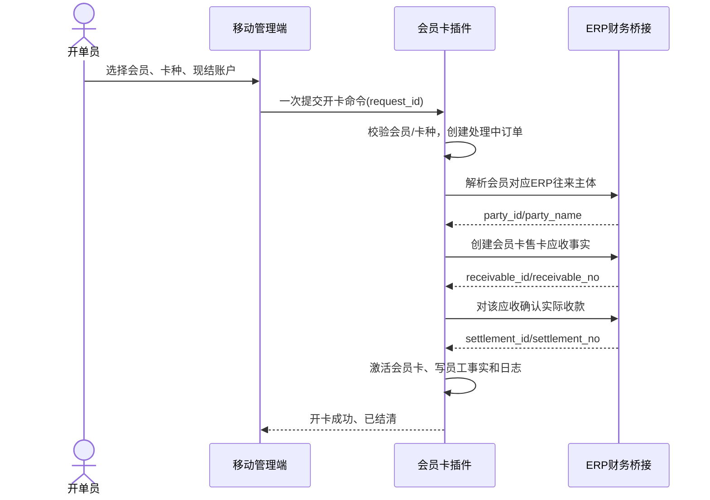
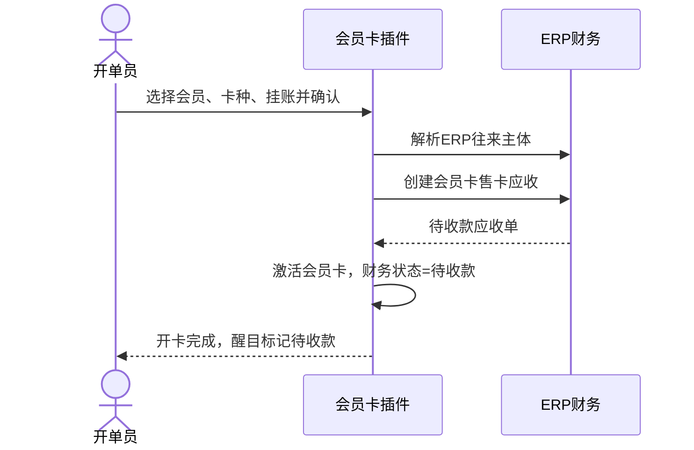
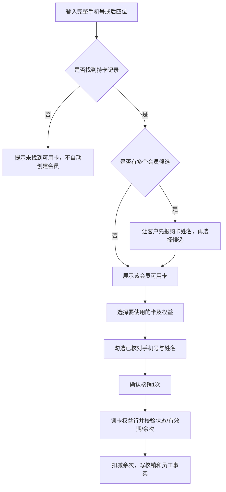
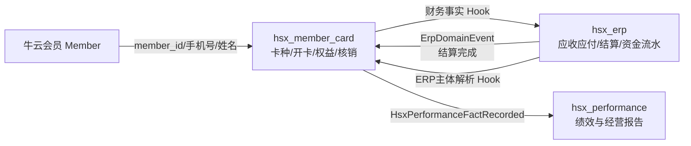
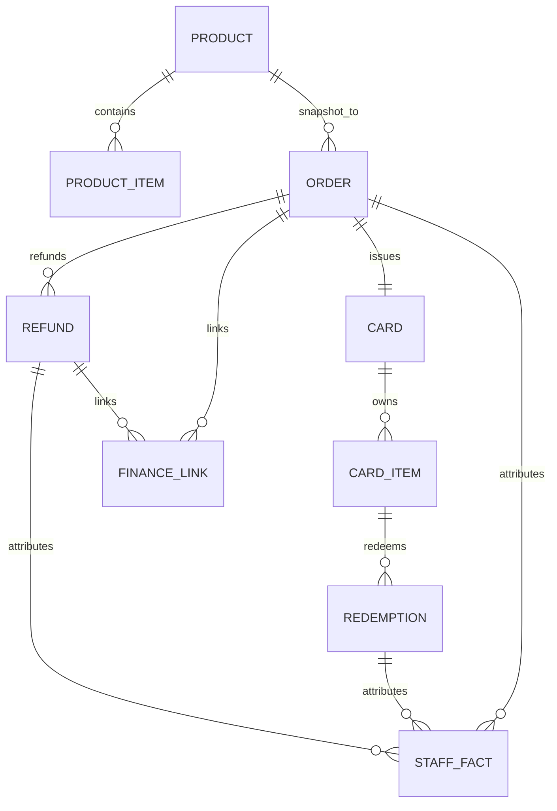

# 贴膜会员卡插件产品与技术实施规划（`hsx_member_card` v0.0.1）

> 文档状态：v0.0.1 已按规划实现，进入界面联调与业务验收  
> 更新日期：2026-07-16  
> 实施说明：`niucloud/addon/hsx_member_card/docs/IMPLEMENTATION.md`  
> 适用仓库：`niucloud` / `admin` / `site-uniapp`  
> 产品范围：单站点、单门店、贴膜服务会员卡  
> 目标读者：产品、后端、PC 前端、移动管理端、测试，以及接手实现的 AI

---

## 0. 执行摘要

本插件的核心不是“生成一张卡片”，而是完成以下可审计闭环：

> 创建卡种 → 选择或创建会员 → 开卡 → ERP 现结/应收 → 手机号找卡 → 姓名人工核对 → 核销 → 核销冲正 → 取消/退款 → 员工事实与财务回流。

第一版必须做到前台操作简单、后台数据严谨：

- 店员开卡只需选择会员、卡种和结算方式，一次提交完成。
- 店员核销只需让客户报手机号或后四位，再询问购卡姓名，选择卡片后确认核销一次。
- 不管理家庭成员，不要求本人到场，不发短信验证码。
- 开单人、核销人都由服务端读取当前登录员工，前端不能伪造。
- 现结与挂账都进入 ERP 财务；现结在用户界面是一次操作，底层仍严格分为“业务应收事实”和“实际收款结算”。
- 核销、冲正、退款均保留原记录，不允许删除历史。
- 多门店、商城售卡、微信支付、配件库存、复杂工资计算不进入 v0.0.1。

### 0.1 已确认的产品决策

| 议题 | v0.0.1 决策 |
| --- | --- |
| 插件键 | `hsx_member_card` |
| 插件中文名 | 会员服务卡 |
| 依赖 | 依赖 `hsx_erp`，建议 `type=addon`、`support_app=hsx_erp` |
| 门店 | 不做多门店，不出现门店配置和跨店清算 |
| 卡类型 | 次数和有效期是两个独立维度，可组合 |
| 共享使用 | 默认允许家人代用；不建立授权使用人名单 |
| 身份核验 | 手机号/后四位找卡 + 店员询问购卡姓名并人工核对 |
| 现结 | 必须选择 ERP 资金账户；一个界面动作完成开卡和收款登记 |
| 挂账 | 生成 ERP 应收，卡可立即使用，但明显标识“待收款” |
| 默认核销 | 每次只核销 1 次，不提供随意填写多次的输入框 |
| 核销撤销 | 只能“核销冲正”，不能删除核销记录 |
| 退款 | 已使用卡必须先逐笔冲正，恢复为未使用后才能整卡退款 |
| 绩效 | 保存开单、收款、核销、冲正、退款人员事实；v0.0.1 不直接计算工资 |
| 商城/微信支付 | 仅预留字段和事件，不实现 |
| 贴膜库存 | 不实现膜库存扣减；以后关联 ERP 普通商品/耗材 |

### 0.2 可直接交给实现 AI 的总任务

```text
请严格依据《贴膜会员卡插件产品与技术实施规划（hsx_member_card v0.0.1）》分阶段实现。

要求：
1. 先完成 ERP 主体解析、资金账户选项、外部结算、未结事实作废四项公共契约及测试，再创建会员卡主流程。
2. 第一版仅单门店贴膜卡；不得加入商城、微信支付、多门店、库存耗材、授权家庭成员或复杂工资。
3. 开卡前端只能提交一次命令，后端完成会员、主体、应收、现结/挂账、激活的可恢复 Saga。
4. 核销必须手机号/后四位找卡、人工核对购卡姓名、固定扣一次，并使用行锁和 request_id 防重。
5. 所有财务经 ERP Hook；所有员工事实经 HsxPerformanceFactRecorded；禁止跨插件直接写表。
6. 每个阶段先补测试再提交，严格通过本文第 17 节全部验收项。
7. 不修改牛云核心框架，不修改 hsx_recycle 生产表结构；所有代码进入插件业务区。
8. 完成后提交：变更文件清单、SQL 安装/卸载验证、接口契约、PC/H5/微信构建结果、全链路测试报告和未完成项。
```

---

## 1. 产品目标与非目标

### 1.1 产品目标

1. 让 1～2 人的小团队也能在几十秒内完成开卡和核销。
2. 支持“9.9 元 10 次、30 天有效”和“100 元 10 次、永久有效”等组合。
3. 让客户只报手机号和购卡姓名，不要求找卡号、会员 ID 或拿出购卡手机。
4. 让 ERP 财务知道这笔钱为什么收、谁付、是否到账、对应哪张卡和哪位开单员工。
5. 让老板能区分：售卡金额、实际收款、待收款、已核销次数、未核销余额、退款金额。
6. 形成稳定事件和不可变员工事实，为后续工资/KPI 模块提供数据。

### 1.2 明确不做

- 多门店和跨门店核销。
- 家庭成员、授权使用人、短信验证码。
- 储值卡、折扣卡、礼品卡、积分卡。
- 商城在线售卡、微信支付、第三方支付回调。
- 膜、壳、电池等配件库存自动扣减。
- 一个订单购买多张不同卡。
- 组合优惠、优惠券、改价、赠卡、续卡、转赠、合并、拆分。
- 已部分使用卡的自动按比例退款。
- 插件内工资结算、提成发放和工资封账。
- 用户端“我的卡”页面；第一版只交付 PC 与移动管理端。

### 1.3 竞品参考结论

竞品仅用于确认行业通用概念，不照搬其复杂流程：

- 有赞把“次卡”和“期限卡”作为服务权益工具，并支持立即生效、首次使用生效、指定日期、永久/固定时长/固定日期等有效期规则。[有赞卡项使用教程](https://help.youzan.com/displaylist/detail_53_53-2-276149)
- 有赞在收银文档中明确：购卡金额应先视为预收，后续耗卡再逐步结转，不应把所有未消费卡款直接理解成已履约收入。[有赞收银开单使用教程](https://help.youzan.com/displaylist/detail_53_53-2-276152)
- 修改卡项规则只影响新售卡，不应修改历史已售卡；核销记录需要 PC 与移动端一致可查。[有赞按次数使用权益卡教程](https://help.youzan.com/displaylist/detail_44_44-2-103905)

本产品比竞品第一版更克制：只有一个门店、一个开卡流程、一个默认核销次数和一套 ERP 财务事实。

---

## 2. 角色与职责

角色不是固定岗位，一个员工可以同时拥有多个权限。

| 角色能力 | 主要职责 | 默认允许操作 |
| --- | --- | --- |
| 卡种管理员 | 配置销售卡种 | 新建、编辑、启停卡种 |
| 开单员 | 给客户开卡 | 选会员、选卡种、现结/挂账开卡 |
| 核销员 | 到店服务履约 | 手机号查卡、姓名核验、核销一次 |
| 财务 | 处理 ERP 收款与退款 | 确认应收、收款、退款出款、查看凭证 |
| 主管 | 异常处理 | 核销冲正、取消、退款申请、失败重试 |
| 店长/老板 | 经营查看 | 看板、员工事实、退款和异常审计 |

### 2.1 人员字段必须分开

- `issuer_uid/name`：开单人，取创建开卡订单时的当前登录员工。
- `receipt_operator`：实际收款人，由 ERP 结算记录回传；不一定等于开单人。
- `redeemer_uid/name`：核销人，取核销时的当前登录员工。
- `reverse_uid/name`：冲正人。
- `refund_apply_uid/name`：退款申请人。
- `refund_payment_operator`：退款出款人，由 ERP 回传。

任何接口都不得相信前端提交的上述员工 UID、姓名或 `site_id`。

---

## 3. 领域术语与核心规则

### 3.1 卡种、开卡订单和会员卡的区别

- **卡种（Product）**：后台配置模板，例如“10 次贴膜卡”。
- **开卡订单（Order）**：一次销售事实，例如韩世雄购买“10 次贴膜卡”，金额 100 元。
- **会员卡（Card）**：订单成功后发给该会员的具体权益账户，保存实际剩余次数和有效期。
- **卡权益（Card Item）**：可被核销的服务项目。v0.0.1 UI 默认每个卡种只有一个“贴膜服务”，数据库保留多权益扩展能力。
- **核销（Redemption）**：实际提供一次贴膜服务并扣减一次权益。
- **核销冲正（Reversal）**：因误操作恢复一次权益，但保留原核销记录。

### 3.2 卡规则不是二选一

次数与有效期必须独立配置：

#### 次数维度

- `limited`：有限次数，例如 10 次。
- `unlimited`：有效期内不限次，为月卡等场景预留。

#### 有效期维度

- `permanent`：永久有效。
- `duration`：生效后 N 天/N 月有效。
- `fixed`：固定开始日期和结束日期。

#### 生效方式

- `immediate`：开卡成功立即生效，默认。
- `first_use`：第一次核销时开始计算有效期。
- `fixed`：在指定日期开始生效。

可组合出：

| 场景 | 次数 | 有效期 | 生效方式 |
| --- | --- | --- | --- |
| 9.9 元活动卡 | 10 次 | 30 天 | 立即生效 |
| 100 元常规卡 | 10 次 | 永久 | 立即生效 |
| 月度不限次卡 | 不限次 | 1 个月 | 首次使用生效 |
| 节日活动卡 | 10 次 | 固定起止日期 | 固定日期 |

### 3.3 历史快照原则

修改或停用卡种只影响以后开出的新卡：

- 已售卡保存卡名、售价、次数、有效期规则、使用说明快照。
- 卡种改价不能修改历史订单金额。
- 卡种停用不能让历史会员卡失效。
- 历史展示不能依赖当前卡种名称。

### 3.4 手机号与姓名核验

不设计授权使用人，也不记录“这次实际来贴膜的是谁”。贴膜卡是低客单价服务，业务目标是快。

标准核销话术和步骤：

1. 店员问：“购卡手机号是多少？”
2. 客户可以报完整手机号或手机号后四位。
3. 系统返回可用卡候选，后台员工界面展示购卡人完整姓名和脱敏手机号。
4. 店员先让客户主动报购卡姓名，再与系统显示姓名比较。
5. 姓名一致，勾选“已核对手机号与购卡姓名”，确认核销一次。
6. 姓名不一致，不核销；让客户重新核对完整手机号。

安全规则：

- 后四位最少输入 4 位，不能输入 1～3 位全库模糊搜索。
- 后四位匹配多人时不得自动选中。
- 候选按“可用卡、即将到期、最近开卡”排序。
- 员工端可显示完整姓名用于人工比较；用户端未来上线时必须脱敏。
- 搜索后四位必须查询会员卡快照的索引字段，不允许对整个会员表执行无索引 `%1234` 扫描。
- 核销记录只保存“手机号+姓名人工核验已确认”，不保存家人身份。

---

## 4. 业务流程

### 4.1 现结开卡



前端看起来只有一次“确认开卡”，但后端不能把应收事实和实际收款混成一条数据。

#### 失败处理

- ERP 主体解析失败：订单进入 `finance_failed`，不激活卡。
- 应收已创建但收款失败：保留可重试的异常订单和 ERP 应收，卡不激活；使用同一幂等键重试收款。
- 网络重试：相同 `request_id` 返回第一次结果，不再开第二张卡。

### 4.2 挂账开卡



默认允许挂账卡核销，因为店员选择挂账即代表门店同意先服务后收款。设置中保留 `allow_unpaid_redemption`，默认开启。

### 4.3 手机号查卡与核销



核销确认文案：

> 本次将核销 1 次“贴膜服务”，完成后剩余 7 次。请确认已核对购卡手机号与姓名。

### 4.4 核销冲正

1. 主管打开原核销记录。
2. 点击“核销冲正”。
3. 系统展示原卡、客户、服务、核销人、时间、核销前后次数。
4. 主管填写必填原因并二次确认。
5. 服务端锁定原核销和卡权益。
6. 若该核销已冲正则拒绝；否则恢复次数并写负向员工事实。
7. 原核销记录状态变 `reversed`，不可删除。

### 4.5 取消和退款

#### 未收款且从未核销

- 可以取消开卡。
- ERP 原应收必须通过“未结财务事实作废”契约变为 `void`。
- 卡和订单变为 `cancelled`。
- 不生成退款应付，不伪造现金流。

#### 已收款且从未核销

- 发起整卡退款。
- 卡先变为 `refund_pending`，立即禁止核销。
- 生成 ERP “会员卡退款”应付。
- 选择现场退款时由 ERP 立即登记实际付款；选择财务退款时等待财务处理。
- ERP 回传该应付全部结清后，卡和订单变为 `refunded`。

#### 已产生有效核销

v0.0.1 不计算部分退款：

> 必须先把所有有效核销逐笔冲正，恢复为未使用状态，才能整卡退款。

这样避免活动价、已消费价值和剩余次数单价产生争议。

---

## 5. 状态机

### 5.1 卡种状态

```text
draft（草稿） → enabled（启用） → disabled（停用）
disabled → enabled
```

卡种不物理删除；尚未产生订单的草稿可软删除。

### 5.2 开卡订单业务状态

```text
processing → active
processing → finance_failed → processing（重试）
active → refund_pending → refunded
processing/active(未收未用) → cancelled
```

### 5.3 财务状态

```text
processing → pending → partial → settled
pending(未结) → void
settled → refund_pending → refunded
任一请求异常 → failed → 原动作重试
```

### 5.4 会员卡状态

```text
pending → active
active → exhausted
active → expired
active → frozen → active
active/exhausted → refund_pending → refunded
pending/active(未收未用) → cancelled
exhausted → 核销冲正 → active
```

到期判断不能只依赖定时任务：每次查询和核销都必须根据 `valid_end_at` 动态判定；计划任务只负责批量落库和提醒。

### 5.5 核销状态

```text
success → reversed
```

不存在删除、编辑已完成核销、重复冲正。

---

## 6. 总体技术架构

### 6.1 插件边界



边界原则：

- 会员卡插件拥有卡种、订单、持卡、核销、退款申请和员工事实。
- ERP 拥有往来主体、应收、应付、结算、资金账户和真实资金流水。
- 会员卡插件不能直接读写 ERP 表，也不能直接引用 ERP Controller/Model。
- 插件间协作走事件/Hook；历史记录保存中文和来源快照。
- 不修改牛云核心框架，所有改动放在插件目录。

### 6.2 依赖策略

建议 `info.json`：

```json
{
  "title": "会员服务卡",
  "desc": "贴膜次卡、期限卡、开卡收款、手机号核销和员工事实",
  "key": "hsx_member_card",
  "version": "0.0.1",
  "author": "hsx",
  "type": "addon",
  "support_app": "hsx_erp",
  "compile": [],
  "support_version": "1.2.4"
}
```

- ERP 未安装：禁止安装或启用新插件。
- ERP 暂时不可用：禁止新开卡和退款；已存在卡可继续核销，绩效事件进入 Outbox 重试。
- 不依赖 `phone_shop`，不修改 `hsx_recycle` 生产数据和 SQL。

### 6.3 推荐目录

```text
niucloud/addon/hsx_member_card/
├── Addon.php
├── info.json
├── app/
│   ├── adminapi/controller/
│   ├── adminapi/route/route.php
│   ├── dict/
│   │   ├── menu/site.php
│   │   ├── adminapp/app.php
│   │   ├── adminapp/app_group.php
│   │   └── schedule/schedule.php
│   ├── job/schedule/
│   ├── lang/zh-cn/
│   ├── listener/
│   ├── model/
│   ├── service/admin/
│   ├── support/
│   ├── validate/
│   └── event.php
├── admin/
│   ├── api/
│   ├── components/
│   ├── hooks/
│   ├── lang/
│   └── views/member_card/
├── uni-app/
│   ├── api/
│   ├── components/
│   ├── hooks/
│   ├── locale/
│   └── pages/
├── sql/install.sql
├── sql/uninstall.sql
├── resource/
├── tests/
└── docs/
```

禁止编辑 `.pnpm-store`、`vendor`、核心 `app/`、核心 `src/` 或构建配置。

开发态 PC 页面还需同步到 `admin/src/addon/hsx_member_card/`，移动管理端同步到 `site-uniapp/src/addon/hsx_member_card/`。以插件包源码为发布源，提供同步或 hash 校验脚本，禁止长期手工维护两份后产生漂移。当前核心安装器不会自动处理 `site-uniapp`，该缺口应由发布同步流程解决，不能为此侵入核心安装器。

---

## 7. 数据库设计

### 7.1 ER 图



### 7.2 通用约束

- 所有业务表必须包含 `site_id` 并建立站点组合索引。
- `site_id`、操作人由服务端注入，不接受前端入参。
- 不使用数据库外键，关联完整性由站点内事务和服务校验保证。
- 金额统一 `decimal(12,2)`，PHP 使用字符串/BCMath 或与 ERP 一致的 Money 工具，禁止浮点累计。
- 时间统一 Unix 秒级 `int`，界面统一时区展示。
- 编号唯一索引必须包含 `site_id`。
- 幂等请求字段不允许默认空字符串反复写入；必须由服务端生成或严格校验。
- JSON 快照使用 `longtext`，编码采用 `JSON_UNESCAPED_UNICODE | JSON_UNESCAPED_SLASHES`。

### 7.3 `member_card_product`：卡种主表

| 字段 | 类型 | 说明 |
| --- | --- | --- |
| `id` | int unsigned PK | 卡种 ID |
| `site_id` | int | 站点 |
| `product_no` | varchar(40) | 卡种编号，站点内唯一 |
| `product_name` | varchar(100) | 例如“10次贴膜卡” |
| `cover_url` | varchar(500) | 卡面图，可空 |
| `sale_price` | decimal(12,2) | 售价 |
| `market_price` | decimal(12,2) | 划线价，可空/0 |
| `effective_mode` | varchar(20) | `immediate/first_use/fixed` |
| `validity_mode` | varchar(20) | `permanent/duration/fixed` |
| `duration_value` | int | N 天/N 月 |
| `duration_unit` | varchar(10) | `day/month` |
| `fixed_start_at` | int | 固定生效时间 |
| `fixed_end_at` | int | 固定失效时间 |
| `usage_notice` | text | 使用说明 |
| `status` | varchar(20) | `draft/enabled/disabled/deleted` |
| `sort` | int | 排序，数值越大越靠前 |
| `create_uid/name` | int/varchar(60) | 创建人快照 |
| `update_uid/name` | int/varchar(60) | 最近编辑人快照 |
| `create_at/update_at` | int | 时间 |

索引：

- `UNIQUE(site_id, product_no)`
- `INDEX(site_id, status, sort)`
- `INDEX(site_id, product_name)`

### 7.4 `member_card_product_item`：卡种权益

| 字段 | 类型 | 说明 |
| --- | --- | --- |
| `id` | int unsigned PK | 权益 ID |
| `site_id` | int | 站点 |
| `product_id` | int | 卡种 ID |
| `item_code` | varchar(40) | 稳定编码，默认 `film_service` |
| `item_name` | varchar(100) | 默认“贴膜服务” |
| `usage_mode` | varchar(20) | `limited/unlimited` |
| `total_times` | int | 有限次必须 >0；不限次为 0 |
| `daily_limit` | int | 0 表示不限；第一版默认 0 |
| `reference_price` | decimal(12,2) | 原价/分摊参考价 |
| `recognition_mode` | varchar(20) | `average/fixed/none` |
| `recognition_amount` | decimal(12,2) | 固定每次耗卡金额，可空 |
| `sort` | int | 排序 |
| `status` | tinyint(1) | 1 启用 |
| `create_at/update_at` | int | 时间 |

索引：

- `UNIQUE(site_id, product_id, item_code)`
- `INDEX(site_id, product_id, status, sort)`

v0.0.1 产品表单只创建一个权益；不要因为数据库支持多权益就在第一版 UI 增加复杂配置。

### 7.5 `member_card_order`：开卡订单

| 字段 | 类型 | 说明 |
| --- | --- | --- |
| `id` | int unsigned PK | 订单 ID |
| `site_id` | int | 站点 |
| `order_no` | varchar(40) | `MC...`，站点内唯一 |
| `request_id` | varchar(80) | 开卡幂等键，站点内唯一 |
| `member_id` | int | 牛云会员 ID |
| `holder_name` | varchar(100) | 购卡姓名快照 |
| `holder_mobile` | varchar(20) | 购卡手机号快照 |
| `holder_mobile_last4` | char(4) | 后四位索引字段 |
| `party_id/name` | int/varchar(100) | ERP 往来主体快照 |
| `product_id/no/name` | int/varchar | 卡种引用与快照 |
| `product_snapshot` | longtext | 售价、次数、有效期、权益规则快照 |
| `order_amount` | decimal(12,2) | 应收金额 |
| `paid_amount` | decimal(12,2) | ERP 回流累计实收 |
| `refunded_amount` | decimal(12,2) | ERP 回流累计退款 |
| `settlement_mode` | varchar(20) | `immediate/receivable` |
| `capital_account_id/name` | int/varchar(100) | 现结选择的 ERP 账户快照 |
| `business_status` | varchar(20) | `processing/active/cancelled/refund_pending/refunded/failed` |
| `finance_status` | varchar(20) | `processing/pending/partial/settled/void/refund_pending/refunded/failed` |
| `issuer_uid/name` | int/varchar(60) | 服务端注入开单人 |
| `confirmed_at` | int | 开卡完成时间 |
| `cancelled_at` | int | 取消时间 |
| `remark` | varchar(255) | 备注 |
| `last_error` | varchar(1000) | 财务失败原因 |
| `create_at/update_at` | int | 时间 |

索引：

- `UNIQUE(site_id, order_no)`
- `UNIQUE(site_id, request_id)`
- `INDEX(site_id, member_id, business_status)`
- `INDEX(site_id, holder_mobile)`
- `INDEX(site_id, holder_mobile_last4, business_status)`
- `INDEX(site_id, issuer_uid, confirmed_at)`
- `INDEX(site_id, finance_status, create_at)`

### 7.6 `member_card_card`：会员持卡账户

| 字段 | 类型 | 说明 |
| --- | --- | --- |
| `id` | int unsigned PK | 卡 ID |
| `site_id` | int | 站点 |
| `card_no` | varchar(40) | 卡号，站点内唯一 |
| `order_id/no` | int/varchar(40) | 来源开卡订单 |
| `member_id` | int | 会员 ID |
| `holder_name/mobile/last4` | varchar/char | 持卡查询快照 |
| `product_id/no/name` | int/varchar | 卡种历史快照 |
| `rule_snapshot` | longtext | 完整规则快照 |
| `status` | varchar(20) | `pending/active/exhausted/expired/frozen/refund_pending/refunded/cancelled` |
| `finance_status` | varchar(20) | 便于列表醒目展示 |
| `effective_mode` | varchar(20) | 生效方式快照 |
| `activated_at` | int | 激活时间 |
| `first_used_at` | int | 首次核销时间 |
| `valid_start_at` | int | 实际生效时间，首次使用生效可暂为 0 |
| `valid_end_at` | int | 0 为永久 |
| `freeze_reason` | varchar(255) | 冻结原因 |
| `issuer_uid/name` | int/varchar(60) | 开单人快照 |
| `create_at/update_at` | int | 时间 |

索引：

- `UNIQUE(site_id, card_no)`
- `UNIQUE(site_id, order_id)`（v0.0.1 一单一卡）
- `INDEX(site_id, member_id, status)`
- `INDEX(site_id, holder_mobile)`
- `INDEX(site_id, holder_mobile_last4, status)`
- `INDEX(site_id, valid_end_at, status)`

### 7.7 `member_card_card_item`：会员卡权益余额

| 字段 | 类型 | 说明 |
| --- | --- | --- |
| `id` | int unsigned PK | 持卡权益 ID |
| `site_id` | int | 站点 |
| `card_id` | int | 卡 ID |
| `product_item_id` | int | 来源模板权益 ID |
| `item_code/name` | varchar | 历史快照 |
| `usage_mode` | varchar(20) | `limited/unlimited` |
| `granted_times` | int | 发放次数 |
| `used_times` | int | 有效核销次数 |
| `remaining_times` | int | 剩余次数；不限次为 0 |
| `reversed_times` | int | 历史冲正次数 |
| `daily_limit` | int | 每日限制 |
| `allocated_amount` | decimal(12,2) | 卡款分摊到该权益的总额 |
| `recognized_amount` | decimal(12,2) | 已耗卡确认金额，仅经营报表使用 |
| `status` | tinyint(1) | 是否可用 |
| `create_at/update_at` | int | 时间 |

索引：

- `UNIQUE(site_id, card_id, item_code)`
- `INDEX(site_id, card_id, status)`

### 7.8 `member_card_redemption`：核销及冲正记录

| 字段 | 类型 | 说明 |
| --- | --- | --- |
| `id` | bigint unsigned PK | 核销 ID |
| `site_id` | int | 站点 |
| `redeem_no` | varchar(40) | 核销单号 |
| `request_id` | varchar(80) | 核销幂等键 |
| `card_id/no` | int/varchar(40) | 会员卡 |
| `card_item_id` | int | 权益余额行 |
| `member_id` | int | 会员 |
| `holder_name/mobile` | varchar | 核销时快照 |
| `item_code/name` | varchar | 服务快照 |
| `redeem_times` | int | v0.0.1 固定为 1 |
| `before_remaining` | int | 核销前余次 |
| `after_remaining` | int | 核销后余次 |
| `recognized_amount` | decimal(12,2) | 本次耗卡金额，不是现金流水 |
| `verification_mode` | varchar(30) | 固定 `mobile_name_manual` |
| `verification_confirmed` | tinyint(1) | 店员确认已核对 |
| `operator_uid/name` | int/varchar(60) | 核销人 |
| `status` | varchar(20) | `success/reversed` |
| `reversed_at` | int | 冲正时间 |
| `reverse_uid/name` | int/varchar(60) | 冲正人 |
| `reverse_reason` | varchar(255) | 必填原因 |
| `remark` | varchar(255) | 备注 |
| `occurred_at/create_at/update_at` | int | 时间 |

索引：

- `UNIQUE(site_id, redeem_no)`
- `UNIQUE(site_id, request_id)`
- `INDEX(site_id, card_id, status, occurred_at)`
- `INDEX(site_id, member_id, occurred_at)`
- `INDEX(site_id, operator_uid, occurred_at)`

### 7.9 `member_card_refund`：整卡退款申请

| 字段 | 类型 | 说明 |
| --- | --- | --- |
| `id` | int unsigned PK | 退款 ID |
| `site_id` | int | 站点 |
| `refund_no` | varchar(40) | 退款单号 |
| `request_id` | varchar(80) | 幂等键 |
| `order_id/no` | int/varchar | 原订单 |
| `card_id/no` | int/varchar | 原卡 |
| `member_id` | int | 会员 |
| `party_id/name` | int/varchar | ERP 主体 |
| `original_amount` | decimal(12,2) | 原订单金额 |
| `refund_amount` | decimal(12,2) | v0.0.1 必须为整卡金额 |
| `refund_mode` | varchar(20) | `immediate/finance` |
| `capital_account_id/name` | int/varchar | 现场退款账户快照 |
| `status` | varchar(20) | `processing/pending/paid/failed/cancelled` |
| `apply_uid/name` | int/varchar(60) | 申请人 |
| `reason` | varchar(255) | 必填 |
| `last_error` | varchar(1000) | 财务失败原因 |
| `paid_at/create_at/update_at` | int | 时间 |

索引：

- `UNIQUE(site_id, refund_no)`
- `UNIQUE(site_id, request_id)`
- `INDEX(site_id, order_id, status)`
- `INDEX(site_id, card_id, status)`

### 7.10 `member_card_finance_link`：ERP 财务关联

| 字段 | 类型 | 说明 |
| --- | --- | --- |
| `id` | bigint unsigned PK | 关联 ID |
| `site_id` | int | 站点 |
| `biz_type` | varchar(30) | `card_sale/card_refund/card_cancel` |
| `biz_id/no` | int/varchar(40) | 插件业务对象 |
| `event_id` | varchar(80) | 发往 ERP 的稳定幂等键 |
| `target_type` | varchar(20) | `receivable/payable` |
| `target_id/no` | int/varchar(40) | ERP AP/AR |
| `amount` | decimal(12,2) | 财务事实金额 |
| `settled_amount` | decimal(12,2) | ERP 回流累计结算 |
| `remaining_amount` | decimal(12,2) | 剩余金额 |
| `finance_status` | varchar(20) | `processing/pending/partial/settled/void/failed` |
| `settlement_no` | varchar(40) | 最近结算号 |
| `payload_hash` | char(64) | 防止同 event_id 不同请求 |
| `retry_count` | int | 重试次数 |
| `last_error` | varchar(1000) | 错误 |
| `last_sync_at/create_at/update_at` | int | 时间 |

索引：

- `UNIQUE(site_id, event_id)`
- `UNIQUE(site_id, biz_type, biz_id, target_type)`
- `INDEX(site_id, target_type, target_id)`
- `INDEX(site_id, finance_status, update_at)`

### 7.11 `member_card_staff_fact`：不可变员工事实

| 字段 | 类型 | 说明 |
| --- | --- | --- |
| `id` | bigint unsigned PK | 事实 ID |
| `site_id` | int | 站点 |
| `event_id` | varchar(80) | 唯一事实键 |
| `fact_type` | varchar(30) | `sale/paid/redeem/redeem_reverse/refund` |
| `biz_type/id/no` | varchar/int/varchar | 来源对象 |
| `staff_role` | varchar(30) | `issuer/receipt_operator/redeemer/reverse_operator/refund_operator` |
| `staff_uid/name` | int/varchar(60) | 人员快照 |
| `metric_key` | varchar(40) | KPI 稳定编码 |
| `quantity` | decimal(14,2) | 次数/张数 |
| `amount` | decimal(12,2) | 金额 |
| `direction` | tinyint | 1 正向，-1 冲减 |
| `reversal_of_event_id` | varchar(80) | 被冲减事实 |
| `occurred_at/create_at` | int | 时间 |

索引：

- `UNIQUE(site_id, event_id)`
- `INDEX(site_id, staff_uid, occurred_at)`
- `INDEX(site_id, metric_key, occurred_at)`
- `INDEX(site_id, biz_type, biz_id)`

### 7.12 审计与可靠事件表

还需要三张基础设施表：

1. `member_card_operation_log`
   - 保存 `biz_type/biz_id/biz_no/action/before_json/after_json/operator_uid/name/ip/occurred_at`。
   - 敏感动作必须写前后快照。
2. `member_card_inbox_event`
   - 消费 ERP `ErpDomainEvent` 时以 `(site_id,event_id)` 唯一。
   - 状态 `processing/processed/failed`，重复回调返回 duplicate。
3. `member_card_outbox_event`
   - 保存待发 ERP/KPI 事件，字段包括 `event_id/event_name/aggregate_type/id/payload_json/status/attempts/next_retry_at/error`。
   - 失败由计划任务使用原 `event_id` 重试，不能生成新键。

---

## 8. 财务与收入确认设计

### 8.1 三种金额不能混淆

| 指标 | 含义 |
| --- | --- |
| 售卡金额 | 开卡订单合同金额 |
| 实际收款 | ERP 资金账户真实到账 |
| 耗卡确认金额 | 本次提供服务对应的经营履约金额，不是新的现金收入 |

100 元 10 次卡售出并收款后：

- 现金流入：100 元。
- 待核销权益余额：100 元。
- 已履约服务收入：初始为 0；核销一次后可按 10 元逐步确认。

v0.0.1 必须至少在会员卡报表中分开显示三者。ERP 不能把“未核销卡款”文案写成“已提供贴膜服务收入”。

### 8.2 ERP 动态财务分类

会员卡插件通过 `HsxErpFinanceCategories` 提供，不能改 ERP 基础字典或使用 ERP 保护分类：

```php
[
    'key' => 'hsx_member_card.card_sale',
    'name' => '会员卡预收款',
    'direction' => 'income',
    'scope' => 'member_card_sale',
    'statement_group' => 'advance_receipt',
    'affects_asset_cost' => 0,
    'creates_finance' => 1,
    'party_required' => 1,
    'source_plugin' => 'hsx_member_card',
    'source_key' => 'card_sale',
    'enabled' => 1,
    'sort' => 120,
]
```

退款分类：

```php
[
    'key' => 'hsx_member_card.card_refund',
    'name' => '会员卡退款',
    'direction' => 'expense',
    'scope' => 'member_card_refund',
    'statement_group' => 'advance_receipt_reversal',
    'affects_asset_cost' => 0,
    'creates_finance' => 1,
    'party_required' => 1,
    'source_plugin' => 'hsx_member_card',
    'source_key' => 'card_refund',
    'enabled' => 1,
    'sort' => 119,
]
```

ERP 前置改造：`ErpConfigService` 允许 `advance_receipt` 和 `advance_receipt_reversal` 两个报表分组；经营看板新增“会员卡预收/预收退款”，并从已履约销售收入与毛利中分离。

如果实现团队决定暂不扩展 ERP 报表分组，也不能静默归为普通销售收入；必须在产品验收中标记为财务口径未完成，禁止宣称商用闭环。

### 8.3 ERP 业务来源

插件通过 `HsxErpBusinessSourceOptions` 提供：

```php
[
    'key' => 'hsx_member_card.card_order',
    'name' => '会员卡开卡',
    'direction' => 'income',
    'scene' => 'member_card',
    'source_plugin' => 'hsx_member_card',
    'source_key' => 'card_order',
    'enabled' => 1,
    'sort' => 120,
]
```

历史应收/应付必须保存来源插件、来源名称、订单号和开单人快照，卸载插件后 ERP 历史账仍可读。

---

## 9. 插件间 Hook 与事件契约

### 9.1 现有契约：创建财务事实

会员卡插件调用：

```php
event('ErpFinanceFactRequested', $payload)
```

事件契约为 `finance.fact.requested.v1`。开卡示例：

```json
{
  "event_name": "finance.fact.requested.v1",
  "event_version": 1,
  "event_id": "hsx_member_card:order:128:sale",
  "site_id": 100005,
  "source_plugin": "hsx_member_card",
  "source_plugin_name": "会员服务卡",
  "source_name": "会员卡开卡订单",
  "source_type": "hsx_member_card.card_order",
  "order_no": "MC202607160001",
  "line_id": "order:128",
  "category_key": "hsx_member_card.card_sale",
  "party_id": 35,
  "party_name": "韩世雄",
  "asset_id": 0,
  "amount": "100.00",
  "channel": {
    "code": "erp_store",
    "name": "门店开卡"
  },
  "occurred_at": 1784160000,
  "operator": {
    "id": 12,
    "name": "admin"
  },
  "remark": "100元10次贴膜卡"
}
```

期望响应：

```json
{
  "consumer": "hsx_erp",
  "event_id": "hsx_member_card:order:128:sale",
  "status": "processed",
  "direction": "income",
  "target_type": "receivable",
  "target_id": 96,
  "target_no": "AR202607160001"
}
```

关键规则：

- `event_id` 稳定且可重放；相同 ID 不同 payload 必须报错。
- `party_id` 是 ERP 主体 ID，不是 `member_id`。
- `line_id` 使用字符串保存插件业务 ID；不要依赖 ERP 旧 `source_id int`。
- 该事件只创建应收/应付，不产生真实现金流水。

### 9.2 ERP 前置契约一：会员解析为往来主体

当前 ERP 缺少可供外部插件复用的通用主体桥接。必须先在 ERP 插件内抽取公共服务并新增 Hook：

- Hook：`ErpPartyResolveRequested`
- 契约：`erp.party.resolve_requested.v1`

请求：

```json
{
  "event_name": "erp.party.resolve_requested.v1",
  "event_version": 1,
  "event_id": "hsx_member_card:member:1024:party",
  "site_id": 100005,
  "source_plugin": "hsx_member_card",
  "member": {
    "member_id": 1024,
    "name": "韩世雄",
    "mobile": "13800138000"
  },
  "role": "sale_customer",
  "occurred_at": 1784160000
}
```

响应：

```json
{
  "consumer": "hsx_erp",
  "status": "processed",
  "party_id": 35,
  "party_name": "韩世雄",
  "member_id": 1024,
  "created": false
}
```

ERP 实现要求：

- 使用 `(site_id,member_id)` 的 `erp_party_member` 唯一关系。
- 已绑定则返回并补齐 `sale_customer` 角色。
- 未绑定则以会员昵称/姓名和手机号创建 ERP 主体并绑定。
- 同一事件可重放，不重复建主体。
- 不把“会员#1024”作为优先名称；优先昵称、姓名、手机号关联资料。

### 9.3 ERP 前置契约二：外部插件请求实际结算

新增通用 Hook：

- Hook：`ErpFinanceSettlementRequested`
- 契约：`erp.finance.settlement_requested.v1`

请求：

```json
{
  "event_name": "erp.finance.settlement_requested.v1",
  "event_version": 1,
  "event_id": "hsx_member_card:order:128:receipt",
  "site_id": 100005,
  "source_plugin": "hsx_member_card",
  "target": {
    "type": "receivable",
    "id": 96,
    "no": "AR202607160001"
  },
  "settlement": {
    "amount": "100.00",
    "capital_account_id": 2,
    "voucher_urls": ["upload/receipt/xxx.jpg"],
    "remark": "会员卡现场收款"
  },
  "operator": {
    "id": 12,
    "name": "admin"
  },
  "occurred_at": 1784160000
}
```

ERP 监听器必须：

- 校验目标属于当前站点。
- 校验 `target.origin_plugin=hsx_member_card`，防止插件结算其他插件的账。
- `receivable` 调用 ERP 唯一收款服务；`payable` 调用 ERP 唯一付款服务。
- 使用 `event_id` 作为结算 `request_id`，复用 ERP `(site_id,request_id)` 幂等。
- 强制校验资金账户有效、金额不超剩余金额。
- 生成 settlement、settlement_link、money_ledger 和凭证，不由会员卡插件写表。

响应：

```json
{
  "consumer": "hsx_erp",
  "status": "processed",
  "settlement_id": 77,
  "settlement_no": "ST202607160001",
  "target_type": "receivable",
  "target_id": 96,
  "remaining_amount": "0.00"
}
```

### 9.4 ERP 前置契约三：读取可用资金账户

开单员需要选择收款账户，但会员卡插件不能查询 ERP 资金账户表，也不应为了选账户获得完整财务账本权限。新增只读 Hook：

- Hook：`ErpCapitalAccountOptionsRequested`
- 契约：`erp.capital_account.options_requested.v1`
- 入参：`site_id/source_plugin/direction=in/event_id`
- 返回：当前站点启用账户的 `id/name/account_type/is_default`，不返回余额和敏感流水。

移动端规则：

- 只有一个可用账户：自动选中。
- 配置了默认账户：自动选中但允许更换。
- 多个账户且无默认：要求店员选择。
- 无有效账户：禁止现场收款，提示先到 ERP 配置资金账户；仍可在允许挂账时选择“记账待收”。

保存插件默认账户前必须经该 Hook 验证，不可永久保存已停用账户。

### 9.5 ERP 前置契约四：作废未结财务事实

未收款、未核销的开卡取消不能生成退款，应作废原应收。新增：

- Hook：`ErpFinanceFactVoidRequested`
- 契约：`erp.finance.fact_void_requested.v1`

校验要求：

- 目标来源插件必须等于请求插件。
- `settled_amount=0` 且状态为 `pending` 才能作废。
- 已部分/全部结算必须拒绝，改走退款反向事实。
- ERP 状态改 `void`，写审计/反向业务轨迹，不删除原应收。
- 同一作废事件幂等。

### 9.6 ERP 已有回调：结算完成

会员卡插件监听 `ErpDomainEvent`，只处理：

```text
event_name = erp.settlement.completed.v1
target.origin.plugin = hsx_member_card
```

处理规则：

- 使用 ERP `event_id` 写 `member_card_inbox_event`，重复回调不得重复累计。
- 按 `target_id` 更新对应 `member_card_finance_link`。
- 只看目标自己的 `settled_amount/remaining_amount`，不能拿结算单总额判断某张卡是否结清。
- `remaining_amount>0`：订单为 `partial`。
- `remaining_amount=0`：开卡应收标记 `settled`；退款应付标记 `paid/refunded`。
- 回调失败返回 failed，让 ERP Outbox 使用原事件重试。

### 9.7 现有绩效插件接入

仓库已有 `hsx_performance`，会员卡直接发布现有事件：

```php
event('HsxPerformanceFactRecorded', $payload)
```

推荐 payload：

```json
{
  "event_id": "hsx_member_card:redeem:501:staff",
  "site_id": 100005,
  "source_plugin": "hsx_member_card",
  "business_chain": "member_card",
  "action_key": "member_card.redeemed",
  "employee_uid": 12,
  "employee_name": "admin",
  "role_key": "redeemer",
  "business_type": "member_card_redemption",
  "business_id": "501",
  "business_no": "MR202607160001",
  "quantity": "1.00",
  "amount": "10.00",
  "profit": "0.00",
  "occurred_at": 1784160000
}
```

action key：

- `member_card.issued`
- `member_card.paid`
- `member_card.redeemed`
- `member_card.redemption_reversed`
- `member_card.refunded`

会员卡先写本地 `member_card_staff_fact` 与 Outbox，再派发绩效事件；绩效插件未安装或暂时失败时不影响开卡/核销主流程，Outbox 可重试。会员卡插件不直接计算工资，ERP 若需要统一入口，可在经营工作台读取 `hsx_performance` 的聚合报告，而不是反向读取会员卡业务表。

v0.0.1 默认统计：

| 指标 | 触发点 | 冲减点 |
| --- | --- | --- |
| 售卡张数 | 卡激活，发布 `member_card.issued` | 退款完成发布负向事实 |
| 售卡金额 | 卡激活 | 退款完成发布负向事实 |
| 实际收款 | ERP 回传后发布 `member_card.paid` | ERP 退款完成 |
| 核销次数 | `member_card.redeemed` | `member_card.redemption_reversed` |

绩效规则以后决定按哪一个指标计算工资；事实不能因为规则变化而改写。

---

## 10. 后端接口设计

所有后台接口挂标准 `AdminCheckToken + AdminCheckRole + AdminLog`。Controller 只接参数、调用 Service、返回结果。

### 10.1 卡种接口

| Method | Path | 用途 |
| --- | --- | --- |
| GET | `member_card/product/lists` | 卡种分页、名称/状态筛选 |
| GET | `member_card/product/options` | 开卡页启用卡种选项 |
| GET | `member_card/product/:id` | 卡种详情 |
| POST | `member_card/product/save/:id` | 新增/编辑卡种 |
| POST | `member_card/product/:id/enable` | 启用 |
| POST | `member_card/product/:id/disable` | 停用 |
| DELETE | `member_card/product/:id` | 仅无历史订单草稿可软删除 |

保存卡种请求：

```json
{
  "product_name": "10次贴膜卡",
  "sale_price": "100.00",
  "market_price": "150.00",
  "effective_mode": "immediate",
  "validity_mode": "permanent",
  "duration_value": 0,
  "duration_unit": "day",
  "usage_notice": "凭购卡手机号和姓名核销",
  "item": {
    "item_code": "film_service",
    "item_name": "贴膜服务",
    "usage_mode": "limited",
    "total_times": 10,
    "daily_limit": 0,
    "reference_price": "15.00",
    "recognition_mode": "average"
  }
}
```

服务端校验：售价非负且不超字段上限；有限次必须大于 0；固定日期开始小于结束；duration 必须有正整数和合法单位。

### 10.2 会员接口

| Method | Path | 用途 |
| --- | --- | --- |
| GET | `member_card/member/options` | 开卡时按完整手机号/姓名/会员号搜索 |
| POST | `member_card/member/quick_create` | 姓名+手机号快速创建会员并解析 ERP 主体 |
| GET | `member_card/member/:member_id/cards` | 会员持卡列表 |

快速创建请求：

```json
{
  "request_id": "uuid-or-stable-id",
  "name": "韩世雄",
  "mobile": "13800138000"
}
```

规则：

- 先按当前站点完整手机号查会员，存在则复用并更新缺失昵称，不重复创建。
- 不存在才使用牛云会员 Service 创建。
- 创建后调用 `ErpPartyResolveRequested`，返回 `member_id + party_id`。
- 密码生成、会员号生成沿用框架服务，不复制核心逻辑。

### 10.3 开卡订单接口

| Method | Path | 用途 |
| --- | --- | --- |
| GET | `member_card/order/lists` | 订单分页和筛选 |
| GET | `member_card/order/:id` | 订单、卡、财务、操作日志详情 |
| POST | `member_card/order/create` | 一次命令完成开卡编排 |
| POST | `member_card/order/:id/retry_finance` | 主管重试失败财务步骤 |
| POST | `member_card/order/:id/cancel` | 取消未收未用订单 |

开卡请求：

```json
{
  "request_id": "mc-issue-uuid",
  "member_id": 1024,
  "product_id": 8,
  "settlement_mode": "immediate",
  "capital_account_id": 2,
  "voucher_urls": ["upload/receipt/xxx.jpg"],
  "remark": "客户到店开卡"
}
```

禁止前端传入或覆盖：

- 订单金额、卡种快照。
- 姓名、手机号快照（服务端从会员取）。
- `party_id`（服务端解析）。
- 开单人 UID/姓名。
- `site_id`。

响应：

```json
{
  "order_id": 128,
  "order_no": "MC202607160001",
  "card_id": 88,
  "card_no": "CARD202607160001",
  "business_status": "active",
  "finance_status": "settled",
  "finance_no": "AR202607160001",
  "settlement_no": "ST202607160001",
  "message": "开卡成功，已收款 ¥100.00"
}
```

### 10.4 手机号查卡接口

| Method | Path | 用途 |
| --- | --- | --- |
| GET | `member_card/card/search` | 完整手机号或后四位查可用卡 |
| GET | `member_card/card/:id` | 卡详情、权益、核销和财务状态 |
| POST | `member_card/card/:id/freeze` | 主管冻结 |
| POST | `member_card/card/:id/unfreeze` | 主管解冻 |

请求：

```text
GET member_card/card/search?mobile_keyword=8000&name=韩世雄
```

参数规则：

- 纯数字 11 位：按完整手机号精确查。
- 纯数字 4～10 位：v0.0.1 只接受恰好 4 位作为后四位查找；其他长度提示输入完整手机号或后四位。
- `name` 作为多人候选的精确辅助条件，可空。
- 只返回当前站点且未退款/取消的持卡记录。

响应示意：

```json
{
  "candidates": [
    {
      "member_id": 1024,
      "holder_name": "韩世雄",
      "mobile_masked": "138****8000",
      "available_card_count": 2,
      "cards": [
        {
          "card_id": 88,
          "card_no": "CARD202607160001",
          "product_name": "10次贴膜卡",
          "status": "active",
          "finance_status": "settled",
          "item_name": "贴膜服务",
          "remaining_times": 8,
          "validity_text": "永久有效",
          "recommended": true
        }
      ]
    }
  ]
}
```

### 10.5 核销与冲正接口

| Method | Path | 用途 |
| --- | --- | --- |
| POST | `member_card/card/:id/redeem` | 核销一次 |
| GET | `member_card/redemption/lists` | 核销记录 |
| GET | `member_card/redemption/:id` | 核销详情 |
| POST | `member_card/redemption/:id/reverse` | 主管冲正 |

核销请求：

```json
{
  "request_id": "mc-redeem-uuid",
  "card_item_id": 91,
  "verification_confirmed": 1,
  "remark": "到店贴膜"
}
```

后端忽略任何 `times>1`；v0.0.1 固定扣 1 次。

核销响应：

```json
{
  "redeem_id": 501,
  "redeem_no": "MR202607160001",
  "card_id": 88,
  "item_name": "贴膜服务",
  "before_remaining": 8,
  "after_remaining": 7,
  "card_status": "active",
  "message": "核销成功，剩余 7 次"
}
```

冲正请求：

```json
{
  "request_id": "mc-reverse-uuid",
  "reason": "店员误点，实际未提供服务"
}
```

### 10.6 退款接口

| Method | Path | 用途 |
| --- | --- | --- |
| POST | `member_card/order/:id/refund/apply` | 整卡退款申请 |
| GET | `member_card/refund/lists` | 退款记录 |
| GET | `member_card/refund/:id` | 退款/ERP应付详情 |
| POST | `member_card/refund/:id/retry_finance` | 主管重试失败步骤 |

退款请求：

```json
{
  "request_id": "mc-refund-uuid",
  "refund_mode": "finance",
  "capital_account_id": 0,
  "reason": "客户未使用，协商整卡退款"
}
```

服务端必须检查：

- 有效核销数量为 0。
- 订单已收款；未收款走取消而不是退款。
- 未存在处理中/已完成退款。
- `immediate` 必须选择 ERP 账户。

### 10.7 配置与统计接口

| Method | Path | 用途 |
| --- | --- | --- |
| GET | `member_card/config` | 读取配置 |
| POST | `member_card/config` | 保存配置 |
| GET | `member_card/dashboard` | 经营看板 |
| GET | `member_card/staff/stats` | 员工事实统计 |

建议使用核心配置键 `HSX_MEMBER_CARD_CONFIG`：

```json
{
  "allow_receivable": 1,
  "allow_unpaid_redemption": 1,
  "default_capital_account_id": 0,
  "require_mobile_name_confirmation": 1,
  "default_redeem_times": 1,
  "finance_retry_limit": 8
}
```

其中姓名核验和一次核销在 v0.0.1 固定为 1，前端展示说明但不允许关闭。

---

## 11. 后端服务分层与关键算法

### 11.1 类职责

| 类 | 职责 |
| --- | --- |
| `MemberCardProductService` | 卡种 CRUD、快照、启停校验 |
| `MemberCardMemberService` | 会员查询、快速创建、ERP 主体解析 |
| `MemberCardIssueService` | 开卡编排、有效期计算、卡权益发放 |
| `MemberCardQueryService` | 手机号/后四位查卡和列表聚合 |
| `MemberCardRedeemService` | 并发安全核销、冲正、耗卡金额 |
| `MemberCardRefundService` | 取消、退款和 ERP 退款事实 |
| `MemberCardFinanceBridgeService` | 所有 ERP Hook 调用、财务关联和重试 |
| `MemberCardPerformanceService` | 不可变员工事实和按范围聚合 |
| `MemberCardIntegrationService` | Inbox/Outbox、事件派发和回调 |
| `MemberCardConfigService` | 站点配置和默认账户 |
| `MemberCardLogService` | 操作日志与前后快照 |

Controller 不允许出现事务、状态机、金额或次数计算。

会员选择前端优先复用现有能力：PC 参考/复用 ERP `counterparty-select`，移动端参考/复用 `ErpPartyPopup`；后端仍必须通过新 `ErpPartyResolveRequested` 服务契约，不能从会员卡插件引用 ERP Controller。

### 11.2 开卡 Saga

跨插件动作不能假设一个数据库事务可以安全包住所有事件。使用可恢复 Saga：

1. 事务 A：按 `(site_id,request_id)` 创建 `processing` 订单和产品快照。
2. 解析 ERP 主体；保存订单主体快照。
3. 使用稳定 event ID 创建 ERP 应收；保存 finance link。
4. 挂账：事务 B 激活卡、权益和员工售卡事实。
5. 现结：请求 ERP 对该应收收款；成功后事务 B 激活卡。
6. 任一步失败：订单标 `finance_failed`，保存错误和可重试步骤；不得再建第二张订单。
7. 重试使用原 event ID；ERP 返回 duplicate 也视为成功并继续下一步。

前端只调用一次 `order/create`，不要在前端串联“创建订单→创建应收→确认收款→激活卡”四个接口。

### 11.3 有效期计算

统一封装 `MemberCardValidity`：

- `permanent`：`valid_end_at=0`。
- `duration/day`：按自然日计算，激活当天算第 1 天，结束日 23:59:59 失效。
- `duration/month`：按自然月周期计算，例如 2026-07-16 生效、1 个月有效，到 2026-08-15 23:59:59。
- `fixed`：开始日 00:00:00，结束日 23:59:59。
- `first_use`：开卡时 `valid_start_at=valid_end_at=0`，第一次核销事务中确定并固化；后续不重算。

所有边界使用同一工具，禁止 PC、移动端和后端各算一套。

### 11.4 并发安全核销

核销必须在一个数据库事务中：

1. 按 `request_id` 查重。
2. `SELECT ... FOR UPDATE` 锁定 card 和 card_item。
3. 动态检查冻结、退款、取消、到期、生效和财务规则。
4. 有限次检查 `remaining_times >= 1`。
5. 检查每日限制（若配置）。
6. 更新 `used_times+1`、`remaining_times-1`。
7. 写 redemption、operation_log、staff_fact、outbox。
8. 若余次为 0，卡状态改 `exhausted`。
9. 提交后派发非关键绩效事件。

剩余一次时两个并发请求只能有一个成功；任何情况下 `remaining_times` 不得为负。

### 11.5 耗卡金额

有限次单权益默认：

```text
普通核销金额 = 卡实际售价 ÷ 发放总次数
最后一次核销金额 = 卡分摊总额 - 之前累计确认金额
```

最后一次使用差额兜底，防止 100÷3 的小数误差。

不限次卡：

- 若 `recognition_mode=fixed`，每次使用按配置金额记录。
- 若 `none`，只记录次数和服务事实，不在 v0.0.1 自动确认经营收入。

耗卡金额是经营履约指标，不写 ERP `money_ledger`，因为核销时没有新现金发生。

### 11.6 冲正算法

冲正事务：

1. 锁定原 redemption、card、card_item。
2. 原记录必须 `success`。
3. 恢复 `remaining_times+1`，`used_times-1`，`reversed_times+1`。
4. `recognized_amount` 扣回原核销确认金额。
5. 原记录改 `reversed` 并写冲正人、原因。
6. 写方向为 -1 的员工事实，引用原 event ID。
7. 若卡原 `exhausted` 且未过期，恢复 `active`；已过期仍为 `expired`。

### 11.7 定时任务

- `MemberCardExpireJob`：每天批量把到期 active/frozen 卡落为 expired；仅为列表和统计，核销仍动态校验。
- `MemberCardOutboxRetryJob`：按退避策略重试 failed/pending Outbox。
- `MemberCardFinanceReconcileJob`：扫描 finance processing/failed 超时记录，通过同一 event ID 查询/重放，形成异常提醒。

禁止在普通 HTTP 请求中跑大批量过期扫描。

---

## 12. PC 前端规划

PC 端负责配置、查询、财务关联和异常处理，不承担高频现场核销。

### 12.1 页面

| 路由 | 页面 | 核心内容 |
| --- | --- | --- |
| `hsx_member_card/dashboard` | 会员卡看板 | 今日售卡、实收、待收、核销、有效卡、异常 |
| `hsx_member_card/product` | 卡种管理 | 卡种 CRUD、启停、排序 |
| `hsx_member_card/order` | 开卡订单 | 会员、卡种、开单人、业务/财务双状态 |
| `hsx_member_card/card` | 持卡管理 | 手机号/姓名/卡号查卡、余次、有效期 |
| `hsx_member_card/redemption` | 核销记录 | 核销人、时间、前后余次、冲正状态 |
| `hsx_member_card/refund` | 退款记录 | 退款状态、ERP 应付、实际出款 |
| `hsx_member_card/staff` | 员工事实 | 售卡、实收、核销、冲正、退款 |
| `hsx_member_card/config` | 基础设置 | 挂账开关、默认账户、未收款卡规则 |

### 12.2 列表设计原则

- 使用现有 Element Plus 组件和 ERP 列表密度，不创造另一套视觉系统。
- 搜索栏使用统一表单组件；手机号、姓名、卡号分别有明确 placeholder。
- 业务状态与财务状态分列，不能只显示一个模糊“已完成”。
- 订单列表重点顺序：会员 → 卡种 → 金额 → 财务 → 开单人 → 时间 → 操作。
- 长单号使用统一省略组件：悬停完整展示，点击复制。
- 详情统一使用抽屉，不创建与列表重复的独立 PC 页面。
- 敏感操作用二次确认弹窗，弹窗 body 可滚动。
- 页面重新获得焦点、抽屉关闭和返回列表时重新请求数据，避免旧缓存。

### 12.3 卡种编辑器

不要先让用户选择“次卡/期限卡”然后限制组合。编辑表单直接分区：

1. 基础信息：卡名、售价、划线价、状态、说明。
2. 可用次数：有限次数/不限次数。
3. 有效期限：永久/生效后 N 天或月/固定日期。
4. 生效方式：立即/首次核销/固定日期。
5. 权益内容：v0.0.1 固定一个贴膜服务项。

右侧实时预览：

> 100 元 · 10 次 · 永久有效  
> 凭购卡手机号和姓名核销

---

## 13. 移动管理端规划

移动端是主要操作端，统一使用项目已有 `uview-plus` 和 ERP 移动端样式。

### 13.1 工作台

首屏只突出两个主操作：

```text
┌──────────────────────────────┐
│ 会员服务卡                    │
│ 今日售卡 6张  今日核销 18次   │
├──────────────┬───────────────┤
│   快速开卡    │   手机号核销   │
└──────────────┴───────────────┘

待收款 3 笔  ·  财务异常 1 笔
最近核销记录...
```

不在首页堆卡种管理、复杂报表和退款按钮。

### 13.2 快速开卡页面

一个页面完成：

1. 会员卡片：选择会员/快速创建，显示姓名和手机号。
2. 卡种卡片：卡名、价格、次数、有效期。
3. 结算卡片：现场收款/记账待收。
4. 现场收款时显示 ERP 账户选择和可选凭证上传。
5. 底部固定“确认开卡 ¥100.00”。

仅当字段缺失时阻止提交；提交过程全屏 loading，按钮防重复。

### 13.3 手机号核销页面

```text
手机号 / 后四位
[___________________] [查询]

提示：请先让客户报购卡姓名，再与系统信息核对

韩世雄  138****8000
┌──────────────────────────────┐
│ 10次贴膜卡       使用中       │
│ 剩余 8 次         永久有效     │
│ 财务：已结清                   │
│                    [选择核销]  │
└──────────────────────────────┘
```

多人匹配：先展示会员候选，不展开所有卡；选择会员后再加载卡，减少信息密度。

确认弹窗：

- 购卡人姓名。
- 脱敏手机号。
- 卡种、权益、核销前/后次数。
- 必选项：“我已核对手机号与购卡姓名”。
- 主按钮：“确认核销 1 次”。

### 13.4 会员卡详情

信息优先级：

1. 卡名、状态、剩余次数、有效期。
2. 购卡人姓名、脱敏手机号。
3. 财务状态和跳转 ERP 应收。
4. 开单人、开卡时间。
5. 核销时间线。
6. 主管操作：冻结、冲正入口、退款。

### 13.5 可复用组件

必须为真实复用而封装：

| 组件 | 使用位置 |
| --- | --- |
| `MemberCardMemberPickerPopup` | 开卡选择会员、退款查看会员 |
| `MemberCardProductPickerPopup` | 快速开卡、订单筛选 |
| `MemberCardPhoneSearch` | 核销、持卡查询 |
| `MemberCardSummaryCard` | 列表、搜索结果、详情摘要 |
| `MemberCardStatusTag` | PC/移动业务状态和财务状态 |
| `MemberCardSettleSheet` | 现结/挂账、账户和凭证 |
| `MemberCardRedeemConfirm` | 核销确认 |
| `MemberCardSensitiveConfirm` | 冲正、取消、退款 |
| `MemberCardFinanceLink` | 跳转 ERP 应收/应付详情 |

不要把整页表单强行封装成一个大组件；只抽取跨两个以上页面使用的业务单元。

### 13.6 移动端路由建议

```text
/addon/hsx_member_card/pages/dashboard/index
/addon/hsx_member_card/pages/issue/create
/addon/hsx_member_card/pages/redeem/search
/addon/hsx_member_card/pages/card/list
/addon/hsx_member_card/pages/card/detail
/addon/hsx_member_card/pages/order/list
/addon/hsx_member_card/pages/order/detail
/addon/hsx_member_card/pages/redemption/list
/addon/hsx_member_card/pages/refund/list
```

移动端列表统一处理自定义导航栏安全区，不重复叠加 header 占位；弹窗 body 必须可滚动。

---

## 14. 权限与菜单设计

### 14.1 PC 菜单权限键

```text
hsx_member_card_manage
├── hsx_member_card_dashboard
├── hsx_member_card_product
│   ├── hsx_member_card_product_save
│   └── hsx_member_card_product_status
├── hsx_member_card_order
│   ├── hsx_member_card_order_create
│   ├── hsx_member_card_order_cancel
│   └── hsx_member_card_order_retry_finance
├── hsx_member_card_card
│   ├── hsx_member_card_card_freeze
│   └── hsx_member_card_card_unfreeze
├── hsx_member_card_redemption
│   ├── hsx_member_card_redeem
│   └── hsx_member_card_redeem_reverse
├── hsx_member_card_refund
│   ├── hsx_member_card_refund_apply
│   └── hsx_member_card_refund_retry
├── hsx_member_card_staff
└── hsx_member_card_config
```

### 14.2 权限原则

- 普通开单员可开卡、查订单，不可退款/冲正。
- 普通核销员可查卡、核销、看自己的核销记录。
- 冲正、取消、退款、重试财务必须独立权限。
- 财务收付款仍由 ERP 权限控制，不复制到会员卡插件。
- 后端每个敏感 API 都校验权限，不能只隐藏前端按钮。

---

## 15. 提示文案与错误码

### 15.1 关键提示

| 场景 | 文案 |
| --- | --- |
| 多人尾号匹配 | “找到多位尾号相同的客户，请先让客户报购卡姓名，再选择对应会员。” |
| 姓名不符 | “客户提供的姓名与购卡信息不一致，请重新核对完整手机号，暂不要核销。” |
| 待收款卡 | “该卡尚未收款，门店已允许挂账使用。请确认属于已同意的赊账客户。” |
| 过期 | “该卡已于 2026-08-31 到期，当前不可核销。” |
| 余次不足 | “该卡剩余次数不足，请检查是否选错会员卡。” |
| 核销成功 | “核销成功，剩余 7 次。” |
| 冲正确认 | “冲正后恢复 1 次权益，原核销记录永久保留，不能删除。” |
| 已使用退款 | “该卡存在有效核销记录，请先逐笔完成核销冲正。” |
| 财务失败 | “开卡资料已保存，但 ERP 账务未完成，会员卡尚未激活。请重试财务处理。” |
| 重复提交 | “该操作已处理，请勿重复提交。” |

### 15.2 稳定错误码建议

| 错误码 | 含义 |
| --- | --- |
| `MC_PRODUCT_DISABLED` | 卡种已停用 |
| `MC_MEMBER_NOT_FOUND` | 会员不存在 |
| `MC_MOBILE_INVALID` | 手机号/后四位格式不正确 |
| `MC_CARD_NOT_ACTIVE` | 卡不可用 |
| `MC_CARD_NOT_EFFECTIVE` | 尚未生效 |
| `MC_CARD_EXPIRED` | 已过期 |
| `MC_CARD_FROZEN` | 已冻结 |
| `MC_CARD_NO_BALANCE` | 余次不足 |
| `MC_VERIFY_REQUIRED` | 未确认姓名核验 |
| `MC_REDEEM_DUPLICATE` | 重复核销请求 |
| `MC_REDEEM_REVERSED` | 已冲正，不能再次冲正 |
| `MC_REFUND_HAS_REDEMPTION` | 有有效核销，不能退款 |
| `MC_FINANCE_UNAVAILABLE` | ERP 财务不可用 |
| `MC_FINANCE_FAILED` | 财务处理失败 |
| `MC_IDEMPOTENCY_CONFLICT` | 同幂等键不同请求 |

前端展示中文，日志和接口保留稳定错误码。

---

## 16. 实施步骤与提交检查点

### 阶段 0：ERP 公共桥接契约

1. 抽取 `ErpPartyBridgeService`。
2. 实现 `ErpPartyResolveRequested`。
3. 实现 `ErpCapitalAccountOptionsRequested`。
4. 实现 `ErpFinanceSettlementRequested`。
5. 实现 `ErpFinanceFactVoidRequested`。
6. 扩展 `advance_receipt` 报表分组。
7. 给四项契约写独立 smoke tests，验证跨站点、来源所有权、账户脱敏和幂等。

验收门槛：不创建会员卡插件也能用测试 payload 独立完成“主体解析→应收→收款→作废未结应收”。

建议提交：

```text
feat(hsx_erp): add member finance bridge contracts
```

### 阶段 1：插件骨架和数据库

1. 创建 `hsx_member_card` 插件目录、`info.json`、Addon、菜单、路由。
2. 完成 install/uninstall SQL、模型、字典、验证器。
3. 完成配置服务、编号工具、Money、Validity、Idempotency 支持类。
4. 做全新安装、卸载、重装、多站点隔离测试。

建议提交：

```text
feat(hsx_member_card): scaffold plugin and domain schema
```

### 阶段 2：卡种与会员能力

1. 卡种 CRUD、启停、历史快照。
2. 会员搜索和快速创建。
3. ERP 往来主体解析。
4. PC 卡种页面和移动卡种选择组件。

建议提交：

```text
feat(hsx_member_card): add card products and member resolver
```

### 阶段 3：开卡与 ERP 财务

1. 开卡 Saga、现结、挂账、失败重试。
2. 会员卡和权益发放。
3. ERP 财务动态分类与业务来源 Hook。
4. 订单 PC/移动页面。
5. ERP 结算回调 Inbox。

建议提交：

```text
feat(hsx_member_card): close card issuing and finance flow
```

### 阶段 4：手机号核销与冲正

1. 建立手机号后四位索引查询。
2. 核销锁、幂等、有效期、余次和每日限制。
3. 冲正和负向员工事实。
4. 移动端核销主流程与 PC 核销记录。

建议提交：

```text
feat(hsx_member_card): add mobile redemption and reversal
```

### 阶段 5：取消、退款与异常处理

1. 未结应收作废。
2. 退款应付和现场/财务退款。
3. 财务回流、失败重试、退款列表。
4. 敏感确认和操作日志。

建议提交：

```text
feat(hsx_member_card): close cancellation and refund flow
```

### 阶段 6：看板与员工事实

1. 会员卡经营看板。
2. 员工售卡/实收/核销/冲正/退款统计。
3. 接入现有 `HsxPerformanceFactRecorded`，并在 ERP 工作台预留绩效报告入口。
4. 定时过期、Outbox 重试、财务对账任务。

建议提交：

```text
feat(hsx_member_card): add operations dashboard and staff facts
```

### 阶段 7：全链路验收

1. PC 构建、H5 构建、小程序构建。
2. 从 0.0.1 全新安装测试，不只在开发库补表。
3. 真实移动端操作现结、挂账、核销、冲正、退款。
4. 多站点隔离、并发和事件重放测试。
5. 形成验收报告和未完成项清单。

建议提交：

```text
test(hsx_member_card): add full lifecycle regression coverage
```

---

## 17. 测试矩阵与上线门槛

### 17.1 卡种

- 创建 9.9 元、10 次、30 天有效卡。
- 创建 100 元、10 次、永久有效卡。
- 创建不限次、一个月有效卡。
- 停用后不能新开卡，历史卡仍可核销。
- 改价后历史订单、历史卡价格不变。
- 固定日期、月底、闰年和跨年有效期正确。

### 17.2 会员与搜索

- 完整手机号能精确找到。
- 后四位能通过索引找到。
- 同尾号多人时不自动选择。
- 同一会员多张卡按即将到期排序。
- 姓名不符时店员不确认核销。
- 开卡快速创建会员不会重复手机号建档。
- A 站点查不到 B 站点会员卡。

### 17.3 开卡与财务

- 现结一次点击生成订单、卡、ERP 应收、结算和资金流水。
- 挂账生成应收但没有资金流水。
- 挂账卡显示待收款且默认可核销。
- ERP 主体解析失败不激活卡。
- 应收已成功、结算失败后使用同键重试，不重复建应收。
- 重复开卡请求只生成一单一卡。
- 前端伪造金额、开单人、site_id 无效。
- 收款凭证在 ERP 结算详情可查看。

### 17.4 核销与并发

- 正常核销一次余次减一。
- 最后一次后卡变已用完。
- 两个并发请求抢最后一次，只有一个成功。
- 重复 request_id 不重复扣次数。
- 未生效、过期、冻结、退款中卡不可核销。
- 挂账卡核销时显示待收款提醒。
- 第一次核销生效卡只在第一次固化有效期。

### 17.5 冲正

- 主管填写原因后恢复次数。
- 原核销仍存在并标记已冲正。
- 同一核销不能冲正两次。
- 已用完卡冲正后恢复 active。
- 已过期卡冲正后仍 expired。
- 员工核销事实生成对应负向事实。

### 17.6 取消和退款

- 未收未用订单可取消，ERP 应收变 void。
- 已收未用卡可生成退款应付。
- 现场退款产生 ERP 真实出款和凭证。
- 财务退款未付款前卡为 refund_pending 且不可核销。
- ERP 回传全部付款后卡变 refunded。
- 有有效核销时退款被拒绝。
- 全部核销冲正后可整卡退款。
- 重复退款请求不重复出款。

### 17.7 事件与可靠性

- 同 event_id 同 payload 返回 duplicate。
- 同 event_id 不同 payload 报幂等冲突。
- ERP settlement 回调重复不重复累计 paid_amount。
- ERP Outbox 失败后重试可恢复。
- 插件 Outbox 重试使用原 event_id。
- 会员卡插件卸载后 ERP 历史账仍显示来源中文快照。

### 17.8 上线硬门槛

- 任何资金事实都能追到开卡/退款原单。
- 任何核销都能追到卡、会员、核销人和前后次数。
- 不存在物理删除财务、核销、冲正、退款记录的接口。
- 不存在 member_id 当 party_id 的实现。
- 不存在以空 request_id 写唯一索引的实现。
- 不存在卡余次小于 0。
- PC、H5、微信小程序构建全部通过。
- 新站点从安装 0.0.1 可直接使用，不依赖手工执行 SQL。

---

## 18. 给实现 AI 的关键词与红线

实现 AI 在开始写代码前必须搜索并阅读：

```text
ErpFinanceFactRequested
ErpFinanceFactService
confirmReceipt
confirmPayableItemsPayment
ErpCapitalAccountOptionsRequested
erp.settlement.completed.v1
ErpIntegrationService
ErpIdempotency
HsxErpFinanceCategories
HsxErpBusinessSourceOptions
erp_party_member
ErpCounterparty
HsxPerformanceFactRecorded
PerformanceFactService
docs/二开约束_代码业务与版本管理.md
docs/ERP通用业务事实与绩效中台规划.md
niucloud/addon/hsx_erp/docs/ERP动态字典与插件Hook契约.md
```

### 18.1 绝对禁止

1. 会员卡插件直接 `INSERT/UPDATE` ERP 应收、应付、结算、资金流水表。
2. 直接 `new ErpFinanceService()` 跨插件调用具体实现；必须经公共 Hook。
3. 把 `member_id` 当 `party_id`。
4. 现结时跳过应收事实直接伪造资金流水。
5. 把售卡人、收款人、核销人合成一个 `operator` 字段。
6. 修改卡种后批量修改历史卡。
7. 删除核销/退款/财务历史。
8. 前端拆成多个接口自行编排开卡财务步骤。
9. 使用 float 连续计算金额或耗卡分摊。
10. 用 `%后四位` 扫描整个会员表。
11. 只靠定时任务判断过期。
12. ERP 不可用时先激活卡再“以后补账”。
13. 把未核销预收全部显示成已履约服务收入。
14. 将多门店、商城、微信支付、配件库存偷偷加入 v0.0.1。
15. 修改牛云核心框架或回收插件生产表结构。

### 18.2 必须做到

- Controller 薄、Service 编排、Model 只映射。
- 所有查询带 site_id。
- 员工和 site_id 服务端注入。
- 金额、次数操作事务化和幂等化。
- 外部事件 Inbox/Outbox 可重试。
- 手机号搜索结果支持多人候选。
- 敏感操作二次确认、原因必填、日志完整。
- UI 使用现有 Element Plus/uview-plus 和公共业务组件。
- 返回时刷新接口，按钮有 loading，弹窗可滚动。
- PC 和移动端使用同一后端状态与字典，不各写一套中文判断。

### 18.3 现有代码参考（禁止重复造轮子）

| 能力 | 参考文件 |
| --- | --- |
| ERP 外部财务事实 | `niucloud/addon/hsx_erp/app/service/admin/ErpFinanceFactService.php` |
| ERP 立即收支编排 | `niucloud/addon/hsx_erp/app/service/admin/ErpOperatingFinanceService.php` |
| ERP 结算与回调 | `niucloud/addon/hsx_erp/app/service/admin/ErpFinanceService.php` |
| ERP Inbox/Outbox | `niucloud/addon/hsx_erp/app/service/admin/ErpIntegrationService.php` |
| ERP 动态财务分类 | `niucloud/addon/hsx_erp/app/service/admin/ErpConfigService.php` |
| ERP 主体/会员现状 | `niucloud/addon/hsx_erp/app/adminapi/controller/ErpCounterparty.php` |
| ERP 回调消费范例 | `niucloud/addon/hsx_recycle/app/listener/downstream/ErpSettlementCompletedListener.php` |
| 绩效事实契约 | `niucloud/addon/hsx_performance/app/service/core/PerformanceFactService.php` |
| PC 会员与主体选择 | `admin/src/addon/hsx_erp/components/counterparty-select/index.vue` |
| PC 主体筛选 | `admin/src/addon/hsx_erp/components/ErpPartySelect.vue` |
| 移动会员/主体选择 | `site-uniapp/src/addon/hsx_erp/components/ErpPartyPopup.vue` |
| ERP 路由权限风格 | `niucloud/addon/hsx_erp/app/adminapi/route/route.php`、`app/dict/menu/site.php` |
| 移动管理端入口 | `niucloud/addon/hsx_erp/app/dict/adminapp/app.php`、`app_group.php` |

实现前还必须阅读 `docs/二开约束_代码业务与版本管理.md`，遵守插件业务不入侵核心的红线。

---

## 19. 后续版本预留但不实现

### v0.1.x

- 卡延期、次数手工调账、赠送次数。
- 同一会员多张同卡种续卡策略。
- 会员用户端“我的卡”和核销记录。
- 贴膜耗材关联 ERP 商品，核销自动扣库存。

### v0.2.x

- 商城在线购买卡。
- 微信支付回调自动完成“应收事实 + 实际收款”。
- 微信待结算账户和提现账户划转。
- 组合卡、多权益、服务原价比例分摊。

### v1.x

- 多门店适用范围和跨店内部结算。
- 复杂员工提成、工资周期和封账。
- 储值卡、折扣卡、联盟卡。

任何后续能力都通过新表/新事件版本和增量 SQL 升级，不能破坏 v0.0.1 历史数据。

---

## 20. 最终验收口径

完成后的产品必须让店员和老板分别回答清楚：

### 店员

- 客户报手机号，我能不能马上找到卡？
- 客户报的姓名是不是购卡人？
- 这张卡还能用几次、什么时候到期？
- 我点一次后是否只扣一次？
- 点错后主管能否冲正并留痕？

### 老板/财务

- 谁开的卡？
- 这张卡多少钱，钱有没有真正收到？
- 如果没收到，ERP 哪一笔应收在等款？
- 已经核销多少次，未核销还剩多少？
- 谁实际核销、谁冲正、谁退款？
- 退款是否真的从 ERP 指定账户付出？
- 所有原单、应收、结算、核销和冲正能否互相追溯？

当这些问题都能在系统中直接回答，并且重复请求、并发核销、ERP 暂时失败、退款回调重放均不产生脏数据，才能认定 `hsx_member_card v0.0.1` 完成商用闭环。
