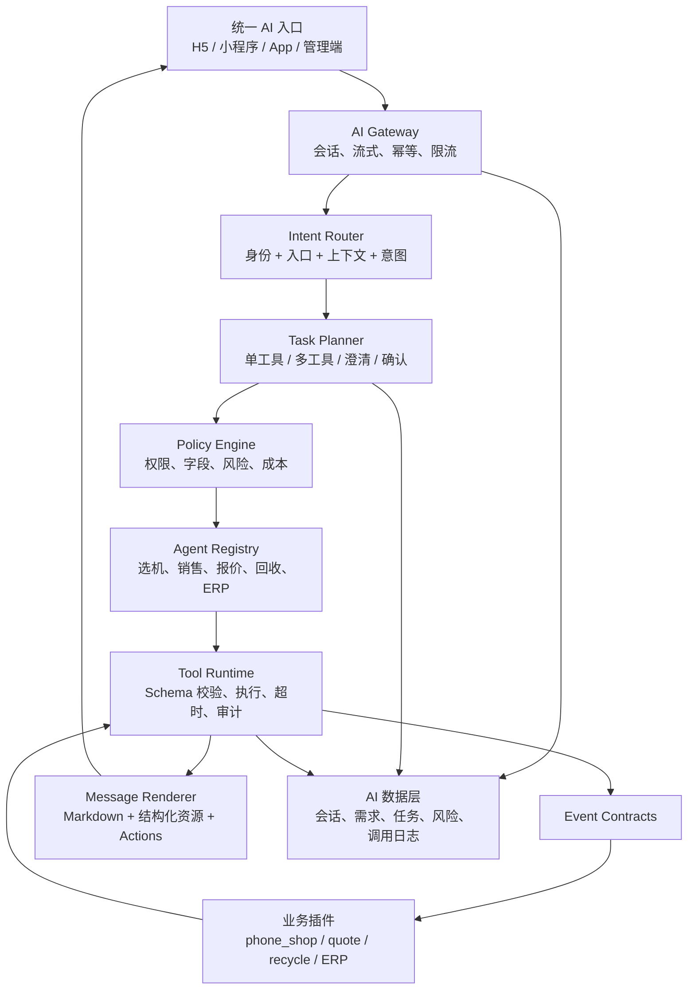

# hsx_ai AI 业务中台架构

## 1. 定位

`hsx_ai` 不是某一个页面里的聊天机器人，而是站点内统一的 AI 业务中台。它负责：

- 模型、语音和未来多模态 Provider 接入；
- 统一会话、消息、资源和用户需求沉淀；
- 身份识别、意图路由、智能体选择和任务编排；
- 插件能力发现、工具授权、参数校验和调用审计；
- 流式响应、Markdown 消息和结构化交互协议；
- 限流、风险识别、临时冻结和账户锁定联动；
- Token、成本、首字时间、工具成功率和业务转化观测。

AI 中台可以很重，但不能成为第二套 ERP 或商城数据库。商品、报价、订单、回收设备、财务和库存事实仍由各业务插件持有，AI 只通过事件契约取得当前身份有权访问的投影。

卸载或停用 `hsx_ai` 后，其他业务插件必须继续完成自己的核心流程。

## 2. 核心原则

1. **一个入口，多种能力**：用户面对一个店铺助手，系统在后台选择智能体和工具。
2. **身份先于意图**：站点、用户类型、角色和权限由服务端注入，模型无权声明或覆盖。
3. **事实属于业务插件**：AI 不跨插件查表，不保存可替代业务主数据的副本。
4. **计算先确定，解释后生成**：价格、库存、利润和权限由业务代码计算，模型负责理解和表达。
5. **结构化交互优先**：Markdown 负责正文，商品、按钮、表单、分页和跳转使用结构化消息块。
6. **读取默认开放，写入必须确认**：订阅、下单、修改和付款等操作必须二次确认并由业务服务校验幂等。
7. **模型输出不可信**：所有工具参数、链接、动作和结构化结果都必须经过服务端校验。
8. **只回答本站业务**：请求进入模型前做领域判断，工具执行前再次鉴权，最终输出还要执行内容策略检查。

## 3. 总体分层



## 4. 智能体、技能和工具

三个概念必须分开：

- **智能体 Agent**：面向某类用户目标的角色、提示词、允许技能和输出策略。例如选机助手、同行销售助手、回收助手。
- **技能 Skill**：用户可感知的能力，例如帮我选手机、写朋友圈、查报价、对比商品、到货提醒。
- **工具 Tool**：可审计的业务接口，例如查询商品、查询报价趋势、创建订阅。工具由插件实现，不直接暴露给用户。

用户默认不切换智能体。路由器根据入口和身份选择：

- 商城入口默认 `purchase`；
- 回收入口默认 `recycle`；
- 统一入口遇到“17 Pro Max 多少钱”这类歧义时，询问“想买还是想卖”；
- B 端同行进入销售助手，可使用建议售价和销售话术；
- 内部员工按角色获得成本、底价、库龄或财务工具。

新增智能体不会自动获得业务权限。它只能组合当前站点已启用、当前身份可见的技能和工具。

## 5. 插件事件契约

保留已有事件，并补齐以下契约：

| 事件 | 方向 | 作用 |
| --- | --- | --- |
| `HsxAiIntegrationRegistryRequested` | 业务 -> AI | 声明插件可接入能力 |
| `HsxAiAgentRegistryRequested` | 业务 -> AI | 注册领域智能体 |
| `HsxAiSkillRegistryRequested` | 业务 -> AI | 注册用户可感知技能和快捷入口 |
| `HsxAiToolRegistryRequested` | 业务 -> AI | 注册工具、Schema、权限和读写属性 |
| `HsxAiToolExecuteRequested` | AI -> 业务 | 执行已授权工具 |
| `HsxAiEntityResolveRequested` | AI -> 业务 | 根据自然语言解析本站真实实体候选 |
| `HsxAiActionRegistryRequested` | 业务 -> AI | 注册按钮动作及各端路由解析器 |
| `HsxAiDemandProjected` | AI -> 业务 | 投影已确认的结构化需求 |
| `HsxAiRiskActionRequested` | AI -> 框架/业务 | 请求临时冻结、人工复核或账户锁定 |

### 快捷能力契约

每个业务插件可以通过 `HsxAiSkillRegistryRequested` 返回一个列表，注册多个用户可感知入口。AI 核心仅负责按站点接入锁、场景和用户类型过滤并统一展示，不保存业务按钮配置。

```php
return [[
    'source_plugin' => 'business_plugin',
    'integration_key' => 'business_plugin',
    'key' => 'skill_key',
    'label' => '快捷入口',
    'icon' => 'search',
    'prompt' => '填入输入框的业务提示：',
    'submit_mode' => 'fill', // fill 或 send
    'scenes' => ['phone_shop.customer_assistant'],
    'audiences' => ['member'],
    'sort' => 100,
]];
```

插件未安装时事件监听不会装配；插件已安装但未在 AI“业务接入”中开启时，AI 核心会过滤其全部入口。

工具定义至少包含：

```json
{
  "key": "phone_shop.goods.search",
  "source_plugin": "phone_shop",
  "integration_key": "phone_shop",
  "scenes": ["phone_shop.customer_assistant"],
  "audiences": ["consumer", "trade_buyer"],
  "auth": "public",
  "permissions": [],
  "read_only": true,
  "timeout_ms": 3000,
  "input_schema": {},
  "output_schema": {}
}
```

`site_id`、用户 ID、角色、权限、IP 和渠道由服务端注入，模型提交同名字段必须被丢弃。

## 6. 意图路由和任务编排

一次请求按以下步骤处理：

1. 恢复会话、入口、身份、上一轮实体和待确认状态；
2. 领域守卫判断是否属于本站业务；
3. 从业务目录解析品牌、系列、型号、订单等实体；
4. 路由器输出 `intent + confidence + agent_key + candidate_tools`；
5. 低置信度时返回结构化候选，不执行商品或报价查询；
6. Planner 生成受限步骤，最多工具数、总耗时和写操作数均有上限；
7. Policy Engine 对每一步重新鉴权；
8. Tool Runtime 执行并固化摘要、耗时和结果哈希；
9. Composer 根据真实工具结果生成最终回答；
10. 异步提取需求、更新会话摘要和运营标签。

标准计划只允许：

```text
clarify -> resolve_entity -> read_tool(s) -> compose
clarify -> preview_write -> user_confirm -> write_tool -> compose
```

禁止模型生成任意循环。MVP 每轮最多 4 个工具步骤、1 个写操作，超过限制直接停止并提示用户缩小问题。

Provider 支持原生 function calling 时可以使用原生格式；不支持时由 JSON Planner 生成相同内部计划，后续执行链保持一致。

## 7. 身份和数据权限

AI 请求上下文必须包含：

```json
{
  "site_id": 100000,
  "actor": {
    "type": "guest|member|trade_buyer|staff|admin",
    "id": 0,
    "roles": [],
    "permissions": []
  },
  "entry": {
    "plugin": "phone_shop",
    "scene": "mall_home",
    "platform": "weapp"
  }
}
```

同一商品按身份投影不同字段：

- C 端：会员售价、成色、公开质检、服务；
- B 端同行：同行价、建议零售价、预估毛利空间、销售话术；
- 内部员工：在岗位权限允许时返回成本、底价、库龄和真实毛利；
- 完整 IMEI 只允许内部有权岗位或已购买该设备的会员查看，公开商城仅返回设备编号和脱敏 IMEI。

字段权限在业务插件内实现，不能仅依赖 System Prompt。

## 8. 会话、需求和跟进

“会话保存”不能继续使用前端数组，需要独立持久化。建议分期增加：

### 8.1 会话表 `ai_conversation`

- `conversation_id`、`site_id`、`actor_type`、`actor_id`；
- `entry_plugin`、`scene_key`、当前 `agent_key`；
- 标题、会话摘要、最后意图、最后消息时间；
- `status`：active/closed/archived/risk_locked；
- `create_at`、`update_at`。

### 8.2 消息表 `ai_message`

- `message_id`、`conversation_id`、`request_id`；
- `role`、`content_format`、最终正文；
- `blocks_json`、`resources_json`、`actions_json`；
- 模型、Token、首字耗时、总耗时；
- `status`、错误码、创建时间。

不保存模型私有推理过程。用户消息和最终回复按配置脱敏、加密或设置保留期限。

### 8.3 工具执行表 `ai_tool_run`

- 工具、插件、步骤、参数摘要和结果摘要；
- 权限决策、耗时、状态和错误；
- 写操作确认人、确认时间和业务幂等号。

### 8.4 需求表 `ai_demand`

每轮结束后异步提取，而不是阻塞首字输出：

```json
{
  "intent": "purchase",
  "customer_type": "trade_buyer",
  "entities": [{"type": "device_model", "id": 101, "name": "iPhone 17 Pro Max"}],
  "budget_min": 1800,
  "budget_max": 2300,
  "requirements": ["256G", "可接受外观瑕疵"],
  "urgency": "this_week",
  "lead_score": 72,
  "confidence": 0.91,
  "source_message_ids": [101, 102]
}
```

需求必须保留来源消息和置信度，后台允许人工修正。后续可形成客户需求时间线、待跟进列表、负责人和企业微信触达，但不能把一次闲聊直接认定为确定商机。

如果未来加入 AI 绘画，图片文件进入牛云附件系统，消息只保存文件 ID、用途、来源模型和安全审核结果。

## 9. 消息和渲染协议

前端不能解析模型生成的任意 HTML。消息由 Markdown 正文和结构化 Blocks 组成：

```json
{
  "content_format": "markdown",
  "content": "这台机器**价格优势明显**，但需要接受屏幕异常。",
  "blocks": [
    {"type": "product_list", "resource_ids": ["goods_4"]},
    {"type": "actions", "action_ids": ["view_goods", "write_moments", "copy_copywriting"]}
  ]
}
```

Markdown 开放标题、段落、加粗、列表、引用、行内代码、代码块和 GFM 表格。表格在窄屏中横向滚动。禁止原始 HTML、脚本、iframe、任意图片域名和内联事件。

结构化 Block 首期支持：

- `product_list`、`product_compare`、`entity_candidates`；
- 通用 `table`：列定义、行数据、对齐和列宽均由受控 JSON 描述；
- 通用 `chart`：支持折线图、柱状图、最多 6 个序列和 60 个类目；
- 领域 `quote_card`、`quote_aggregate`、`price_trend`；
- `copywriting`、`notice`、`progress`；
- `actions`、`confirm`、`load_more`。

Action 首期支持：

- `navigate`：服务端注册的内部路由；
- `copy`：复制服务端已确认内容；
- `send_prompt`：快捷继续提问；
- `load_more`：携带服务端游标翻页；
- `open_panel`：打开型号、对比或文案面板；
- `confirm_action`：确认后执行写工具。

模型只能引用 `action_id`，不能提交 URL。H5、小程序和 App 的实际路由由业务插件的 Action Resolver 返回。

业务插件优先输出通用 Block，不直接依赖 AI 页面组件。例如：

```json
{
  "type": "chart",
  "source_plugin": "hsx_performance",
  "data": {
    "chart_type": "line",
    "title": "近 7 日处理量",
    "categories": ["07/26", "07/27"],
    "series": [{"name": "质检", "data": [12, 18]}],
    "unit": "台"
  }
}
```

服务端 `AiBlockService` 统一限制类型、数量和 JSON 体积；终端由 `AiBlockRenderer` 的渲染器映射选择组件。新增业务报表通常只需输出 `table` 或 `chart`，不修改聊天页。

### 前端组件

统一抽象：

- `AiConversationShell`
- `AiMessageRenderer`
- `AiMarkdownContent`
- `AiResourceRenderer`
- `AiActionBar`
- `AiComposer`
- `AiSkillMenu`

交互组件优先使用 uView Plus 的 Button、Icon、Popup、Modal、Loading、Toast 和 Skeleton。动画只用于消息淡入、流式光标、录音波形、骨架屏和动作反馈，必须支持减少动态效果，并避免动画引起列表重新布局。

流式 Markdown 按 50-100ms 批量刷新，完成段落后再做完整解析；商品卡片和按钮不参与 Markdown 重排。

## 10. 商品推荐和分页

不能把全部库存塞给模型。业务服务先完成：

1. 硬筛选：站点、可见范围、库存、品牌、预算、内存；
2. 实体消歧：型号不明确时返回系列或型号候选；
3. 确定性评分：需求匹配、价格优势、成色、质检风险、服务和库龄；
4. 返回前 1-3 台及推荐依据；
5. 创建有过期时间的 `result_set_id + cursor`；
6. “换一批”继续读取下一页，不重新把整个库存交给模型。

价格建议必须比较同型号、同内存、相近成色和相近时间的数据。价格差异常大时先标记数据风险，再判断是否值得购买。

## 11. 安全与恶意攻击

安全链按请求前、工具前、输出后三层执行。

### 请求前

- API Token、站点和渠道校验；
- 会员/IP/设备指纹多维限流；
- Prompt 长度、消息数、音频时长和文件类型限制；
- 业务领域分类和 Prompt Injection 检测；
- 重复请求幂等、并发上限和站点预算熔断。

### 工具前

- 工具白名单、JSON Schema、角色和权限；
- 字段级 ACL、站点归属和对象归属复核；
- URL、文件和网络访问白名单，防止 SSRF；
- 写操作预览、二次确认和业务幂等；
- 工具超时、最大步骤和最大结果大小。

### 输出后

- 敏感字段和密钥泄露扫描；
- 禁止暴露 System Prompt、内部错误栈和模型私有推理；
- Markdown 和 Action 安全过滤；
- 商品事实来源和更新时间标记。

### 风险分级

| 等级 | 处理 |
| --- | --- |
| L1 | 当前请求拒绝、普通限流 |
| L2 | AI 能力临时冻结 5-30 分钟 |
| L3 | 站点后台风险告警，要求人工复核 |
| L4 | 高置信、多次重复攻击时联动会员或站点员工锁定 |

牛云已有会员 `MemberService::setStatus()` 和站点员工 `SiteUserService::lock()`。AI 风险中间件只提交风险动作，不直接越过框架服务改账号状态。自动锁定必须有可配置阈值、证据、操作日志和解锁入口；单次越狱提示或普通误问不能锁整个账户。

游客无法锁账户，只冻结站点下的 IP/设备指纹；代理和共享网络必须避免误伤。

## 12. 性能和稳定性

- SSE 支持心跳、取消、超时和断线提示；
- 用户发起新问题时可取消上一轮生成和语音播放；
- 首字输出与需求提取解耦，需求结构化进入队列；
- 工具调用并行只允许彼此无依赖的只读工具；
- 商品目录、公开机型知识和短期结果集使用站点级缓存；
- 上下文使用摘要和检索，不累计发送全部历史消息；
- TTS 按句切分、缓存并排队播放；
- Provider 失败按场景配置降级通道，不重复执行写工具；
- 每轮记录首字时间、总耗时、Token、工具耗时和失败阶段。

## 13. 后台能力

后台最终需要以下菜单，而不是继续堆在一个 Tab：

- 智能体：角色、适用身份、允许技能、提示词版本；
- 业务接入：插件通信锁和能力清单；
- 会话：按会员、意图、时间、状态查看；
- 客户需求：结构化需求、置信度、负责人和跟进状态；
- 任务：编排步骤、运行状态和人工确认；
- 风险中心：攻击证据、冻结、锁定和解锁；
- 模型与语音：Provider、模型和额度；
- 调用审计：Token、成本、性能和错误。

查看会话和需求本身也需要菜单权限，普通员工不能浏览所有客户对话。

## 14. 实施路径

### Phase 1：统一会话和前端协议

- 新增会话、消息和工具执行表；
- 会话创建、历史列表、消息分页和继续对话；
- 安全 Markdown、结构化资源和 Action Executor；
- 流式取消、心跳、错误状态和前端渲染性能；
- 基础限流、AI 临时冻结和风险日志。

### Phase 2：销售端闭环

- 商品实体识别和型号候选；
- 商品确定性排序、结果集和分页；
- 商品详情、复制、写朋友圈、对比和到货订阅技能；
- C 端与 B 端字段、价格和文案策略隔离；
- 销售需求结构化沉淀。

### Phase 3：通用路由和多插件工具

- Agent/Skill/Action 注册事件；
- Intent Router 和受限 Planner；
- 接入报价查询与价格趋势；
- 买/卖意图消歧和插件间只读编排。

### Phase 4：回收、订单和写操作

- 回收估价和预填下单；
- 当前会员订单、质检和售后查询；
- 订阅、下单等二次确认；
- 异步任务、队列重试和人工接管。

### Phase 5：知识库和经营智能体

- 标准机型知识、参数和资料版本；
- ERP、库存、财务和绩效只读工具；
- 管理端经营助手和分析报告；
- 评测集、Prompt 版本、灰度发布和效果对比。

每个 Phase 必须有契约测试、权限矩阵测试、越权测试、Prompt Injection 测试、性能基线和回滚方案。不能以“模型看起来能回答”作为验收标准。

## 15. 第一阶段验收标准

1. 同一会员刷新或更换设备后，可以继续自己的历史会话；
2. 其他会员、其他站点和无权限员工无法读取该会话；
3. Markdown 不执行 HTML/脚本，Action 不能跳转到未注册地址；
4. 商品卡片、复制、继续提问、加载更多和内部跳转都有明确反馈；
5. 中断、超时、Provider 失败和工具失败不会留下无限加载状态；
6. 恶意高频请求会先冻结 AI 能力，并在后台形成可追溯风险记录；
7. 后台可以看到会话时间线和结构化需求，但看不到模型私有推理；
8. AI 未安装、停用或业务接入锁关闭时，业务插件正常运行且入口隐藏。
