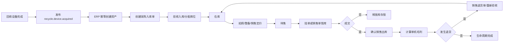

# 二手机 ERP 核心设计

## 1. 目标

建设独立插件 `hsx_erp`，打通设备从回收成交、资产入库、整备、定价、锁库、销售出库、售后回库到最终结算的完整链路。

系统必须支持：

- 一机一档：每台设备有稳定、唯一、可追溯的资产身份。
- 一机一价：每台设备独立记录采购成本、附加成本、目标售价、最低售价和实际成交价。
- 串号级库存：库存最小单位是设备，而不是型号 SKU 数量。
- 全程留痕：关键动作记录操作人、时间、业务对象、前后值和来源。
- 事件扩展：商城、外部 ERP、财务、通知和 KPI 模块通过事件接入。
- 异常可逆：已确认业务不直接删除，通过取消、红冲、反向单据或重新入库修正。

## 2. 现有系统结论

### 2.1 可以直接复用

`hsx_recycle` 已具备：

- 回收订单及设备级质检、报价、确认、打款和退回。
- `device_id`、IMEI、IMEI2、SN、机型、容量、颜色等设备信息。
- 质检人 `check_uid`、定价人 `price_uid`、打款人 `pay_uid`。
- 设备打款明细、成本调整明细和设备操作日志。
- `AfterDeviceCheckComplete` 等事件基础。

`hsx_device_asset` 已具备：

- 资产档案 `device_asset_item`。
- 图片、拍照任务、定价工单和操作日志。
- 回收设备导入、扫码入库、图片复检和销售定价。
- `asset_id` 作为回收之后的资产标识。

### 2.2 当前缺口

- 资产入库依赖人工导入，不是可靠、幂等的业务交接。
- `device_asset_item.status` 混合拍照、定价和导出进度，不适合作为 ERP 库存状态。
- 没有仓库、库位、库存批次、库存流水、锁库、调拨、盘点和出库单。
- 回收成本调整只提醒人工同步进销存，未形成统一成本台账。
- 操作日志缺少标准事件编号、业务单据、前后快照、请求幂等键和事件投递状态。
- 员工字段散落在业务表中，无法统一计算跨插件 KPI。
- 利润目前无法闭环，因为没有销售成交、销售退货和售后成本。

## 3. 插件职责边界

| 插件 | 负责 | 不负责 |
| --- | --- | --- |
| `hsx_recycle` | 收货、质检、回收报价、客户确认、回收付款、退回、代卖入口 | 库存账、销售出库、销售利润 |
| `hsx_device_asset` | 图片、视频、拍照任务、销售定价、商品资料 | 库存数量、库位、调拨、盘点、出入库账 |
| `hsx_erp` | 资产主档、仓库库位、库存流水、成本台账、锁库、调拨、盘点、销售单和出库 | 在线支付、完整商城展示、专业会计总账 |
| `shop` | 商品展示、客户下单、可选在线收款、订单前台 | 设备真实库存账和最终成本 |
| 财务模块 | 应收、应付、收付款、折账、费用、资金账户、红冲 | 设备物理库存 |
| KPI 模块 | 事件归因、规则、计分、奖金结算 | 修改业务事实 |

原则：ERP 是设备库存与成本的事实中心；商城只是销售渠道，回收只是入库来源。

同一台物理设备允许在不同插件中拥有各自的业务模型：

- `recycle_device` 是回收领域模型。
- `device_asset_item` 是拍照和销售定价工单领域模型。
- `erp_asset` 是库存、成本和销售履约领域模型。

这些模型不是互相覆盖的重复主档，而是同一设备在不同业务领域中的投影。每个业务事实只能有一个权威来源，其他插件通过来源 ID、事件和必要快照引用。

## 4. 核心领域模型

### 4.1 资产主档

`erp_asset` 表示一台真实设备，建立后不因退货、调拨或重新销售而更换。

关键字段：

- `id`、`asset_no`、`site_id`
- `source_type`、`source_id`、`source_device_id`
- `imei`、`imei2`、`sn`
- `category_id`、`brand_id`、`model_id`、`model_name`
- `capacity`、`color`
- `ownership_type`：自有、代卖、寄存
- `quality_grade`、`check_snapshot`
- `inventory_status`：待入库、在库、锁定、已出库、售后占用、已处置
- `warehouse_id`、`location_id`
- `stock_in_at`、`stock_out_at`
- `current_cost`、`current_sale_price`
- `version`：并发控制版本号

唯一约束建议：

- `(site_id, asset_no)` 唯一。
- 有值时，IMEI 用于匹配同一物理设备，但不能用“历史曾出现”作为禁止再次入库的理由。
- `(site_id, source_type, source_device_id)` 唯一，保证回收事件重复消费不会重复入库。

`hsx_device_asset` 的现有 `asset_id` 应作为迁移来源。最终建议只保留一个资产主档，不让设备资产插件和 ERP 各自维护一份“主档真相”。

#### 设备身份与业务周期

二手机的串号具有“物理身份唯一、业务可多次发生”的特点：

- 同一个 IMEI 通常对应同一台物理设备。
- 同一设备可以销售给客户 A，退货后销售给客户 B。
- 客户 B 以后也可能把它再次卖回，形成新的回收和库存周期。
- 每次回收、销售、退货都必须保留，不能覆盖上一段历史。

因此建议拆成两层：

| 模型 | 含义 |
| --- | --- |
| `erp_device_identity` | 物理设备身份，按 IMEI、IMEI2、SN 等识别 |
| `erp_asset_cycle` | 某次取得所有权后形成的库存经营周期 |

如果一期暂不拆表，也应在 `erp_asset` 外增加 `cycle_no` 或独立周期表，避免把“同一串号再次回收”误判为重复数据。

一次典型生命周期：

```text
物理设备 IMEI 001
  ├─ 周期 1：客户甲卖入 → 回收入库 → 销售给客户乙 → 销售退货 → 再销售给客户丙
  └─ 周期 2：客户丙再次卖入 → 新回收成本 → 新整备成本 → 销售给客户丁
```

销售退货通常仍属于原库存周期；设备被客户使用一段时间后重新卖回，则创建新的库存周期，并重新计算本周期成本和利润。

### 4.2 多维状态

不要使用一个总状态描述全部业务。至少拆分：

- `inventory_status`：物理库存状态。
- `quality_status`：质检/复检状态。
- `pricing_status`：销售定价状态。
- `listing_status`：商城或渠道上架状态。
- `sale_status`：待售、锁定、已售、退货中、已退。
- `finance_status`：待生成、待结算、部分结算、已结算。

总览页面可以计算“当前阶段”，但计算值不能代替各领域真实状态。

### 4.3 单据与流水

一期核心表：

| 表 | 作用 |
| --- | --- |
| `erp_asset` | 一机一档 |
| `erp_warehouse` | 仓库/门店 |
| `erp_location` | 库位 |
| `erp_stock_order` | 入库、出库、调拨、盘点、退货单头 |
| `erp_stock_order_item` | 单据设备明细 |
| `erp_stock_ledger` | 不可变库存流水 |
| `erp_stock_lock` | 挂单、销售单、商城订单的库存锁 |
| `erp_cost_ledger` | 不可变成本流水 |
| `erp_price_history` | 一机一价历史 |
| `erp_sale_order` | 线下、同行、商城统一销售单 |
| `erp_sale_order_item` | 销售设备明细 |
| `erp_operation_event` | 统一业务事件与操作审计 |
| `erp_outbox_event` | 跨插件可靠事件投递 |

`erp_asset.current_cost` 和当前库存状态是查询快照；真正的审计依据是 `erp_cost_ledger` 与 `erp_stock_ledger`。

## 5. 核心流程



### 5.1 入库

1. 回收设备满足“归商家所有”的条件后发布事件。
2. ERP 按 `source_type + source_device_id` 幂等消费。
3. 创建资产和采购入库草稿，保存回收价、质检快照及来源人员。
4. 仓库人员扫码验收、确认 IMEI/SN、选择仓库和库位。
5. 确认后写库存流水和初始成本流水。

回收完成不一定等于物理入库。必须区分：

- 所有权生效时间。
- 物理验收入库时间。
- 可销售时间。

### 5.2 成本

单机当前成本：

```text
采购成本
+ 维修/配件成本
+ 检测查询成本
+ 物流及包装分摊
+ 平台或支付手续费分摊
+ 其他可归属成本
- 成本冲回
= 当前成本
```

其中采购成本来源于 `recycle_device` 的回收成交结果；维修、换壳、换屏、配件、人工、检测、物流等整备成本在 ERP 中继续追加。ERP 不回写回收成交价，而是把全部成本汇总为设备的当前总成本。

每次调整必须写 `erp_cost_ledger`，包含：

- 调整类型和金额。
- 调整前、调整后成本。
- 来源单据和业务事件。
- 操作人、审核人、原因和凭证。
- 是否影响已结算利润。

已销售设备发生后补成本时，不修改历史成交事实，而是产生利润调整记录。

整备建议采用工单管理：

- `erp_refurbish_order`：整备/维修工单。
- `erp_refurbish_item`：维修项目、配件和服务明细。
- `erp_refurbish_log`：领取、检测、维修、复检、完成和返工日志。
- 工单确认完成后，按规则生成一笔或多笔 `erp_cost_ledger`。
- 整备期间资产可进入整备区或维修区，并禁止普通销售锁定。

### 5.3 定价与价格历史

价格需要区分三类事实：

- 工单建议价：由 `hsx_device_asset` 定价工单产生，包括建议销售价、同行价和最低价。
- 渠道展示价：由 Shop 或其他销售渠道维护，用于前台展示和促销。
- 实际成交价：由 ERP 销售单确认，是利润计算的收入依据。

调价日志不建议只保存在 Shop。Shop 可以保存自己的渠道调价记录，但 ERP 应接收标准价格事件并记录统一的 `erp_price_history`，否则线下调价、同行价和多渠道价格无法形成完整时间线。

价格事件至少包括：

- `asset.price.suggested`
- `shop.product.price_changed`
- `erp.sale.price_overridden`
- `erp.asset.min_price_changed`

每条价格历史记录应包含资产、渠道、价格类型、调整前后金额、操作人、原因、审核人和生效时间。

### 5.4 锁库、挂单与双扫码

挂单本质上是有有效期的库存锁，不是出库。

- 同一资产同一时刻只能有一个有效锁。
- 锁必须记录来源：收银挂单、同行报价、商城订单、人工保留。
- 支持过期自动释放、人工释放和转销售单。
- 确认出库时校验锁归属和资产版本，防止重复销售。

线上是否收款应做成销售渠道配置：

- `payment_mode = online_required`：支付后确认销售。
- `payment_mode = offline_confirm`：线下收款后人工确认。
- `payment_mode = account_credit`：挂账出库并生成应收事件。

三种模式最终都落到同一个 ERP 销售单和库存出库流程。

门店双扫码建议采用以下流程：

1. 扫描客户码，解析统一往来单位或会员身份。
2. 扫描设备条码，定位 `erp_asset`。
3. 校验设备在库、可售、未被其他订单锁定。
4. 创建销售草稿或挂单，同时创建 `erp_stock_lock`。
5. 发布 `erp.asset.locked`，通知 Shop 隐藏、下架或显示已预订。
6. 收款、挂账或折账确认后生成正式销售单并出库。
7. 交易取消或超时则释放锁，并通知 Shop 恢复销售。

“客户拿走机器”和“扫码关联客户”不能视为同一个动作。扫码关联只代表预占；必须有明确的“确认交付/确认出库”动作，才能写出库流水并认定销售完成。

客户码不应只绑定普通会员 ID。建议引用统一往来单位 `party_id`，因为同行或客户可能同时向商家供货和拿货，需要在财务中同时存在应收与应付并进行折账。

### 5.5 退货与售后

- 未出库取消：释放锁，不产生库存反向流水。
- 已出库退货：创建销售退货单，写反向库存流水。
- 退回设备必须重新验收，可进入原库位、维修区、隔离区或报废区。
- 退款、折账和应收冲销由财务模块处理，ERP 只发布业务事件。
- 同一设备再次销售沿用原资产档案，生成新的销售单和价格历史。

### 5.6 利润确认

利润至少分为两个口径：

- 预计利润：当前建议售价或渠道展示价减当前总成本，仅用于经营预测。
- 已实现利润：销售确认后，实际成交净额减确认成本和销售直接费用。

因此，“只有销售出去之后才形成已实现利润”是正确的。但销售前仍应展示预计毛利，帮助定价、最低价控制和库存经营。

销售退货后，原已实现利润需要冲回；后续重新销售再形成新一笔已实现利润。已销售后补录成本则生成利润调整，保留原成交和调整轨迹。

## 6. 事件设计

### 6.1 事件信封

所有跨插件事件统一包含：

```json
{
  "event_id": "全局唯一ID",
  "event_name": "erp.asset.stocked",
  "event_version": 1,
  "site_id": 1,
  "occurred_at": 1710000000,
  "aggregate_type": "asset",
  "aggregate_id": 10001,
  "operator": {
    "type": "staff",
    "id": 12,
    "name": "张三"
  },
  "source": {
    "plugin": "hsx_erp",
    "document_type": "stock_in",
    "document_id": 501
  },
  "payload": {}
}
```

### 6.2 关键事件

回收插件发布：

- `recycle.device.checked`
- `recycle.device.price_confirmed`
- `recycle.device.acquired`
- `recycle.device.cost_adjusted`
- `recycle.device.returned`

资产插件发布：

- `asset.photo.completed`
- `asset.price.completed`
- `asset.listing.ready`

ERP 发布：

- `erp.asset.created`
- `erp.asset.stocked`
- `erp.asset.location_changed`
- `erp.asset.cost_changed`
- `erp.asset.locked`
- `erp.asset.lock_released`
- `erp.sale.created`
- `erp.sale.completed`
- `erp.asset.stocked_out`
- `erp.sale.returned`

事件发布必须采用本地事务 + Outbox。业务表提交时同时写 `erp_outbox_event`，后台任务负责投递、重试和记录消费结果，不能在事务中直接调用外部 ERP 或商城。

## 7. 操作日志与 KPI

普通文本日志不足以计算 KPI。`erp_operation_event` 至少记录：

- `event_id`、`event_name`、`event_version`
- `asset_id`、`document_type`、`document_id`
- `stage`：收货、质检、定价、拍照、入库、销售、财务等
- `action`
- `operator_type`、`operator_id`、`operator_name`
- `assigned_operator_id`：任务承接人
- `started_at`、`completed_at`、`duration_seconds`
- `before_snapshot`、`after_snapshot`
- `result`、`exception_code`
- `source_plugin`、`source_ip`

KPI 模块只消费事实事件，不直接依赖某张业务表的当前值。这样规则改变时可以重算。

首批 KPI：

- 收货到质检开始时长。
- 质检处理时长、数量、退回率、复检率。
- 质检完成到定价完成时长。
- 拍照完成量、返工率。
- 入库验收数量、差错率。
- 销售设备数、销售额、单机毛利、毛利率。
- 挂单转化率和超时释放率。
- 退货率、售后损失。

奖金结算需要保存“规则版本 + 事件明细 + 计算结果”，结算后不能因规则修改而悄悄变化。

### 7.1 角色职责与交接

系统不仅记录“谁操作了”，还要记录“当前由谁负责、下一步交给谁、超时找谁”。

建议每个工单或业务任务包含：

- `owner_role`、`owner_uid`：当前责任角色和责任人。
- `upstream_role`、`upstream_uid`：上游交接人。
- `next_role`：正常完成后的下一责任角色。
- `status`：待领取、处理中、待沟通、待审核、已完成、异常。
- `accepted_at`、`completed_at`、`due_at`。
- `handover_note`：交接说明。
- `communication_target_type`、`communication_target_id`：需要沟通的客户、往来单位或内部人员。

职责示例：

| 角色 | 主要职责 | 主要沟通对象 | 交付结果 |
| --- | --- | --- | --- |
| 回收人员 | 接单、收货、确认来源 | 卖家客户 | 可质检设备 |
| 质检人员 | 检测、评级、异常说明 | 回收人员、定价人员 | 质检报告 |
| 整备人员 | 维修、换件、复检 | 仓库、质检、采购 | 整备完成设备及成本 |
| 定价人员 | 建议售价和最低价 | 销售、负责人 | 定价结果 |
| 仓库人员 | 入库、库位、锁库、出库 | 销售、整备、财务 | 库存交付事实 |
| 销售人员 | 客户沟通、报价、挂单、成交、授权范围内代收现结款 | 买家客户 | 销售单、交付确认和收款提交 |
| 财务人员 | 收付款复核、入账、催账、折账、核销和差异处理 | 往来单位、销售 | 财务确认和结算结果 |
| 主管 | 异常、低价、调账和高风险审核 | 各责任角色 | 审核结论 |

销售负责业务沟通，也可以在授权范围内直接收取现金、微信、支付宝等现结款；财务可以针对已形成的应收应付直接联系客户。系统应区分销售跟进记录、销售代收记录和财务催收/付款记录，并让双方看到必要的上下文。

销售代收款需要记录：

- 收款人、收款时间和收款门店。
- 收款方式、金额和资金账户。
- 关联销售单、客户和设备。
- 交易单号、凭证图片和备注。
- 财务状态：待复核、已确认、已驳回、存在差异。

收款权限应支持配置：

- 销售只提交，财务复核后入账。
- 小额现结自动确认，超过金额阈值需要财务复核。
- 指定销售角色可直接确认到指定收款账户。

无论由销售还是财务收款，都应生成统一收款单和资金流水，不能把销售单上的“已付款”字段当作财务流水。

### 7.2 串号关联人与时间线

设备详情需要提供“关联人”和“完整时间线”两个视图。

关联人列表按设备身份聚合，展示：

- 客户/往来单位。
- 关系类型：卖入人、买受人、退货人、代卖委托人、收款方、付款方。
- 关联业务：回收单、销售单、退货单、应收单、应付单。
- 首次关联时间、最近关联时间、关联次数。
- 当前是否仍有未结清账款或进行中业务。

同一个客户可能与同一设备存在多种关系，前端允许选择某个客户后，只查看该客户与设备相关的记录。

时间线按 `occurred_at` 倒序或正序切换，至少包含：

- 回收创建、收货、质检、回收成交。
- 入库、移库、锁库、释放。
- 整备、维修、换件和成本变化。
- 定价、调价、上架和下架。
- 客户扫码关联、销售、交付和出库。
- 收款、付款、挂账、折账和催收。
- 退货、退款、重新入库和再次销售。

时间线记录必须引用 `device_identity_id`、`asset_cycle_id`、客户/往来单位和业务单据，才能跨多个插件还原同一串号的全部历史。

## 8. 指标口径

### 8.1 单机指标

- 在库时长：`首次确认入库时间` 到 `销售出库时间`；未售设备计算到当前时间。
- 总生命周期：`回收订单创建时间` 到 `最终销售完成时间`。
- 单机毛利：`不含税成交净额 - 当前确认成本 - 销售直接费用`。
- 毛利率：`单机毛利 / 不含税成交净额`。
- 成本利润率：`单机毛利 / 当前确认成本`。
- 调价次数：有效销售定价变更次数。
- 库位移动次数：已确认调拨和移库次数。

用户所说的“利润比”需要在产品中明确命名，避免与毛利率混用。建议同时展示“毛利率”和“成本利润率”。

### 8.2 周转指标

- 库存周转次数：`统计期销售成本 / 统计期平均库存成本`。
- 库存周转天数：`统计期天数 / 库存周转次数`。
- 售罄率：`统计期售出设备数 / (期初库存数 + 期间入库数)`。
- 库龄分层：0-3 天、4-7 天、8-15 天、16-30 天、31-60 天、60 天以上。

平均库存成本需要日快照或可回放库存流水，不能用当前库存成本代替历史平均值。

## 9. 必须覆盖的异常

- 重复回收完成事件导致重复资产。
- IMEI/SN 冲突、空串号、串号后补或纠正。
- 已入库后回收侧再次改价。
- 无库位入库、错库位、跨店调拨在途。
- 同一设备被多个销售渠道同时锁定。
- 挂单超时、取消、换机和部分成交。
- 销售已收款但库存出库失败，或已出库但收款确认失败。
- 已销售后追加维修成本。
- 销售退货后设备品相变化和重新定价。
- 盘盈设备无来源、盘亏设备已被锁定。
- 外部 ERP/商城事件重复、乱序、超时和永久失败。
- 员工离职、账号合并后历史 KPI 仍可追溯。
- 已确认单据误操作，只允许反向单据，不允许物理删除。

## 10. 权限与审核

高风险动作独立授权：

- 修改串号。
- 成本调整。
- 低于最低价销售。
- 强制释放他人库存锁。
- 反审核入库/出库。
- 盘盈盘亏确认。
- 销售退货确认。
- 修改已结算归因人员。
- 重投或忽略失败事件。

建议按金额、毛利率和动作类型配置审核规则，而不是写死单一审批流。

## 11. 分期路线

### Phase 0：统一资产身份与事件契约

- 确认 `hsx_device_asset` 是否升级为资产中心，或迁移后由 `hsx_erp` 持有资产主档。
- 增加回收完成、成本调整事件。
- 建立事件信封、Outbox、幂等消费和事件日志。
- 清理“人工导入才入库”的临时边界。

### Phase 1：进销存 MVP

- 仓库、库位、资产主档。
- 采购入库、其他入库、销售出库、其他出库。
- 库存流水、成本流水、库存锁。
- 扫码入库、移库、出库。
- 单机档案和完整操作时间线。
- 库存列表、库龄和成本汇总。

### Phase 2：线下销售

- 客户/往来单位引用。
- 统一销售单、挂单、折扣、最低价控制。
- 现金/线下确认/挂账三种结算配置。
- 退货回库。
- 单机毛利和销售人员 KPI。

### Phase 3：库存治理

- 调拨、盘点、盘盈盘亏。
- 维修/整备工单及成本归集。
- 多门店、多仓库和在途库存。
- 库龄预警、滞销预警和自动调价建议。

### Phase 4：商城与财务

- Shop 商品与 ERP 资产一对一绑定。
- 商城下单锁库、取消释放、成交出库。
- 应收、应付、收付款、折账和费用事件。
- 外部 ERP 适配器和失败补偿后台。

### Phase 5：KPI 与经营分析

- KPI 规则版本、计分、复核和奖金结算。
- 员工、门店、渠道、批次和单机利润。
- 周转率、库存结构、退货率和资金占用分析。

## 12. 下一步实施建议

第一步不应直接开发 Shop，也不应先做复杂财务。建议先完成：

1. 决定资产主档归属，消除 `recycle_device` 与 `device_asset_item` 的双主档风险。
2. 定义回收成交进入 ERP 的准确业务条件。
3. 创建 `hsx_erp` 插件骨架和 Phase 1 数据库迁移。
4. 打通 `recycle.device.acquired -> ERP 入库草稿 -> 仓库确认入库`。
5. 用一台设备完整验证入库、成本调整、锁库、出库、退货和时间线。

这条最小闭环跑通后，再接 Shop，销售渠道只需要调用锁库和销售确认接口，不再自行维护库存。
