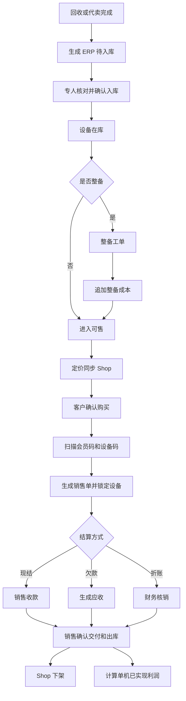

# 二手机 ERP 实施蓝图

## 1. 一句话目标

让一台机器只录入一次，就能完成：

```text
回收/代卖 → 入库 → 整备/成本 → 定价/上架 → 销售 → 收款或欠款 → 出库 → 利润与经营分析
```

员工在一个系统完成工作，管理者能从每个结果追到设备、客户、单据和操作人。

## 2. 系统定位

新建独立插件 `hsx_erp`。

| 系统 | 核心职责 |
| --- | --- |
| `hsx_recycle` | 回收接单、质检、回收报价、卖家确认、回收付款、代卖 |
| `hsx_device_asset` | 拍照、图片复检、建议销售定价、上架资料 |
| `hsx_erp` | 串号库存、成本、销售履约、基础往来账、利润和经营分析 |
| Shop | 商品展示、客户看货、线上订单入口 |
| 博远 ERP | 过渡期外部 ERP，通过接口或 Excel 同步 |

同一台设备允许在三个插件各有业务模型：

- `recycle_device`：回收领域记录。
- `device_asset_item`：拍照定价工单记录。
- `erp_asset`：库存经营记录。

插件之间只通过来源 ID 和事件同步，不互相修改核心业务表。

## 3. 第一版必须跑通的闭环



客户在门店挑选多台设备不进入系统。只有明确购买后才扫码、锁定并生成销售单。

## 4. 第一版模块

### 4.1 工作台

不同角色只看自己的任务：

- 管理员：经营数据、异常和待审核。
- 入库人员：待入库、同步失败、串号冲突。
- 销售：库存查询、快速开单、待交付、我的客户欠款。
- 财务：待复核收款、应收、应付、折账、收付款差异。
- 整备人员：待整备、处理中、待复检。

### 4.2 串号库存

- 按 IMEI、IMEI2、SN、型号、客户、单号查询。
- 查看当前状态、库存周期、成本、售价、库位和负责人。
- 查看历史回收、销售、退货、再次回收。
- 查看关联客户和完整时间线。
- 支持期初库存导入。

### 4.3 入库

- 回收设备和代卖设备自动进入待入库池。
- Excel 批量导入和扫码确认。
- 记录来源、初始成本、所有权类型、入库人和时间。
- 支持同步博远并记录结果。
- 同一来源设备幂等，不能重复入库。

### 4.4 整备

- 发起整备、指派人员、填写项目和金额。
- 整备期间暂停销售。
- 完成后自动追加成本。
- 支持返工和复检。

一期可以只管理整备费用，不做完整配件库存。

### 4.5 销售

- 扫描会员码。
- 扫描最终购买设备码。
- 自动带出设备资料、建议价、最低价和客户余额。
- 输入实际成交价。
- 生成销售单并锁定库存。
- 现结、欠款、折账。
- 销售确认交付并出库。

### 4.6 基础财务

第一版只做经营所需的往来账，不做专业会计总账：

- 往来单位。
- 应收和应付。
- 收款和付款。
- 部分收付。
- 折账核销。
- 销售代收交接。
- 资金账户。
- 客户对账单。

### 4.7 经营分析

- 今日入库、销售、收款、付款和已实现毛利。
- 当前库存数量、成本金额和库龄。
- 单机预计利润与已实现利润。
- 应收、应付和逾期欠款。
- 客户贡献、销售贡献和员工处理量。
- 异常中心。

## 5. 核心数据模型

### 5.1 设备与库存

| 表 | 用途 |
| --- | --- |
| `erp_device_identity` | 物理设备身份，关联 IMEI/IMEI2/SN |
| `erp_asset_cycle` | 每次重新取得设备后的经营周期 |
| `erp_asset` | 当前库存经营快照 |
| `erp_warehouse` | 门店或仓库 |
| `erp_location` | 库位 |
| `erp_stock_order` | 入库、出库、退货、移库、盘点单 |
| `erp_stock_order_item` | 设备明细 |
| `erp_stock_ledger` | 不可变库存流水 |
| `erp_stock_lock` | 销售单或 Shop 订单锁库 |

设备状态建议：

```text
pending_in     待入库
in_stock      在库
refurbishing  整备中
saleable      可售
locked        已锁定
stocked_out   已出库
after_sale    售后中
disposed      已处置
```

### 5.2 成本与价格

| 表 | 用途 |
| --- | --- |
| `erp_cost_ledger` | 回收、整备、物流等成本流水 |
| `erp_refurbish_order` | 整备工单 |
| `erp_refurbish_item` | 整备项目和费用 |
| `erp_price_history` | 建议价、Shop 展示价、最低价、成交价历史 |

成本计算：

```text
当前总成本
= 回收成本
+ 整备成本
+ 可归属费用
- 成本冲回
```

### 5.3 销售与客户

| 表 | 用途 |
| --- | --- |
| `erp_party` | 统一客户、同行、供应方 |
| `erp_party_member_rel` | 往来单位与会员关系 |
| `erp_sale_order` | 销售单 |
| `erp_sale_order_item` | 销售设备及成交价 |
| `erp_sale_return` | 销售退货 |
| `erp_device_party_rel` | 设备和历史客户关系 |

销售单状态：

```text
draft → pending_settlement → pending_delivery → completed
                         ↘ cancelled
completed → returned/partially_returned
```

### 5.4 基础财务

| 表 | 用途 |
| --- | --- |
| `erp_receivable` | 应收 |
| `erp_payable` | 应付 |
| `erp_receipt` | 收款 |
| `erp_payment` | 付款 |
| `erp_settlement` | 核销和折账单 |
| `erp_settlement_item` | 参与核销的应收应付明细 |
| `erp_fund_account` | 现金、微信、支付宝、银行等账户 |
| `erp_fund_ledger` | 不可变资金流水 |

业务单、应收应付和实际收付款必须分开。销售显示“客户已付款”不等于财务已经确认公司到账。

### 5.5 追踪与集成

| 表 | 用途 |
| --- | --- |
| `erp_operation_event` | 员工操作、责任归属、KPI 事实 |
| `erp_outbox_event` | 可靠发布跨插件事件 |
| `erp_inbox_event` | 幂等消费事件 |
| `erp_external_sync` | 博远、Shop 等外部同步记录 |
| `erp_import_batch` | 期初或 Excel 导入批次 |

## 6. 核心规则

### 6.1 串号

- IMEI 用于识别同一物理设备。
- 历史出现过的串号允许再次回收。
- 销售退货继续原库存周期。
- 客户使用后重新卖回，开启新库存周期。
- 同一时刻不允许同一物理设备存在两条有效在库记录。

### 6.2 库存

- 只有确认后的库存单才影响库存。
- 同一设备只能存在一个有效销售锁。
- 出库必须关联销售单或明确的其他出库原因。
- 已出库设备不能再次出库。
- 销售退货使用反向库存流水，不删除原出库记录。

### 6.3 财务

- 所有金额使用 `DECIMAL`。
- 收款、付款、折账必须产生独立单据和流水。
- 已确认财务单据不能直接删除或修改金额。
- 错误通过取消、冲正或反向单据处理。
- 应收、应付余额必须能由流水重新计算。

### 6.4 利润

- 销售前：展示预计利润。
- 确认出库后：生成已实现利润。
- 销售退货：冲回原利润。
- 销售后补录成本：生成利润调整，不覆盖原成交记录。

## 7. 插件事件

### 回收插件发出

- `recycle.device.acquired`
- `recycle.device.consigned`
- `recycle.device.cost_adjusted`
- `recycle.device.returned`

### 设备资产插件发出

- `asset.photo.completed`
- `asset.price.completed`
- `asset.listing.ready`

### ERP 发出

- `erp.asset.stocked`
- `erp.asset.cost_changed`
- `erp.asset.locked`
- `erp.asset.lock_released`
- `erp.sale.created`
- `erp.sale.completed`
- `erp.asset.stocked_out`
- `erp.sale.returned`
- `erp.receivable.created`
- `erp.receipt.confirmed`

Shop 监听锁定、释放、出库事件，完成隐藏、恢复和下架。

## 8. 博远过渡方案

### 当前阶段

- 回收/代卖设备继续支持 Excel 导出。
- 增加入库接口适配器。
- 接收博远销售出库通知，并在本系统下架。
- 所有接口调用保存请求、响应、串号、重试和最终状态。

### 双轨阶段

- 新系统是唯一业务录入源。
- 自动同步博远。
- 每日核对入库、出库、成本和串号。
- 接口失败进入异常中心，不阻断新系统正常工作。

### 最终阶段

- `hsx_erp` 为主。
- 博远成为可关闭的外部适配器。

## 9. 旧数据迁移

迁移当前有效数据：

- 当前库存。
- 未完成业务。
- 客户和往来单位。
- 未结应收应付。
- 资金账户期初余额。

不强制迁移全部已结清历史。

上线步骤：

```text
确定切换时间
→ 闭店盘点
→ 导出博远有效数据
→ 清洗串号和客户
→ 导入期初单
→ 核对库存和余额
→ 锁定期初
→ 新业务只进入新系统
→ 博远只读或自动同步
```

## 10. 页面清单

### 第一批

1. ERP 工作台。
2. 待入库设备。
3. 库存列表。
4. 串号详情和时间线。
5. 整备工单。
6. 快速销售开单。
7. 销售单列表与详情。
8. 应收应付。
9. 收款付款。
10. 折账核销。
11. 经营总览。
12. 外部同步与异常中心。

### 配置

- 仓库和库位。
- 锁定有效期。
- 最低价和低价权限。
- 欠款额度和账期。
- 销售收款权限。
- 资金账户。
- 博远接口。
- Shop 联动。

## 11. 开发顺序

### Sprint 0：插件骨架与基础约束

- 创建 `hsx_erp`。
- 数据库表和状态字典。
- 统一单号、金额、事务和操作日志组件。
- Outbox/Inbox 和外部同步日志。

### Sprint 1：入库与串号库存

- 消费回收/代卖完成事件。
- 待入库、确认入库、期初导入。
- 库存列表、串号详情、库存流水。
- 博远入库 Excel 和接口适配。

### Sprint 2：销售和出库

- 往来单位与会员关联。
- 会员码、设备码快速开单。
- 设备锁定、成交、销售出库。
- Shop 隐藏、恢复和下架事件。

### Sprint 3：基础财务

- 现结收款。
- 欠款生成应收。
- 回收付款生成应付引用。
- 收付款、部分核销和折账。
- 销售代收交接。

### Sprint 4：整备与利润

- 整备工单和成本追加。
- 预计利润、已实现利润和利润调整。
- 销售退货与利润冲回。

### Sprint 5：经营与上线

- 经营看板、库龄、欠款账龄和异常中心。
- 数据迁移工具。
- 双轨对账。
- 权限、压力测试和恢复演练。

## 12. 第一版验收标准

使用真实业务模拟以下场景：

1. 一台回收设备只生成一条待入库记录。
2. 确认入库后能按 IMEI 查询库存和回收来源。
3. 整备增加 100 元后，总成本准确增加 100 元。
4. 销售扫码现结，生成销售单、收款单和出库流水。
5. 销售欠款，设备可以按权限出库并形成应收。
6. 同一设备不能被两张销售单同时锁定或重复出库。
7. 折账后应收应付余额准确。
8. 退货后设备回库，原利润被冲回。
9. 同一串号再次回收时创建新周期，历史不丢失。
10. Shop 或博远接口重复通知不会重复出库或下架。
11. 任意金额和库存变化都能追溯到单据和操作人。
12. 老库存通过期初单导入，不计入当天新回收数据。

## 13. 当前待确认事项

这些问题不阻止 Sprint 0 和 Sprint 1 开始，但应在对应模块开发前确认：

1. 回收成交、回收付款、还是人工确认后进入待入库？
2. 代卖设备在 ERP 中是否计库存数量，是否计商家成本？
3. 整备费用由谁填写，多少金额需要审核？
4. 欠款销售的额度和审批规则。
5. 销售代收款哪些方式可以自动确认到账？
6. 折账是否只允许财务操作？
7. 退货验机由销售、质检还是专人负责？
8. 博远接口的字段、鉴权、重试和通知协议。

