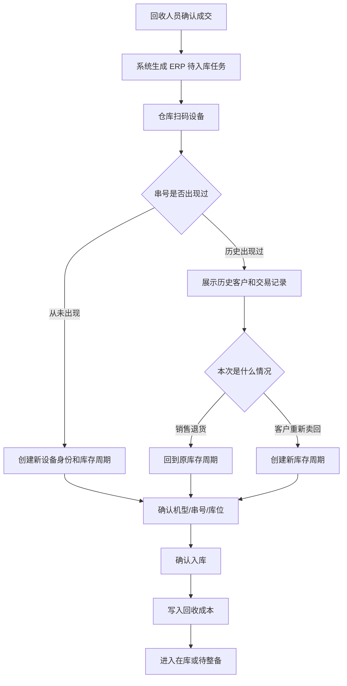
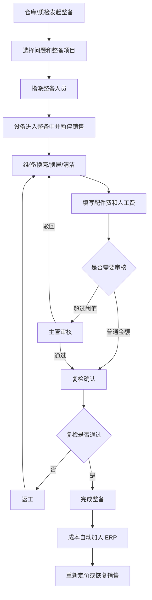
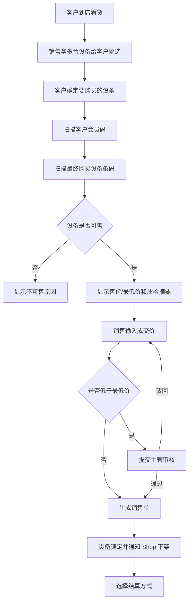
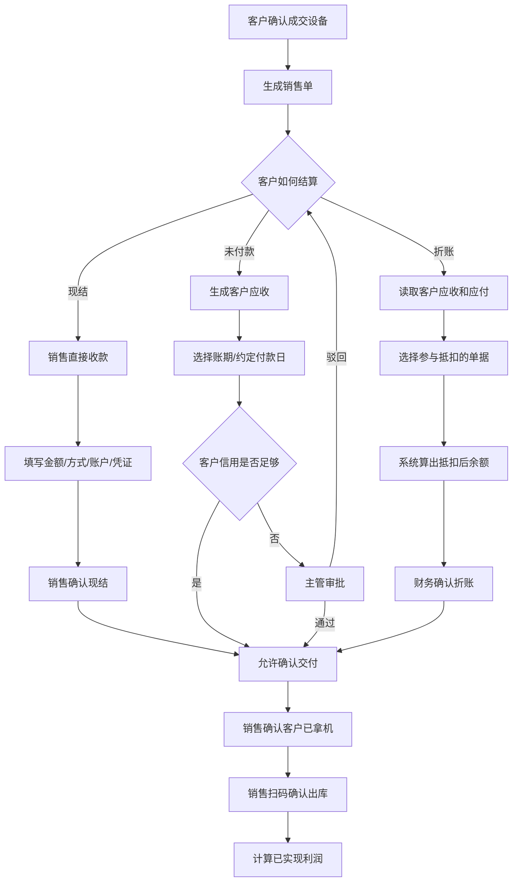
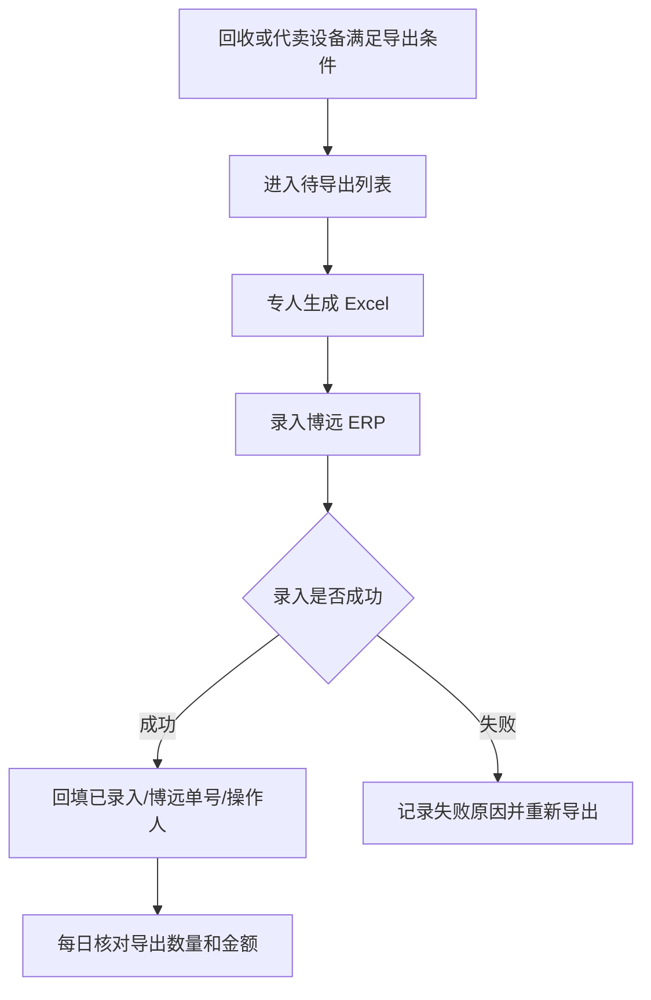
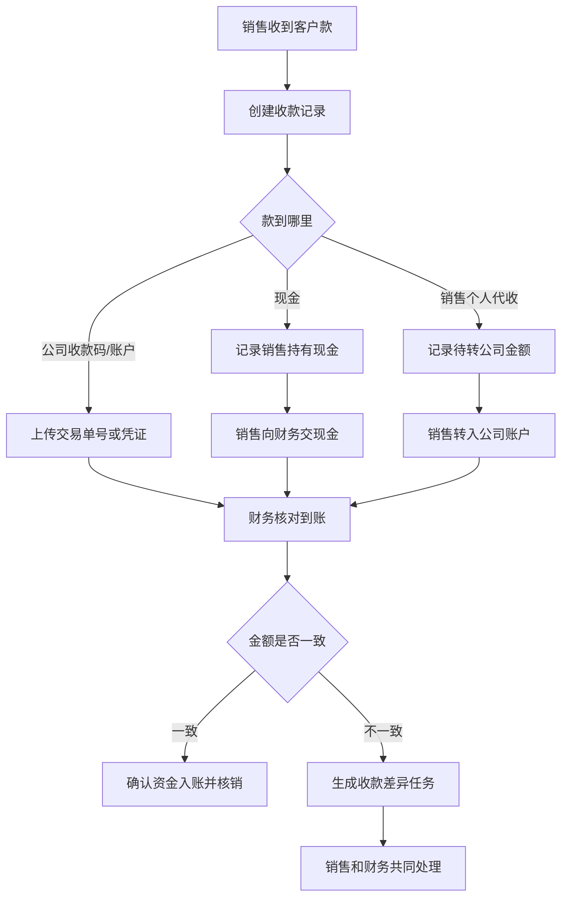
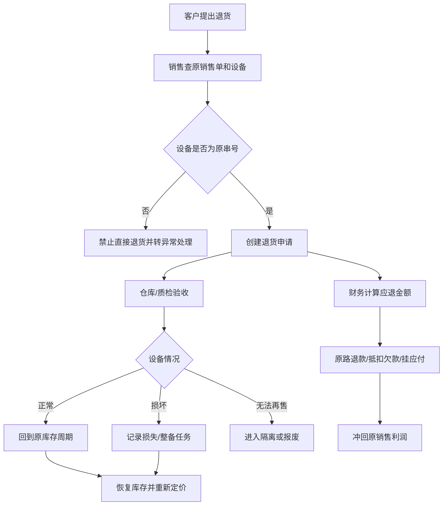
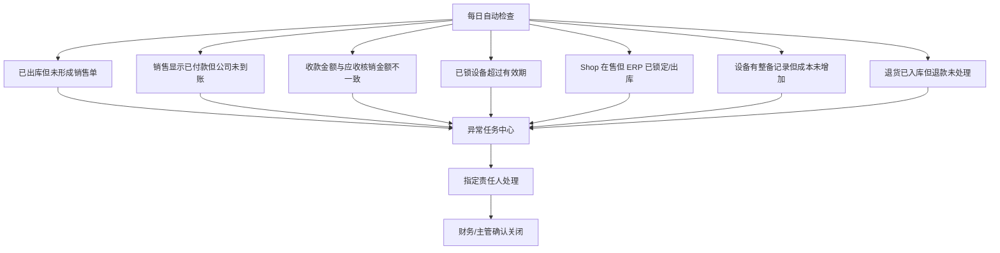
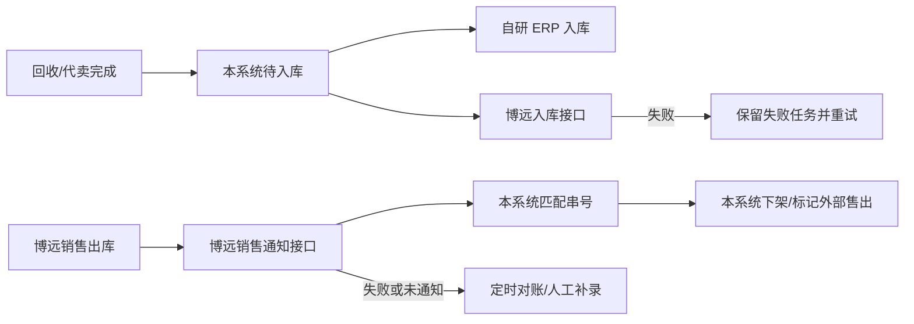
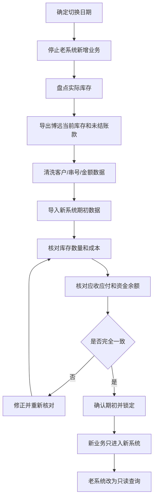

# 二手机 ERP 门店实操流程讨论稿

这份文档用于销售、仓库、财务、质检、整备和老板一起确认实际工作方式。先确认流程，再决定页面和权限。

## 1. 员工每天看到什么

系统首页不按插件划分，而是按“我的工作”划分：

| 角色 | 工作台 |
| --- | --- |
| 回收 | 待收货、待联系客户、价格待确认、待付款 |
| 质检 | 待领取、质检中、被退回、即将超时 |
| 整备 | 待维修、待配件、待复检、返工 |
| 仓库 | 待入库、待移库、已锁待交付、待退货验收 |
| 定价 | 待定价、待调价、低价待审核 |
| 销售 | 可售库存、我的挂单、待收款、待交付、客户欠款 |
| 财务 | 待复核收款、待付款、待核销、折账申请、差异单 |
| 老板 | 今日进销存、资金、毛利、库龄和异常 |

每个任务必须显示：

- 当前该谁处理。
- 已经等了多久。
- 上一步是谁完成的。
- 需要联系哪个客户或同事。
- 下一步交给谁。

## 2. 回收进入 ERP



需要协商：

1. 回收人员确认成交后，是自动生成待入库，还是付款后生成？
2. 仓库是否必须再次核对 IMEI、机型和数量？
3. 没有 IMEI 或串号错误时，谁有权放行？
4. 客户重新卖回时，历史交易是否需要提示风险？

推荐：回收成交后生成待入库，仓库扫码确认后才算物理库存。

## 3. 整备与成本增加



实操建议：

- 整备人员只填写本次实际发生的项目和金额。
- 配件可以先简化为名称、数量、单价，不必一期就做完整配件仓库。
- 超过金额阈值或整备后成本超过预计售价时，交主管确认。
- 工单完成后自动增加成本，不能手工修改“总成本”。

## 4. 客户码与设备码双扫码



客户在门店查看和挑选多台设备属于线下接待动作，不进入系统、不锁库、也不生成挂单。只有客户明确选定设备后，销售才扫描会员码和最终设备条码并生成销售单。

销售单生成后设备进入锁定状态。锁定时间做成门店配置，例如默认 2 小时、当天闭店前自动释放；销售也可以在授权范围内延长。销售必须明确点击“确认交付”，设备才算离店。

## 5. 三种销售结算



需要协商：

1. 现结时销售能否直接确认，金额上限是多少？
2. 销售收到现金后，什么时候交给财务？
3. 哪些客户允许挂账，信用额度由谁设置？
4. 折账是否必须由财务确认？
5. 销售确认成交和销售确认交付是否需要二次确认？

推荐：

- 普通现结允许销售完成，进入财务待复核。
- 挂账必须有客户信用额度或主管审批。
- 折账必须由财务确认。
- 由销售负责实际交机和出库；高价值设备可配置主管复核，不强制仓库参与。

## 5.1 当前第三方 ERP 衔接

现阶段博远 ERP 仍作为实际使用的库存/财务系统，新系统第一阶段可以继续采用 Excel 交接：



导出不能只有“导出过”一个状态，至少记录：

- 待导出。
- 已生成文件。
- 博远录入成功。
- 博远录入失败。
- 已核对。

同时保存导出批次号、文件、设备清单、总成本、导出人、博远录入人和录入时间。这样新 ERP 尚未完全替代博远时，也能查到哪台机器是否已经进入第三方 ERP。

## 6. 销售代收和财务交接



界面上必须明确区分：

- 客户已付款。
- 销售已代收。
- 公司已到账。
- 财务已核销。

这四个状态不能只用一个“已付款”表示。

## 7. 挂单、挂账和折账

| 门店说法 | 系统含义 | 是否出库 | 是否产生欠款 |
| --- | --- | --- | --- |
| 给客户留机 | 销售挂单/库存锁 | 否 | 否 |
| 客户先拿走以后付款 | 挂账销售 | 是 | 是，应收 |
| 客户给过机器又来拿机器 | 应收应付折账 | 通常是 | 抵扣后可能有余额 |

系统页面必须使用不同名称，不能都显示为“挂单”。

## 8. 销售退货



必须先验机，再确认退款。不能只凭销售口头确认把钱退掉。

## 9. 串号追踪页面

进入某个 IMEI 后，页面建议分三块：

### 设备身份

- IMEI、IMEI2、SN、型号。
- 当前在哪里、当前状态、当前负责人。
- 当前库存周期和当前成本。

### 关联客户

| 客户 | 关系 | 次数 | 最近时间 | 未结余额 |
| --- | --- | ---: | --- | ---: |
| 客户甲 | 卖入人 | 1 | 2026-01-10 | 0 |
| 客户乙 | 买受人/退货人 | 2 | 2026-02-18 | 0 |
| 客户丙 | 买受人、再次卖入人 | 2 | 2026-05-20 | 1,500 |

点击客户后，只展示该客户和这台设备的回收、销售、退货及账务记录。

### 完整时间线

```text
2026-01-10 客户甲卖入，回收人员张三
2026-01-11 李四完成质检
2026-01-12 仓库王五确认入库，成本 2,000
2026-01-13 赵六完成换壳，增加成本 120
2026-01-14 定价 2,699
2026-01-16 销售小周关联客户乙并锁机
2026-01-16 客户乙现结，销售小周代收
2026-01-16 仓库王五确认出库
2026-01-20 客户乙退货，设备重新入库
2026-01-25 销售给客户丙
2026-05-20 客户丙再次卖回，开启库存周期 2
```

## 10. 每日快速对账

财务或老板每天不需要检查所有数据，只处理异常：



老板首页只需要看到：

- 今日入库、出库和当前库存。
- 今日收款、付款、应收、应付。
- 今日已实现毛利。
- 超龄库存金额。
- 未交接代收款。
- 未处理异常数量。

## 11. 建议会议逐项确认

1. 回收成交还是回收付款后，生成 ERP 待入库？
2. 仓库是否必须二次验机？
3. 整备成本由谁填写、谁审核，金额阈值是多少？
4. 最低价由谁设置，低价销售由谁批准？
5. 挂单默认保留多久？
6. 销售现结收款的权限和金额上限是多少？
7. 现金和个人代收必须在多久内交接？
8. 哪些客户允许挂账，额度和账期由谁批准？
9. 折账是否一律由财务确认？
10. 高价值设备出库是否需要销售和仓库双确认？
11. 退货由谁验机，验机前是否允许退款？
12. 每日异常由谁负责清零，老板看哪些异常？

## 12. 自研 ERP 基础可用范围

自研 ERP 第一阶段不以替代所有博远功能为目标，而是确保管理员、销售、仓库和财务可以完成最常用工作。

### 必须有

| 模块 | 基础能力 |
| --- | --- |
| 串号库存 | IMEI/SN 查询、当前状态、库位、历史周期、库存流水 |
| 入库 | 回收/代卖设备进入待入库、扫码确认、批量导入 |
| 销售 | 会员码、设备码、快速开单、现结、欠款、出库 |
| 库存 | 在库、锁定、出库、退货、移库、盘点 |
| 客户 | 会员资料、购买记录、卖入记录、应收应付余额 |
| 财务 | 收款、付款、应收、应付、核销、折账、资金账户 |
| 权限 | 角色菜单、最低价、欠款销售、成本调整和作废权限 |
| 查询 | 按串号、客户、单号、员工、状态快速搜索 |
| 报表 | 库存、库龄、销售、毛利、欠款、员工工作量 |
| 日志 | 谁在什么时候对哪台设备做了什么 |

### 第一阶段可以不做

- 复杂审批引擎。
- 完整配件库存。
- 自动会计凭证。
- 发票和税务系统。
- AI 定价。
- 多平台自动营销。
- 复杂薪资结算。

### 好用的最低标准

- 销售从扫码到完成现结出库，不超过一个页面。
- 常用动作支持扫码和批量处理。
- 员工首页只展示自己的待办。
- 错误提示说明原因和下一步找谁。
- 已确认单据不能悄悄修改，但冲正操作必须简单。
- 老板和财务只看异常，不要求每天人工核对全部单据。

## 13. 博远接口与自研并行方案

两个博远接口都应视为“外部适配器”，不能成为自研 ERP 的核心依赖：



实施时保留三种模式：

- `boyuan_only`：博远为主，本系统只接收同步结果。
- `dual_run`：两边同时记录并每日对账。
- `self_erp`：自研 ERP 为主，博远只作为可选外部系统。

不论采用哪种模式，每次同步都记录接口请求、响应、串号、业务单号、重试次数和最终结果。接口失败不能阻断本系统正常记录业务。

## 14. 旧数据迁移与新旧系统切换

不建议第一版把博远全部历史单据完整迁入。更稳妥的方案是迁移“继续影响今天经营的数据”，历史数据保留在老系统只读查询。

### 需要迁移

- 当前仍在库的设备和串号。
- 当前被锁定、整备中、调拨中的设备。
- 当前客户和往来单位资料。
- 尚未结清的应收、应付和客户余额。
- 当前资金账户期初余额。
- 尚未完成的退货、售后和销售订单。
- 必须继续追踪的设备历史客户关系。

### 可以暂不迁移

- 已经完成且结清的历史销售单。
- 已经完成且结清的历史回收单。
- 多年前的完整操作日志。
- 不再影响库存、往来余额和利润的历史报表。

历史数据后续可以做成只读归档查询，或按需分批迁移。

### 推荐切换方式



### 时间边界

必须配置一个明确的 `cutover_at`：

```text
cutover_at 之前：
以老系统历史记录为准，不在新系统重复创建业务。

cutover_at 之后：
所有回收、入库、销售、收付款必须进入新系统。

切换时仍未完成的业务：
作为“期初未完成单据”迁移到新系统继续处理。
```

切换时间最好选择盘点完成后的非营业时间，例如某日闭店后停止老系统，第二天开店只使用新系统。

### 期初数据不能伪装成普通业务

新系统应使用专门单据：

- 期初库存单。
- 期初应收单。
- 期初应付单。
- 期初资金余额单。
- 期初未完成业务单。

每条期初记录保留：

- 原系统名称。
- 原单号和原始主键。
- 原始业务日期。
- 导入批次。
- 导入文件。
- 导入人和复核人。
- 原始数据快照。

期初单不计入切换日的新回收量和新销售量，但参与当前库存、余额和后续利润计算。

### 串号冲突处理

导入库存前按 IMEI/SN 分组：

- 同一串号只有一条在库记录：正常导入。
- 同一串号存在多条已完成历史：归入同一设备身份的历史周期。
- 同一串号存在多条当前在库：必须人工确认，禁止自动导入。
- 缺少串号：生成待补录任务，不能悄悄使用空串号合并。

### 上线后的核对期

建议前 7 至 14 天每天核对：

- 新系统库存与实际库存。
- 新系统与博远的新增入库。
- 新系统销售出库与 Shop 下架。
- 应收应付和实际收付款。
- 期初设备是否被重复入库。

双轨期内只允许一个系统作为业务录入源。另一个系统只能通过接口同步，不能让员工两边各录一次，否则无法判断哪边是真实数据。

### 回退原则

上线初期如果发生严重问题：

- 暂停新业务录入。
- 保留新系统全部流水，不删除。
- 导出切换后新增业务。
- 经负责人确认后决定修复继续，或把增量补回博远。

不能通过清空新系统重新导入来解决问题，否则已发生的出入库和资金记录会失去追踪。
