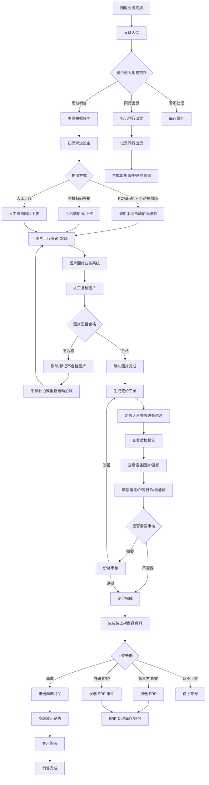
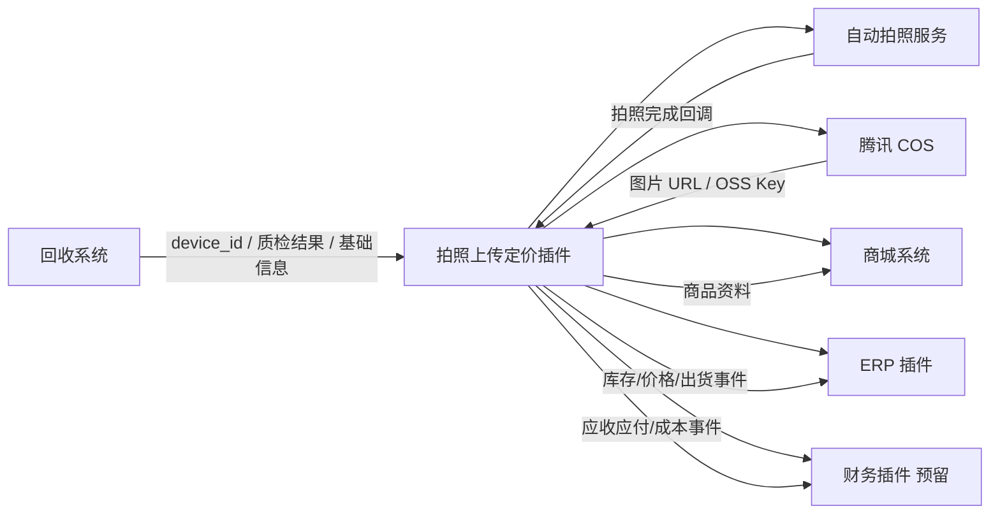
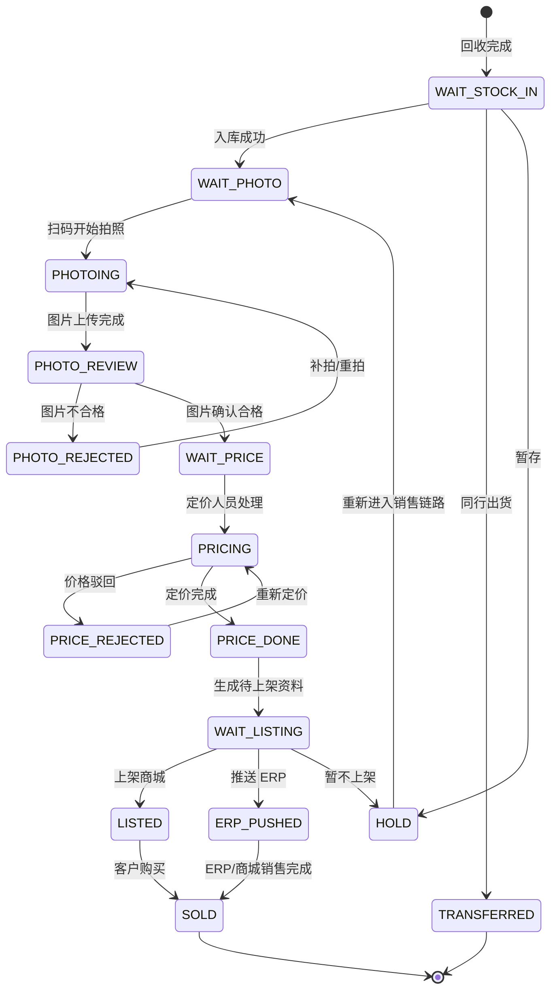
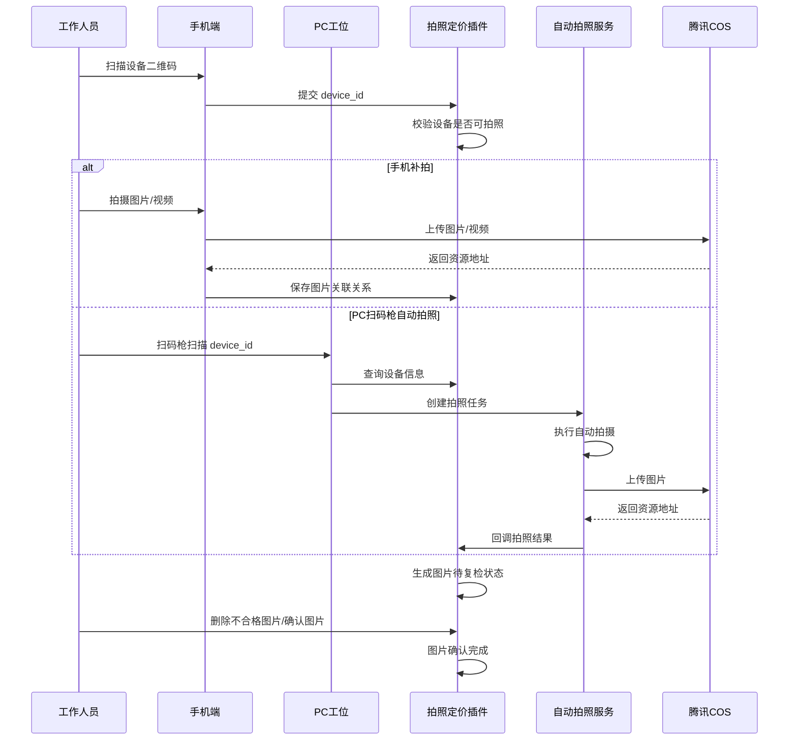
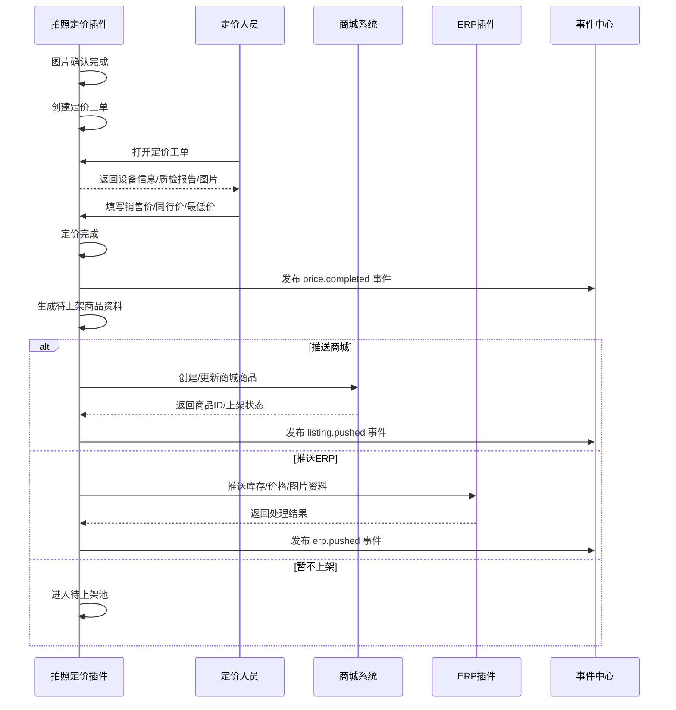
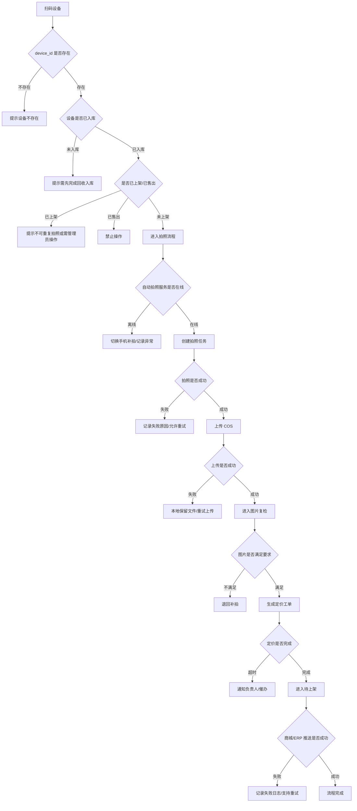
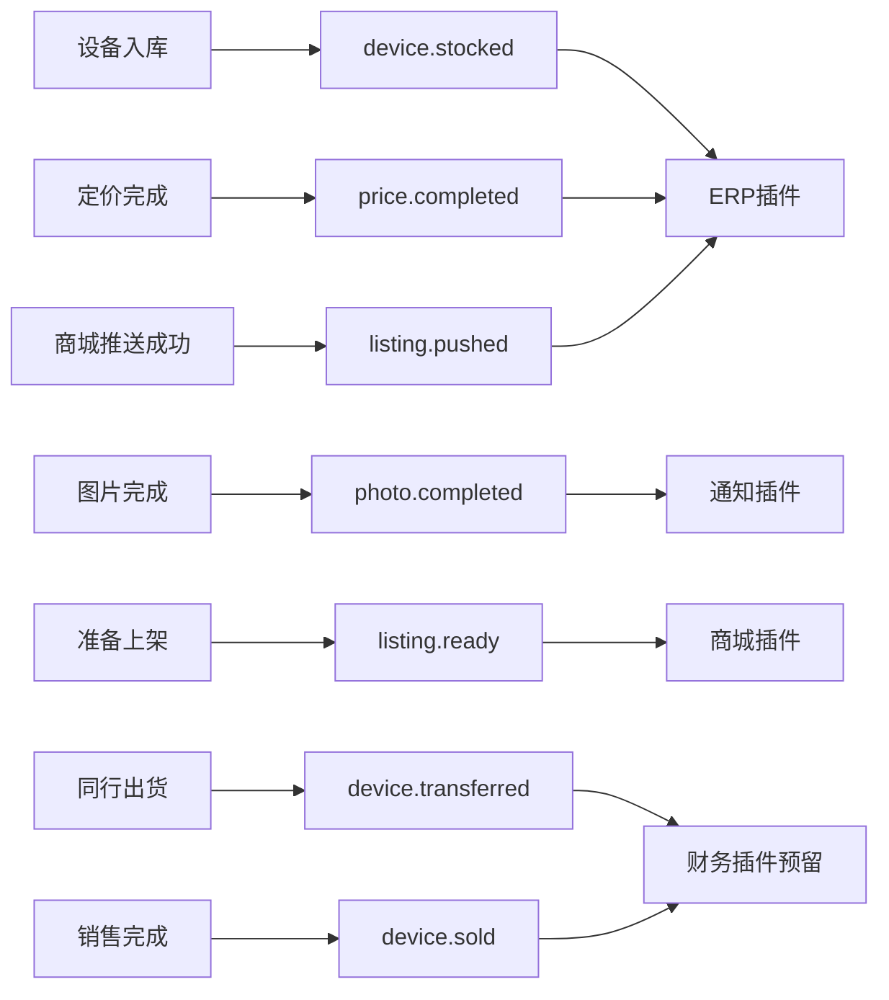
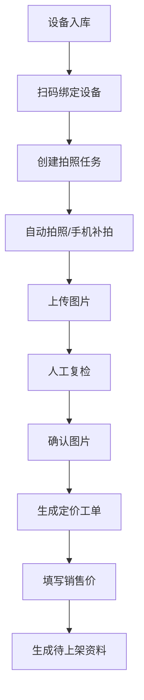
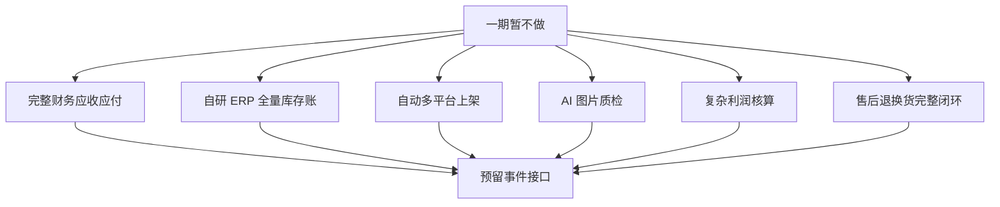

# 拍照上传与销售定价系统流程图

## 1. 总体业务流程

```mermaid
flowchart TD
    A[回收业务完成] --> B[设备入库]
    B --> C{是否进入销售链路}

    C -->|商城销售| D[生成拍照任务]
    C -->|同行出货| X[标记同行出货]
    C -->|暂不处理| Y[库存暂存]

    D --> E[扫码绑定设备]
    E --> F{拍照方式}

    F -->|PC扫码枪 + 自动拍照箱| G[调用本地自动拍照服务]
    F -->|手机扫码补拍| H[手机端拍照/上传]
    F -->|人工上传| I[人工选择图片上传]

    G --> J[图片上传腾讯 COS]
    H --> J
    I --> J

    J --> K[图片回传业务系统]
    K --> L[人工复检图片]

    L --> M{图片是否合格}
    M -->|不合格| N[删除/标记不合格图片]
    N --> O[手机补拍或重新自动拍照]
    O --> J

    M -->|合格| P[确认图片完成]
    P --> Q[生成定价工单]

    Q --> R[定价人员查看设备信息]
    R --> S[查看质检报告]
    S --> T[查看设备图片/视频]
    T --> U[填写销售价/同行价/最低价]

    U --> V{是否需要审核}
    V -->|需要| W[价格审核]
    V -->|不需要| Z[定价完成]

    W -->|通过| Z
    W -->|驳回| Q

    Z --> AA[生成待上架商品资料]
    AA --> AB{上架去向}

    AB -->|商城| AC[推送商城商品]
    AB -->|第三方 ERP| AD[推送 ERP]
    AB -->|自研 ERP| AE[发送 ERP 事件]
    AB -->|暂不上架| AF[待上架池]

    AC --> AG[商城展示销售]
    AD --> AH[ERP 处理库存/账务]
    AE --> AH

    X --> AI[记录同行出货]
    AI --> AJ[生成出货事件/账务预留]

    AG --> AK[客户购买]
    AK --> AL[销售完成]
```

## 2. 系统边界流程

```mermaid
flowchart LR
    A[回收系统] -->|device_id / 质检结果 / 基础信息| B[拍照上传定价插件]

    B --> C[自动拍照服务]
    B --> D[腾讯 COS]
    B --> E[商城系统]
    B --> F[ERP 插件]
    B --> G[财务插件 预留]

    C -->|拍照完成回调| B
    D -->|图片 URL / OSS Key| B
    B -->|商品资料| E
    B -->|库存/价格/出货事件| F
    B -->|应收应付/成本事件| G
```

## 3. 设备状态流转

```mermaid
stateDiagram-v2
    [*] --> WAIT_STOCK_IN: 回收完成

    WAIT_STOCK_IN --> WAIT_PHOTO: 入库成功
    WAIT_STOCK_IN --> TRANSFERRED: 同行出货
    WAIT_STOCK_IN --> HOLD: 暂存

    WAIT_PHOTO --> PHOTOING: 扫码开始拍照
    PHOTOING --> PHOTO_REVIEW: 图片上传完成

    PHOTO_REVIEW --> PHOTO_REJECTED: 图片不合格
    PHOTO_REJECTED --> PHOTOING: 补拍/重拍

    PHOTO_REVIEW --> WAIT_PRICE: 图片确认合格

    WAIT_PRICE --> PRICING: 定价人员处理
    PRICING --> PRICE_REJECTED: 价格驳回
    PRICE_REJECTED --> PRICING: 重新定价

    PRICING --> PRICE_DONE: 定价完成
    PRICE_DONE --> WAIT_LISTING: 生成待上架资料

    WAIT_LISTING --> LISTED: 上架商城
    WAIT_LISTING --> ERP_PUSHED: 推送 ERP
    WAIT_LISTING --> HOLD: 暂不上架

    LISTED --> SOLD: 客户购买
    ERP_PUSHED --> SOLD: ERP/商城销售完成

    TRANSFERRED --> [*]
    SOLD --> [*]
    HOLD --> WAIT_PHOTO: 重新进入销售链路
```

## 4. 拍照任务流程

```mermaid
sequenceDiagram
    participant Staff as 工作人员
    participant Mobile as 手机端
    participant PC as PC工位
    participant Plugin as 拍照定价插件
    participant Camera as 自动拍照服务
    participant COS as 腾讯COS

    Staff->>Mobile: 扫描设备二维码
    Mobile->>Plugin: 提交 device_id
    Plugin->>Plugin: 校验设备是否可拍照

    alt 手机补拍
        Staff->>Mobile: 拍摄图片/视频
        Mobile->>COS: 上传图片/视频
        COS-->>Mobile: 返回资源地址
        Mobile->>Plugin: 保存图片关联关系
    else PC扫码枪自动拍照
        Staff->>PC: 扫码枪扫描 device_id
        PC->>Plugin: 查询设备信息
        PC->>Camera: 创建拍照任务
        Camera->>Camera: 执行自动拍摄
        Camera->>COS: 上传图片
        COS-->>Camera: 返回资源地址
        Camera->>Plugin: 回调拍照结果
    end

    Plugin->>Plugin: 生成图片待复检状态
    Staff->>Plugin: 删除不合格图片/确认图片
    Plugin->>Plugin: 图片确认完成
```

## 5. 定价与上架流程

```mermaid
sequenceDiagram
    participant Plugin as 拍照定价插件
    participant Pricer as 定价人员
    participant Mall as 商城系统
    participant ERP as ERP插件
    participant Event as 事件中心

    Plugin->>Plugin: 图片确认完成
    Plugin->>Plugin: 创建定价工单

    Pricer->>Plugin: 打开定价工单
    Plugin-->>Pricer: 返回设备信息/质检报告/图片
    Pricer->>Plugin: 填写销售价/同行价/最低价
    Plugin->>Plugin: 定价完成

    Plugin->>Event: 发布 price.completed 事件
    Plugin->>Plugin: 生成待上架商品资料

    alt 推送商城
        Plugin->>Mall: 创建/更新商城商品
        Mall-->>Plugin: 返回商品ID/上架状态
        Plugin->>Event: 发布 listing.pushed 事件
    else 推送ERP
        Plugin->>ERP: 推送库存/价格/图片资料
        ERP-->>Plugin: 返回处理结果
        Plugin->>Event: 发布 erp.pushed 事件
    else 暂不上架
        Plugin->>Plugin: 进入待上架池
    end
```

## 6. 异常流程

```mermaid
flowchart TD
    A[扫码设备] --> B{device_id 是否存在}

    B -->|不存在| B1[提示设备不存在]
    B -->|存在| C{设备是否已入库}

    C -->|未入库| C1[提示需先完成回收入库]
    C -->|已入库| D{是否已上架/已售出}

    D -->|已上架| D1[提示不可重复拍照或需管理员操作]
    D -->|已售出| D2[禁止操作]
    D -->|未上架| E[进入拍照流程]

    E --> F{自动拍照服务是否在线}
    F -->|离线| F1[切换手机补拍/记录异常]
    F -->|在线| G[创建拍照任务]

    G --> H{拍照是否成功}
    H -->|失败| H1[记录失败原因/允许重试]
    H -->|成功| I[上传 COS]

    I --> J{上传是否成功}
    J -->|失败| J1[本地保留文件/重试上传]
    J -->|成功| K[进入图片复检]

    K --> L{图片是否满足要求}
    L -->|不满足| L1[退回补拍]
    L -->|满足| M[生成定价工单]

    M --> N{定价是否完成}
    N -->|超时| N1[通知负责人/催办]
    N -->|完成| O[进入待上架]

    O --> P{商城/ERP 推送是否成功}
    P -->|失败| P1[记录失败日志/支持重试]
    P -->|成功| Q[流程完成]
```

## 7. 插件事件设计

```mermaid
flowchart LR
    A[设备入库] --> E1[device.stocked]
    B[图片完成] --> E2[photo.completed]
    C[定价完成] --> E3[price.completed]
    D[准备上架] --> E4[listing.ready]
    F[商城推送成功] --> E5[listing.pushed]
    G[同行出货] --> E6[device.transferred]
    H[销售完成] --> E7[device.sold]

    E1 --> ERP[ERP插件]
    E2 --> Notify[通知插件]
    E3 --> ERP
    E4 --> Mall[商城插件]
    E5 --> ERP
    E6 --> Finance[财务插件预留]
    E7 --> Finance
```

## 8. 推荐一期 MVP 范围

```mermaid
flowchart TD
    A[设备入库] --> B[扫码绑定设备]
    B --> C[创建拍照任务]
    C --> D[自动拍照/手机补拍]
    D --> E[上传图片]
    E --> F[人工复检]
    F --> G[确认图片]
    G --> H[生成定价工单]
    H --> I[填写销售价]
    I --> J[生成待上架资料]
```

## 9. 暂不进入一期的能力

```mermaid
flowchart TD
    A[一期暂不做] --> B[完整财务应收应付]
    A --> C[自研 ERP 全量库存账]
    A --> D[自动多平台上架]
    A --> E[AI 图片质检]
    A --> F[复杂利润核算]
    A --> G[售后退换货完整闭环]

    B --> H[预留事件接口]
    C --> H
    D --> H
    E --> H
    F --> H
    G --> H
```

