# 回收业务链路流程图

## 1. 回收主链路

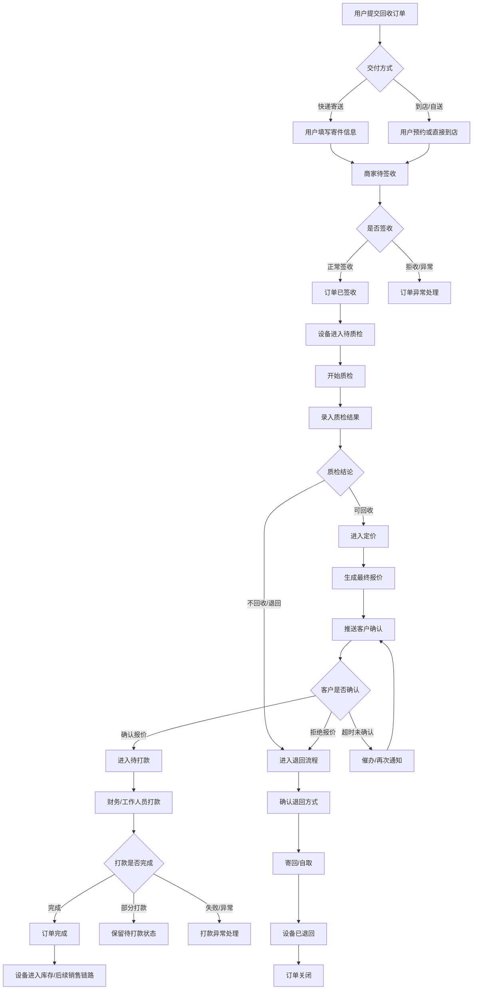

## 2. 订单状态流转

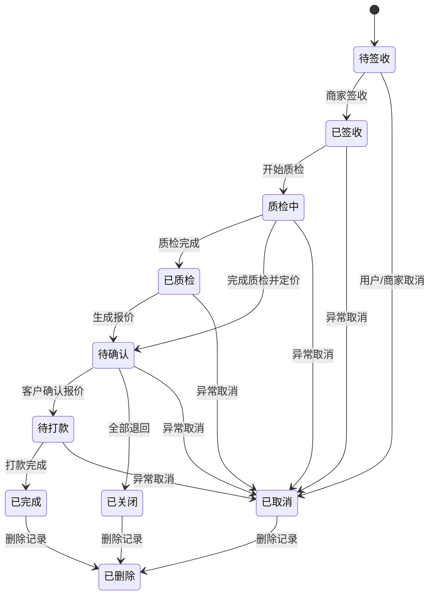

## 3. 设备状态流转

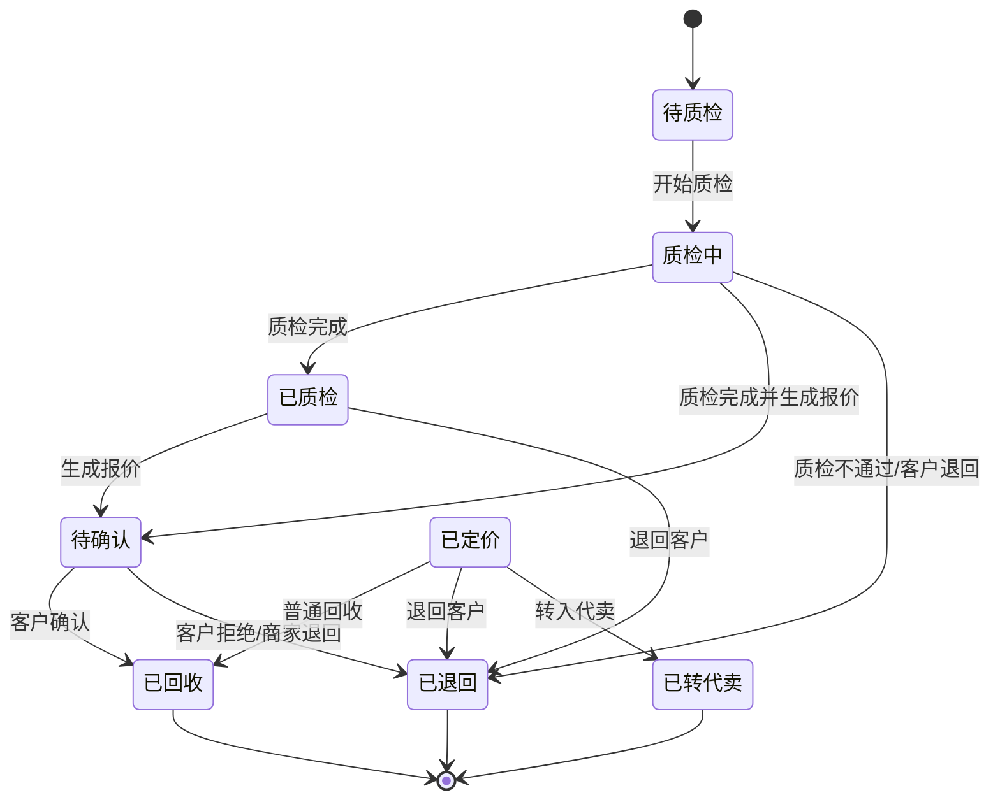

## 4. 配置分支流程

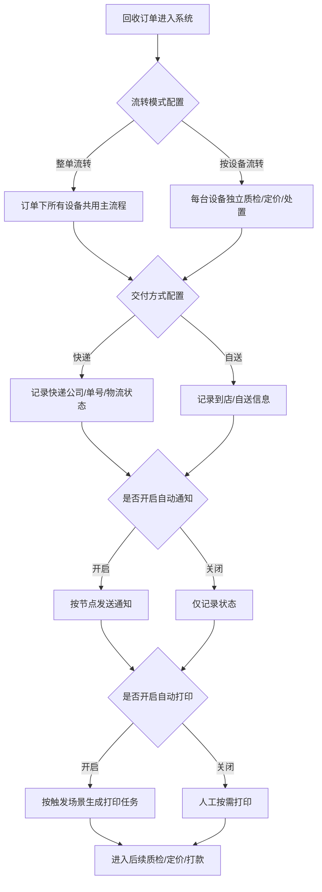

## 5. 质检与定价流程

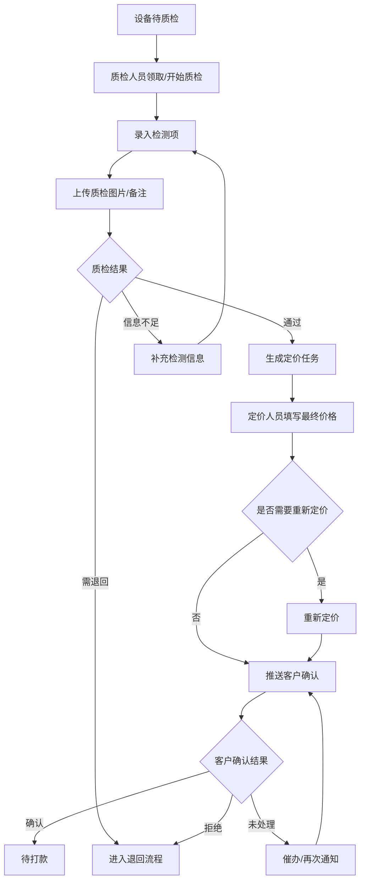

## 6. 打款与完成流程

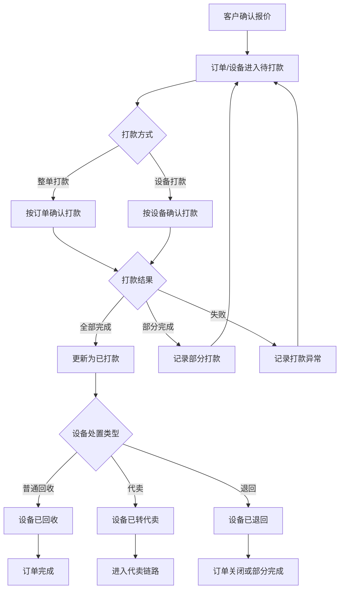

## 7. 退回流程

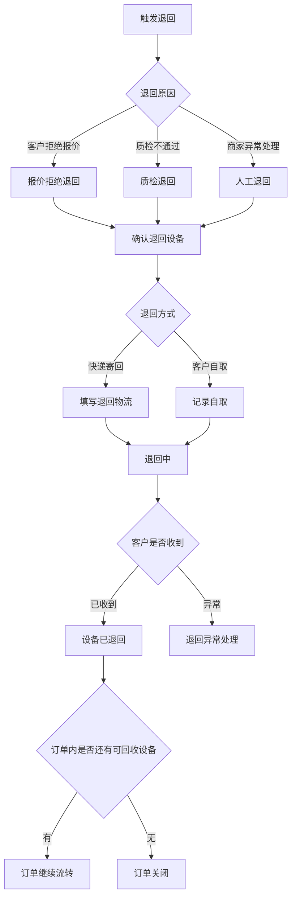

## 8. 代卖流程

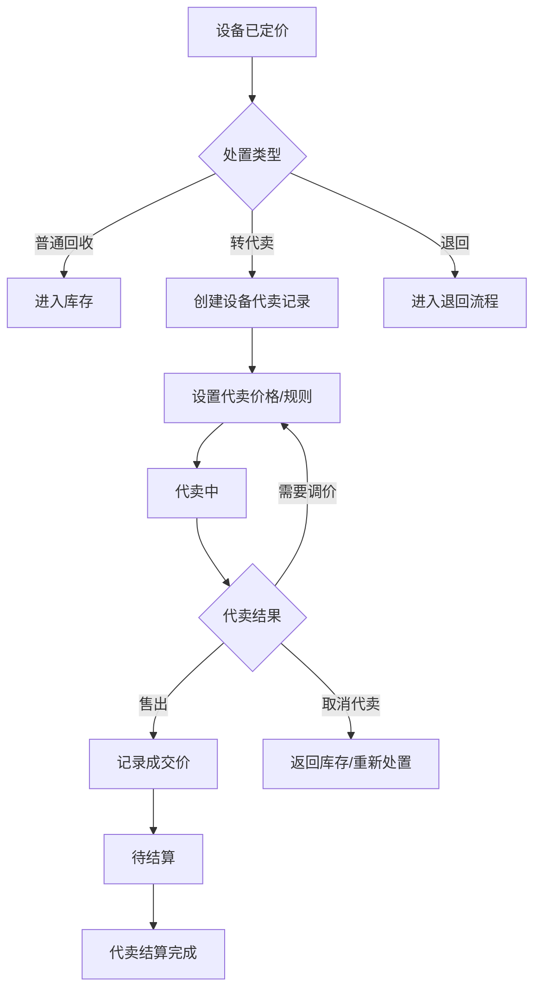

## 9. 通知触发流程

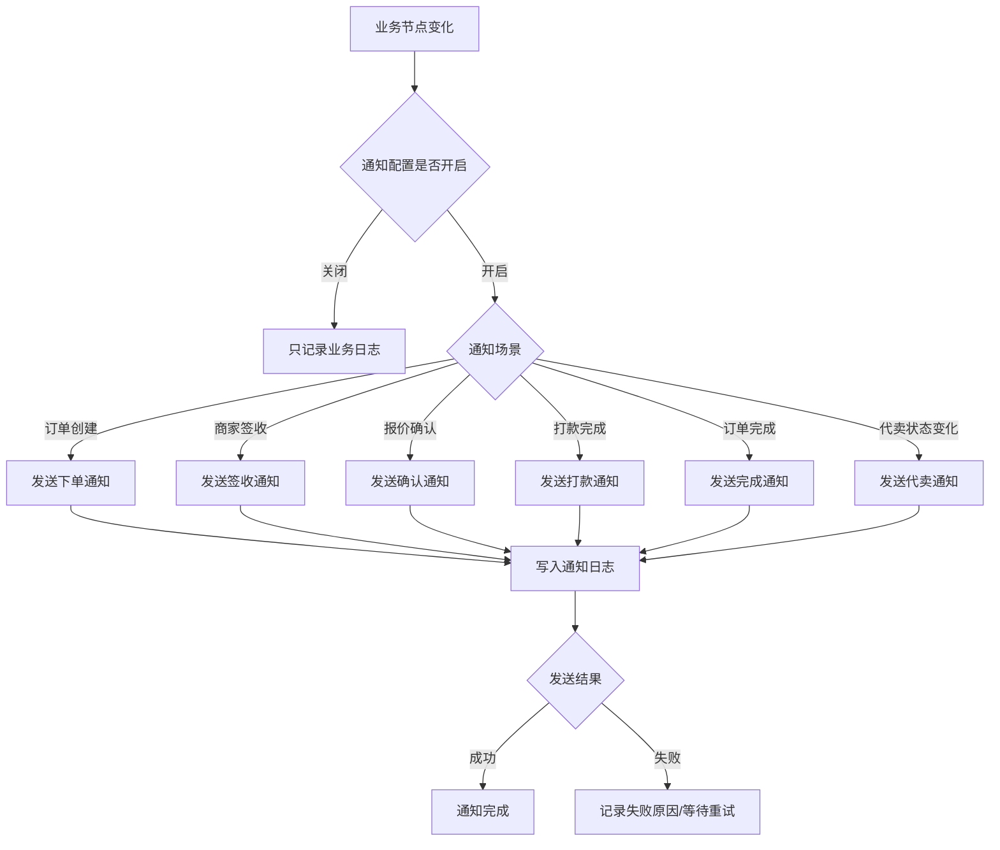

## 10. 打印触发流程

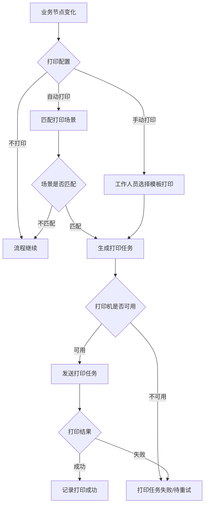

## 11. 第三方服务边界

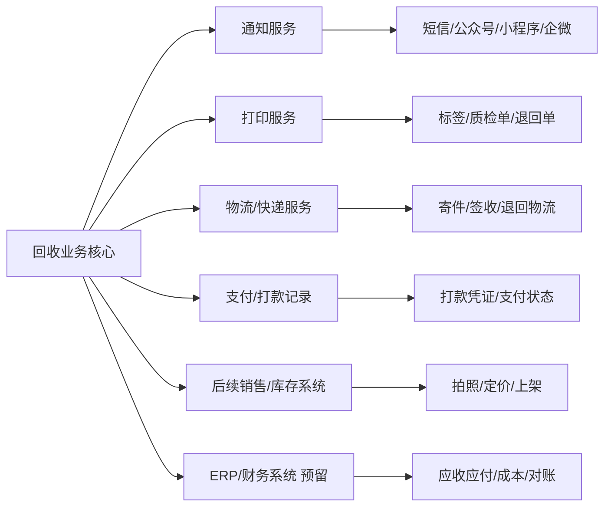

## 12. 回收完成后的出口

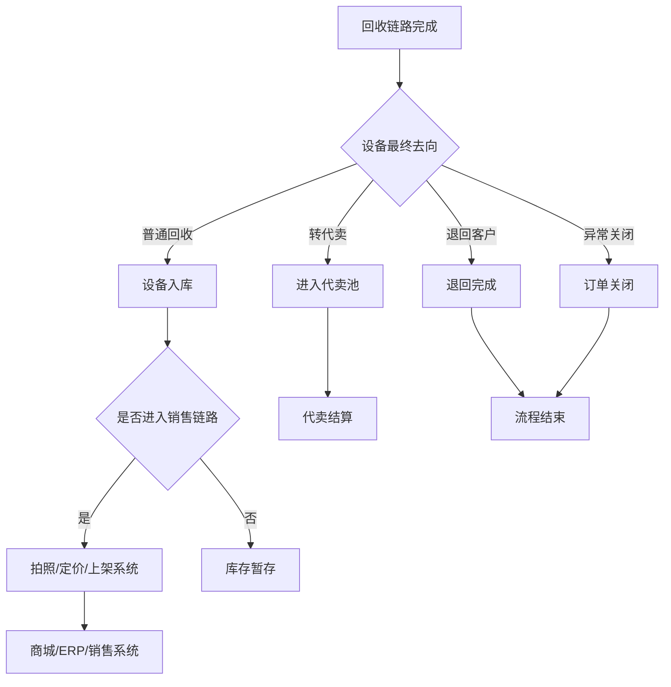

