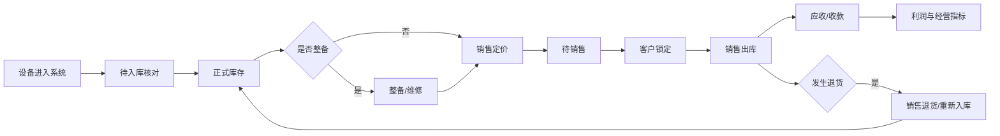
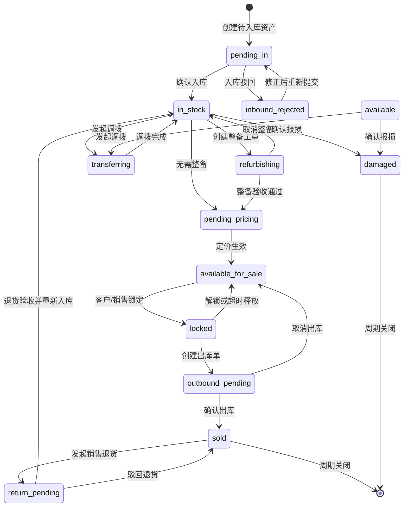

# 二手机 ERP V1 产品与技术规格

## 1. 文档定位

本文档是 `hsx_erp` 第一版的产品、业务和技术基线，用于：

- 确定开发范围和模块边界。
- 统一设备、库存、成本、销售和财务口径。
- 指导数据库、服务、事件、权限和页面设计。
- 作为测试、试运行和正式上线的验收依据。

原则上，代码实现与本文档冲突时，应先确认业务规则并更新文档，再修改代码。

## 2. 产品目标

### 2.1 业务目标

让一台二手机从进入系统到最终销售、退货或再次回收的全过程可流转、可追溯、可核算。

核心闭环：



### 2.2 老板视角

老板无需理解业务表结构，应能直接回答：

- 当前有多少机器，库存金额是多少？
- 哪些机器库存时间过长？
- 今天、近 7 天、近 30 天卖了多少？
- 毛利润、毛利率和资金回笼情况如何？
- 谁欠公司钱，公司欠谁钱？
- 哪些设备正在整备，整备花了多少钱？
- 哪些员工完成了入库、整备、销售定价、销售和收款？
- 哪些流程超时、失败或存在异常？

### 2.3 技术目标

- ERP 可独立安装和使用。
- 回收、商城、财务和第三方系统通过服务契约与事件协作。
- 插件之间不得直接写入对方业务表。
- 关键操作具备事务、幂等、并发控制和审计记录。
- 已确认业务不允许直接删除，只允许撤销、红冲或反向单据。
- 数据库变化必须提供版本化升级脚本。

## 3. 插件与模块边界

### 3.1 ERP 核心插件

`hsx_erp` 负责：

- 物理设备身份。
- 设备经营周期。
- 入库单和库存状态。
- 仓库、库位、调拨、盘点和报损。
- 整备、维修和单机成本。
- 销售定价、库存锁定、出库和退货。
- 单机收入、成本、毛利润的业务事实。
- 操作时间线和领域事件。

### 3.2 回收插件

`hsx_recycle` 负责：

- 回收订单、质检、报价、付款和退回。
- 将已满足入库条件的设备转换为标准快照。
- 在标准快照中给出回收价格事实和整备建议。默认无需整备；只有明确传入需要整备时，ERP 才进入整备流程。
- 发布标准入库请求事件。
- 查询 ERP 同步结果。

回收插件不得：

- 直接创建 ERP 资产。
- 直接修改 ERP 库存和成本流水。
- 将自己的设备状态作为 ERP 库存状态使用。

### 3.3 财务插件

财务插件负责：

- 往来单位。
- 应收、应付。
- 收款、付款、部分结算。
- 折账、退款、红冲和调账。
- 资金账户和资金流水。
- 经营费用。
- 财务报表与关账。

ERP 不自行维护资金账户余额。

### 3.4 整备决策边界

整备不是财务动作。是否换电池、维修、清洁或外修，由质检、回收估价、店长或整备角色决定。

系统里必须区分两类“定价”：

- 回收定价：`hsx_recycle` 插件里给客户的回收价格，进入 ERP 后只作为采购成本、应付和来源快照事实。
- 销售定价：ERP 后续给销售客户的销售价格，状态 `pending_pricing` 指的是待销售定价。

入库事件支持以下整备契约：

```json
{
  "refurbishment": {
    "required": false,
    "decision_source": "default",
    "reason": "",
    "suggested_items": [],
    "estimated_cost": "0.00",
    "decided_by": {
      "type": "staff",
      "id": 0,
      "name": ""
    },
    "assignee": {
      "type": "staff",
      "id": 0,
      "name": ""
    },
    "decided_at": 0
  }
}
```

默认 `required=false`，设备确认入库后自动进入待销售定价。来源系统明确传入 `required=true` 时，设备确认入库后自动生成整备工单并分配给 `assignee`，同时发布 `erp.refurbishment.required.v1` 事件。

财务只消费整备完成后的成本事实和应付事实，不负责判断设备是否需要整备。

### 3.5 商城插件

商城插件负责：

- 商品展示和客户浏览。
- 线上订单。
- 线上支付配置。
- 商品上下架。

商城必须通过 ERP 查询可售库存和锁定设备，不得独立判断某台机器是否可售。

## 4. V1 模块清单

| 模块 | V1 范围 | 当前状态 |
| --- | --- | --- |
| 设备身份 | IMEI/SN 身份、多次经营周期 | 已有基础 |
| 统一入库 | 手工建档、回收事件接入 | 已有基础 |
| 入库单 | 单台/批量核对、部分确认、异常驳回 | 部分完成 |
| 库存档案 | 当前状态、库龄、仓库、库位、流水 | 部分完成 |
| 仓库库位 | 仓库、库位、启停用 | 未开始 |
| 整备工单 | 指派、维修、换壳、清洁、验收、返工 | 未开始 |
| 成本中心 | 采购、配件、人工、物流、调整成本 | 采购成本已有 |
| 销售定价 | 销售定价、审核、调价日志、最低利润限制 | 开发中 |
| 库存锁定 | 客户锁定、超时释放、人工解锁 | 未开始 |
| 销售出库 | 销售单、出库单、现结、挂账 | 未开始 |
| 销售退货 | 原单退货、重新入库、利润反算 | 未开始 |
| 库存作业 | 调拨、盘点、报损、差异处理 | 未开始 |
| 经营看板 | 库存、销售、利润、周转、异常 | 未开始 |
| 员工 KPI | 操作量、时效、利润贡献 | 未开始 |
| 事件中心 | Inbox、Outbox、失败重试、监控 | 基础已有 |
| 权限审计 | 细粒度权限、高风险审核、日志 | 基础权限已有 |
| 数据迁移 | Excel 导入、旧系统切换、差异报告 | 未开始 |

## 5. 核心数据对象

### 5.1 物理设备身份

表示现实世界中的同一台机器。

唯一识别顺序：

1. IMEI。
2. SN。
3. 无串号设备使用系统生成身份号，并标记待补充串号。

同一身份可以存在多个经营周期，但同一时刻只能有一个未关闭周期。

### 5.2 经营周期

表示设备某一次进入公司到离开公司的完整经营过程。

示例：

```text
第一次回收 → 整备 → 卖给客户 A → 周期关闭
客户 A 再次卖回 → 新经营周期 → 卖给客户 B
```

利润、库龄、负责人和业务来源均按经营周期统计。

### 5.3 资产当前快照

用于快速查询设备当前状态，包含：

- 当前库存状态。
- 当前仓库和库位。
- 当前总成本。
- 当前销售价。
- 当前锁定信息。
- 当前经营周期。

快照可以更新，但每次变化必须同时产生不可变流水。

### 5.4 业务单据

核心单据：

- 入库单。
- 整备工单。
- 成本调整单。
- 定价单。
- 库存锁定单。
- 销售单。
- 出库单。
- 销售退货单。
- 调拨单。
- 盘点单。
- 报损单。

## 6. 设备状态机

### 6.1 主状态



### 6.2 状态约束

- `pending_in` 不属于正式库存金额。
- `in_stock` 及其后续在库状态计入库存金额。
- 只有 `available` 可以被销售锁定。
- `locked` 不允许被第二张销售单锁定。
- `sold` 不允许再次出库。
- 销售退货成功后进入新库存阶段，但仍保留原销售单关系。
- 报损必须产生损失流水，不得直接将资产删除。

## 7. 单据状态机

### 7.1 通用状态

| 状态 | 说明 |
| --- | --- |
| `draft` | 草稿，可编辑 |
| `submitted` | 已提交，等待处理 |
| `partial_confirmed` | 部分明细已确认 |
| `confirmed` | 已确认，业务生效 |
| `rejected` | 已驳回 |
| `cancelled` | 生效前取消 |
| `reversed` | 生效后被反向单据冲销 |

### 7.2 通用规则

- 草稿可以修改或取消。
- 已提交只能由具备处理权限的角色确认或驳回。
- 已确认不可直接修改关键金额和设备明细。
- 已确认业务撤销时必须生成反向单据和反向流水。
- 每张反向单据必须引用原单据。
- 单据号在站点内唯一。

### 7.3 入库单

允许：

- 单台确认。
- 勾选批量确认。
- 整单确认。
- 单台异常驳回。
- 部分确认后继续处理剩余设备。

整单只有全部有效明细处理完成后才能结束。

### 7.4 整备工单

状态：

```text
draft → assigned → processing → pending_acceptance
→ completed
→ reworking → pending_acceptance
→ cancelled
```

工单必须记录：

- 设备。
- 整备项目。
- 负责人。
- 预计与实际完成时间。
- 配件、人工、外修和其他费用。
- 前后照片。
- 验收人和验收结果。
- 返工次数。

### 7.5 销售单

状态：

```text
draft → locked → outbound_pending → completed
locked → cancelled
outbound_pending → cancelled
completed → return_pending → returned
```

销售单与收款状态分离：

```text
unpaid / partial_paid / paid / refunded / partial_refunded
```

这样支持现结、部分收款、挂账和退款。

## 8. 成本规则

### 8.1 成本类型

| 类型 | 示例 |
| --- | --- |
| `purchase` | 回收或采购成本 |
| `part` | 屏幕、电池、外壳等配件 |
| `labor` | 内部或外部人工 |
| `logistics` | 与单机直接相关的物流 |
| `inspection` | 检测费用 |
| `platform` | 可归属单机的平台费用 |
| `adjustment` | 经审批的成本调整 |
| `reversal` | 反向冲销 |

### 8.2 成本不变量

```text
当前总成本 = 全部有效成本流水 amount_delta 之和
```

- 不允许直接覆盖当前总成本。
- 每次成本变化必须记录来源单据、操作人、时间和原因。
- 已销售设备新增成本必须走售后或利润调整流程。
- 代卖设备的货权成本与应付结算金额需要分开记录。

## 9. 库存规则

### 9.1 库存不变量

- 每个有效经营周期只能存在一个当前资产快照。
- 每台在库设备只能位于一个仓库、一个库位。
- 库存状态变化必须产生库存流水。
- 同一设备不能同时处于多个有效锁定单。
- 出库必须引用有效销售单。

### 9.2 仓库与库位

V1 支持：

- 多仓库。
- 仓库下多库位。
- 仓库、库位启停用。
- 默认入库仓。
- 调拨在途状态。

不能将仓库名称直接存到设备表作为唯一依据，应保存仓库和库位 ID。

### 9.3 锁定规则

- 默认锁定时长可配置。
- 支持手工锁定、销售单锁定和商城订单锁定。
- 到期由队列自动释放。
- 已进入出库处理的锁定不能自动释放。
- 强制解锁需要独立权限并填写原因。

## 10. 财务触发口径

ERP 只发布业务事实，不自行推断所有财务结果。

### 10.1 入库事件

`erp.asset.stocked.v1` 至少携带：

```json
{
  "event_id": "string",
  "site_id": 1,
  "asset_id": 1,
  "cycle_id": 1,
  "source_plugin": "hsx_recycle",
  "source_type": "recycle_device",
  "source_id": 1,
  "counterparty_id": 1,
  "ownership_type": "owned",
  "payable_amount": "3000.00",
  "paid_amount": "3000.00",
  "settlement_status": "paid",
  "occurred_at": 0
}
```

财务插件根据业务来源和结算状态决定：

- 是否生成应付单。
- 是否生成付款记录。
- 是否只关联已有回收付款记录。

不得仅根据“设备入库”重复生成应付。

### 10.2 销售事件

`erp.asset.sold.v1` 至少携带：

- 往来单位。
- 销售单和出库单。
- 销售金额。
- 已收金额。
- 当前总成本快照。
- 毛利润快照。
- 收款状态。

### 10.3 反向事件

所有已生效业务的取消都必须发布独立反向事件，不能覆盖原事件。

## 11. 核心事件目录

| 事件 | 产生时机 | 主要订阅方 |
| --- | --- | --- |
| `erp.inbound.requested.v1` | 外部系统请求入库 | ERP |
| `erp.asset.created.v1` | 创建待入库资产 | 操作日志、外部同步 |
| `erp.asset.stocked.v1` | 正式入库 | 财务、经营指标 |
| `erp.asset.inbound_rejected.v1` | 入库驳回 | 来源插件 |
| `erp.refurbishment.created.v1` | 创建整备工单 | 通知、KPI |
| `erp.refurbishment.completed.v1` | 整备验收完成 | 销售定价、KPI |
| `erp.refurbishment.cancelled.v1` | 整备取消 | 通知、KPI |
| `erp.refurbishment.skipped.v1` | 确认无需整备 | 销售定价、KPI |
| `erp.asset.cost_changed.v1` | 单机成本变化 | 财务、利润指标 |
| `erp.asset.price_changed.v1` | 销售价变化 | 商城、审计 |
| `erp.asset.locked.v1` | 库存锁定 | 商城、销售 |
| `erp.asset.unlocked.v1` | 库存解锁 | 商城、销售 |
| `erp.asset.sold.v1` | 销售出库完成 | 财务、商城、KPI |
| `erp.asset.sale_returned.v1` | 销售退货完成 | 财务、商城、利润指标 |
| `erp.asset.transferred.v1` | 仓库调拨完成 | 库存指标 |
| `erp.asset.damaged.v1` | 报损完成 | 财务、老板看板 |

### 11.1 事件技术规范

每个事件必须包含：

- `event_id`：全局幂等编号。
- `event_name`：带版本号的事件名称。
- `event_version`。
- `site_id`。
- `occurred_at`。
- `operator`。
- `aggregate_type`。
- `aggregate_id`。
- `source`。
- `payload`。

发布规则：

- 业务数据与 Outbox 在同一数据库事务提交。
- 队列发布失败可以重试。
- 消费方通过 Inbox 或业务唯一键幂等。
- 失败事件必须可查询、重试和标记人工处理。

## 12. 服务层设计

### 12.1 分层

```text
Controller
  → Admin/Application Service
    → Core Domain Service
      → Model/Repository
      → Ledger
      → Outbox
```

### 12.2 核心服务建议

| 服务 | 职责 |
| --- | --- |
| `ErpInboundService` | 所有来源统一入库 |
| `ErpInventoryService` | 库存状态、仓库、库位和流水 |
| `ErpRefurbishmentService` | 整备工单和验收 |
| `ErpCostService` | 追加、冲销和计算成本 |
| `ErpPricingService` | 销售定价、审核和调价 |
| `ErpReservationService` | 锁定、释放和超时任务 |
| `ErpSalesService` | 销售单、出库和利润固化 |
| `ErpSalesReturnService` | 销售退货和反向处理 |
| `ErpStocktakeService` | 盘点和差异处理 |
| `ErpMetricService` | 老板看板指标 |

服务不得依赖具体前端页面，也不得直接读取其他插件业务表。

## 13. 权限模型

### 13.1 角色建议

| 角色 | 主要职责 |
| --- | --- |
| 入库员 | 核对、确认或驳回入库 |
| 仓管 | 入库、调拨、盘点、报损 |
| 整备员 | 接单、登记项目和费用、提交验收 |
| 整备主管 | 指派、验收、返工 |
| 定价员 | 销售定价和调价申请 |
| 销售 | 锁定客户、创建销售单和出库 |
| 财务 | 应收应付、收付款和对账 |
| 财务主管 | 折账、红冲和调账审核 |
| 老板 | 全局只读、报表和高风险审批 |
| 系统管理员 | 配置、权限和集成管理 |

### 13.2 权限颗粒度

权限命名采用：

```text
hsx_erp_<module>_<action>
```

高风险权限必须独立：

- `hsx_erp_cost_adjust`
- `hsx_erp_cost_reverse`
- `hsx_erp_price_approve`
- `hsx_erp_price_below_floor`
- `hsx_erp_asset_force_unlock`
- `hsx_erp_stock_damage_confirm`
- `hsx_erp_sales_cancel_confirmed`
- `hsx_erp_sales_return_confirm`
- `hsx_erp_finance_export`
- `hsx_erp_event_retry`

### 13.3 数据权限

商业化版本至少预留：

- 全部数据。
- 指定门店。
- 指定仓库。
- 本人负责业务。
- 仅查看汇总，不查看成本明细。

## 14. 审计与安全

必须记录：

- 操作人和角色。
- 操作时间、IP 和客户端信息。
- 业务单据。
- 操作前后状态。
- 金额变化。
- 操作原因。
- 审批人。

高风险操作要求：

- 二次确认。
- 必填原因。
- 可配置审核阈值。
- 不能通过修改数据库记录绕开反向流水。

## 15. 老板经营看板

### 15.1 库存指标

- 在库数量。
- 库存总成本。
- 自有与代卖库存。
- 待入库、整备中、待销售定价、可售、锁定数量。
- 平均库龄。
- 30/60/90 天以上库存。
- 库存周转率。
- 报损金额。

### 15.2 销售与利润

- 销售额。
- 已收款和未收款。
- 销售设备数。
- 单机平均售价。
- 毛利润。
- 毛利率。
- 退货率。
- 按型号、渠道、门店和员工排名。

### 15.3 资金与往来

由财务插件提供：

- 应收余额。
- 应付余额。
- 净往来余额。
- 逾期应收。
- 今日收付款。
- 各资金账户余额。

### 15.4 员工指标

- 入库数量和平均处理时长。
- 整备数量、返工率和成本。
- 销售定价数量和调价次数。
- 销售数量、销售额和毛利润贡献。
- 收款金额和逾期追回金额。
- 异常操作和超时任务。

## 16. 异常与反向流程

V1 必须覆盖：

| 异常 | 处理方式 |
| --- | --- |
| 重复同步 | 幂等返回已有资产 |
| 串号冲突 | 阻止创建并要求选择已有身份或纠错 |
| 入库信息错误 | 明细驳回，修正后重新提交 |
| 部分设备入库 | 入库单保持部分确认 |
| 已入库后发现错误 | 反向入库或库存调整单 |
| 整备成本录错 | 成本反向流水后重新追加 |
| 锁定超时 | 队列自动释放 |
| 重复出库 | 行锁与状态校验阻止 |
| 已收款后取消销售 | 退货和退款单，不删除原销售单 |
| 同一串号再次回收 | 复用身份，创建新经营周期 |
| 事件发布失败 | Outbox 重试和人工处理 |
| 外部系统不可用 | 本地业务提交，异步重试同步 |

## 17. 数据迁移与切换

### 17.1 推荐切换方式

采用时间切点：

```text
切点之前：旧 ERP 作为历史账。
切点之后：新系统作为唯一业务入口。
```

迁移内容：

- 切点时仍在库设备。
- 未结应收应付。
- 客户和往来单位。
- 必要的历史销售与成本汇总。

不建议第一版迁移所有历史操作明细。

### 17.2 导入流程

```text
上传 → 字段映射 → 格式校验 → 串号查重
→ 试算报告 → 人工确认 → 正式导入
→ 导入批次与差异报告
```

导入必须可追踪批次，不允许直接静默写表。

## 18. 非功能要求

### 18.1 稳定性

- 关键业务必须使用数据库事务。
- 设备状态更新必须使用行锁或乐观锁。
- 事件消费必须幂等。
- 批量任务必须返回成功、失败和跳过明细。
- 单次批量操作数量需要可配置限制。

### 18.2 性能

V1 目标：

- 10 万设备档案可正常分页检索。
- 常用列表响应目标低于 2 秒。
- 批量入库和出库使用队列或分批处理。
- 看板指标使用汇总表或缓存，避免实时扫描全部流水。

### 18.3 测试

必须覆盖：

- 状态机合法与非法转换。
- 重复事件。
- 并发锁定和并发出库。
- 部分确认。
- 成本追加和冲销。
- 销售退货。
- 同串号多经营周期。
- 权限拒绝。
- Outbox 失败重试。

### 18.4 升级

- 插件版本使用语义化版本。
- 每次表结构变化提供升级 SQL。
- 升级脚本可重复执行或具备执行记录。
- 发布前提供数据库备份和回滚说明。

## 19. 实施阶段

### 阶段 A：库存基础稳定

范围：

- 入库单独立页面。
- 单台、批量、整单确认。
- 明细驳回和重新提交。
- 仓库、库位。
- 资产详情和完整时间线。
- 事件监控与重试入口。

验收：

- 任意设备可准确确认或驳回。
- 部分确认不影响其他设备。
- 重复操作不产生重复库存和成本。

### 阶段 B：整备与成本

范围：

- 整备工单。
- 指派、处理、验收、返工和取消。
- 配件、人工、外修等成本。
- 成本冲销。

验收：

- 当前总成本等于有效成本流水之和。
- 每笔费用可追溯至人员和工单。

### 阶段 C：销售定价、锁定与销售

范围：

- 销售定价和调价日志。
- 最低利润规则。
- 锁定和超时释放。
- 销售单和出库单。
- 现结、部分收款、挂账参数。
- 销售退货。

验收：

- 同一设备不能重复销售。
- 销售完成时固化收入、成本和毛利润。
- 退货通过反向业务恢复库存和账务。

### 阶段 D：财务账套

范围：

- 往来单位。
- 应收、应付。
- 收款、付款。
- 部分结算。
- 折账。
- 费用和资金账户。
- 红冲、退款和调账。

验收：

- 任意往来单位的余额可由流水重新计算。
- 资金账户余额可由资金流水重新计算。
- 折账不产生虚假资金流。

### 阶段 E：经营与商业化

范围：

- 老板经营看板。
- KPI。
- 数据迁移。
- 权限模板。
- 自动化测试。
- 监控告警。
- 使用手册和上线方案。

验收：

- 老板指标能追溯到底层业务单据。
- 核心流程通过试运行和财务对账。
- 连续试运行期间无无法解释的库存或金额差异。

## 20. 商业化上线门槛

以下条件全部满足后，才能标记为可正式商用：

- 库存闭环完整。
- 销售和退货闭环完整。
- 应收应付和收付款闭环完整。
- 库存、往来、资金均可通过流水重算。
- 核心操作具备权限和审计。
- 数据迁移完成并有差异报告。
- 自动化测试覆盖核心状态机和并发场景。
- 失败事件可监控和重试。
- 至少完成一轮真实门店并行试运行。
- 财务、仓管、销售和老板共同签字验收。

## 21. 当前最近任务

下一开发模块确定为：

```text
入库工作台完善
→ 仓库/库位
→ 整备工单
→ 成本服务
```

在完成整备和成本闭环前，不进入正式销售与财务开发。
