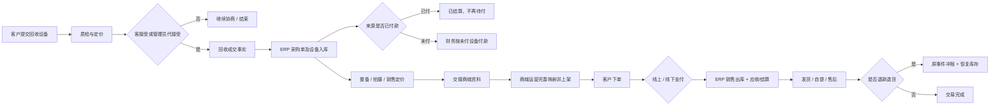

# 回收 → ERP → 商城销售闭环验收手册

> 版本日期：2026-09-01  
> 适用插件：`hsx_recycle` + `hsx_erp` + `phone_shop`  
> 本版约束：**不新增表、不新增字段、不修改三个插件的 install.sql**

## 1. 交付结论

本版把三个插件之间最容易造成账、货不一致的链路收口到同一套业务规则：

1. 回收设备确认成交后，按设备进入 ERP，同一回收订单的后续设备追加到原采购单，不会因为设备分批质检而丢单。
2. 来源回收系统已付款的历史事实，同步到 ERP 后直接标记为已结算，不再向财务展示一次“待付款”。
3. 商城线上付款的一物一码设备，统一生成 ERP 销售、应收、结算和出库事实；任一环节短暂失败可自动补偿。
4. 商城混合订单按“各类商品实际金额占比”分摊实付、手续费和净到账，不会将整单金额在两条 ERP 链路中重复入账。
5. 后台手工出入库仍严格要求真实员工、仓库和库位；只有带稳定事件号的外部已付事实才允许使用可审计的“系统补偿”身份。
6. 移动 ERP 列表的价格筛选与页面实际展示价格使用同一规则；接口失败会显示后端可操作的原因，不再静默空白。

## 2. 业务主链路

## 3. 核心规则

### 3.1 一笔回收订单、多台设备

- 第一台设备成交时创建 ERP 采购单。
- 同一回收订单的其他设备后续成交时，追加到同一采购单。
- 应付按设备明细计算：已付的明细不可再勾选，未付的明细可继续付款。
- 重放同一设备事件不会重复创建资产、采购明细或应付。

### 3.2 历史已付款防重复打款

- 以回收系统的 `pay_status` 和实际已付金额为来源事实。
- 已付金额不得超过本次设备采购成本，避免异常数据放大。
- ERP 自动创建/复用系统账户 **“来源系统已付待核对”** 记录这类过渡事实，不占用真实银行账户。
- 该账户为过渡核对账户；若出现负余额，表示需财务将历史流水与真实账户核对，**不表示要再给客户付一次款**。
- 即使当时定价员已删除或停用，仍保留历史定价人快照，不会因人员状态阻断历史事实入库。

### 3.3 商城线上销售

- ERP 一物一码设备：生成销售单、设备出库、应收和结算。
- 商城原生商品：记录商城销售的 ERP 财务事实。
- 同一订单同时含有两类商品时，两条链路仅接收属于自己的金额占比：

  `本类实付 = 订单实付 × 本类商品原始金额 / 整单商品原始金额`

- 线上已付使用微信支付清算账户直接结清应收，不再给财务展示“客户未付”。
- 退款成功后使用原事件冲销应收、结算和库存，重复通知不会重复退库或重复冲账。

### 3.4 B/C 端价格身份

- 是否允许使用同行价，以会员等级的“转发/同行权益”为准。
- 不再依赖等级名称是否叫“同行”，管理员可以自由命名会员等级。
- 订单保留 `retail / peer` 价格身份快照，便于客服、财务和售后解释当时成交价。

## 4. 自动补偿与人工介入

补偿任务每分钟扫描一次，复用现有 ERP inbox/outbox 表，没有新增数据表。

| 事实 | 失败后处理 | 幂等保障 |
| --- | --- | --- |
| 回收设备入库 | 每分钟重试 | 来源设备 + 事件号 |
| 一物一码设备销售 | 每分钟重试 | 销售 event_id + 资产状态 |
| 商城原生商品已付入账 | 每分钟重试 | 商城订单支付事件号 |
| 商城退款/退货 | 每分钟重试 | 原退款事件号 |
| ERP 向商城/回收发送状态 | 每分钟重试 | outbox event_id + 消费者回执 |

处理级别：

1. **1～9 次失败**：系统自动补偿，保留最后失败原因和时间。
2. **第 10 次仍失败**：停止无限自动重试，在调度结果中计入“人工”，避免持续污染日志和放大故障。
3. **人工处理原则**：先修复仓库/库位、员工、销售渠道、业务来源等配置，再重放原事件；不得手工新建第二张单来“补”。

调度执行结果会显示：

`发件箱：扫描/成功/失败/人工；入库、支付、退款收件箱：扫描/成功/失败/人工。`

## 5. 移动端交互规则

### 5.1 价格筛选

- 页面展示价格：优先销售价，没有销售价时使用估价。
- 最低价/最高价筛选必须使用同一显示价格，避免“页面显示 1580，按 790 筛选出来”这类口径错乱。
- 最低价、最高价不允许负数；最低价大于最高价时直接返回明确错误。

### 5.2 加载失败

库存、采购、应付、应收、销售、退货、盘点、串号追溯和经营收支列表共用统一错误处理：

- 优先显示后端返回的业务原因。
- 网络中断时显示“网络连接失败，请检查网络后重试”。
- 完全无可解析信息时显示“数据加载失败，请稍后重试”。
- 1.5 秒内相同错误仅提示一次，避免下拉加载和列表请求同时失败造成弹窗轰炸。
- 加载失败不会伪装成“没有更多数据”，保留用户重试能力。

## 6. 上线步骤

### 6.1 后端

1. 更新 `hsx_erp` 本次服务、监听器、调度和权限字典文件。
2. 更新 `hsx_recycle/app/service/admin/order/RecycleDeviceErpSyncService.php`。
3. 更新 `phone_shop` 的 ERP 付款桥接和价格身份文件。
4. 清除应用运行缓存，重启 PHP/OPcache（若环境已启用）。
5. 重启队列与调度进程，确认“ERP 跨插件事件补偿”每分钟运行。
6. 在后台执行菜单/权限重置，使“补录商城成交资料”的 POST 权限生效。

**本版不执行 SQL，不运行字段迁移。**

### 6.2 移动管理端

1. 更新 `site-uniapp/src/addon/hsx_erp` 下的列表页和 `utils/error.ts`。
2. 重新打包需要使用的端：H5 和/或微信小程序。
3. 后端规则生效不依赖移动端更新，但旧端不会获得新的可读错误提示。

## 7. 业务验收用例

| 编号 | 操作 | 预期结果 |
| --- | --- | --- |
| A01 | 一笔回收订单提交 2 台，先接受第 1 台 | ERP 生成 1 张采购单、1 条设备明细，第 1 台可付款 |
| A02 | 后接受同单第 2 台 | 原采购单追加第 2 台，不新建第 2 张采购单 |
| A03 | 第 1 台已付、第 2 台未付 | 付款界面只允许操作第 2 台，第 1 台不能重复付款 |
| A04 | 同步安装 ERP 前已付款的回收设备 | ERP 创建设备与采购明细，应付余额为 0 |
| A05 | 历史定价员已停用后同步旧设备 | 不因“采购员不存在”丢失入库，显示历史经办人快照 |
| B01 | 商城线上购买 1 台 ERP 设备 | ERP 设备出库、销售单生成、应收结清，金额与商城实付快照一致 |
| B02 | 一单同时购买 ERP 设备和商城原生商品 | 两条财务事实合计等于整单实付，不多一倍、不少一半 |
| B03 | 付款后人为暂停 ERP，再恢复 | 失败事件被保留，恢复后每分钟补偿，最终只有 1 张销售单 |
| B04 | 对 B01 订单全额退款 | ERP 恢复设备库存，冲销未结应收/结算，重放不会再恢复一次 |
| C01 | 非同行会员下单 | 订单使用零售价，价格身份为 `retail` |
| C02 | 拥有转发/同行权益的会员下单 | 订单使用同行价，价格身份为 `peer` |
| D01 | 移动端输入最低价大于最高价 | 显示“最低价不能大于最高价”，不返回误导性空列表 |
| D02 | 移动端加载时关闭网络 | 显示可理解的网络错误，恢复网络后可重试 |

## 8. 自动化验收结果

- PHP 语法检查：通过。
- 代码差异格式检查：通过。
- `hsx_erp` + `hsx_recycle` + `phone_shop` PHP 契约/回归测试：**54 / 54 通过**。
- 移动管理端 H5 真实构建：通过。
- 移动管理端微信小程序真实构建：通过。
- 独立 `type-check` 会被仓库中既有的生成 `.vue.js` 文件和 TypeScript `allowJs` 配置拦截；与本次修改无关，已以 H5/小程序真实构建作为前端交付验收。

## 9. 上线后首日观察

1. 查看“ERP 跨插件事件补偿”调度日志，“人工”数应为 0。
2. 抽查当日 3 笔回收成交：回收设备 ID、ERP 资产 ID、采购明细、应付余额四者一致。
3. 抽查当日 3 笔商城线上支付：商城实付 = ERP 各销售事实分摊金额之和。
4. 检查“来源系统已付待核对”账户的新增流水，逐笔对应历史已付回收事实。
5. 若出现失败，保留原 event_id 和调度日志，不手工重建订单，先根据明确错误修复配置后重放。
