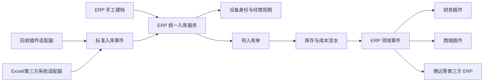

# ERP 插件独立与集成架构

## 目标

ERP 必须同时支持两种部署方式：

1. 独立安装：不安装回收插件，也可以手工建档、入库、整备、定价、销售。
2. 联动安装：回收、商城、第三方系统通过标准事件接入 ERP。

## 依赖方向

## 边界规则

- ERP 不引用回收插件的 PHP 类、模型或数据表。
- 回收插件不写 ERP 数据表，只发布标准设备快照。
- 所有入库来源必须进入 `ErpInboundService`。
- 来源原始数据保存在 `source_snapshot`，核心表只保存标准字段。
- 财务、商城和第三方系统通过领域事件协作，不直接修改库存流水。
- 已确认的库存和成本记录只允许追加反向流水，不允许物理删除。

## 财务插件关系

《财务插件流程图设计》中的应收、应付、收付款、折账和费用应当作为独立财务插件实现。

ERP 负责：

- 一机一档和经营周期。
- 入库、出库和库存锁定。
- 采购、整备、维修等单机成本。
- 单机利润计算所需的业务事实。

财务插件负责：

- 往来单位。
- 应收、应付、收款、付款和折账。
- 资金账户和资金流水。
- 经营费用与财务报表。

推荐事件：

| ERP 事件 | 财务动作 |
| --- | --- |
| `erp.asset.stocked` | 根据业务来源决定是否生成应付 |
| `erp.asset.cost_changed` | 记录整备、维修等成本来源 |
| `erp.asset.sold` | 生成应收并固化销售收入和单机利润 |
| `erp.asset.sale_returned` | 生成反向应收或退款业务 |

## 下一阶段

1. 整备工单与追加成本。
2. 销售定价和调价日志。
3. 库存锁定、销售出库和退货。
4. 独立财务插件订阅 ERP 事件。
