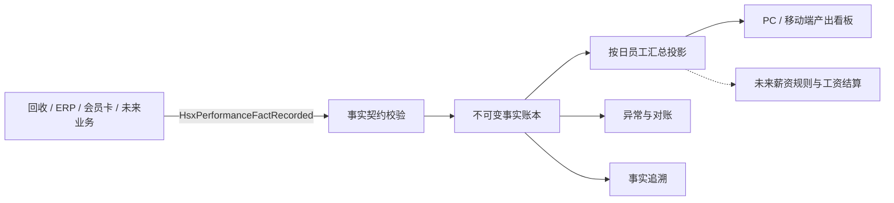

# 员工产出中心技术架构

## 1. 目标与边界

`hsx_performance` 是跨业务的员工产出事实中心，不属于 ERP、回收或会员卡任一业务插件。

- 业务插件负责确认“谁在什么时候完成了什么动作，以及动作对应哪个业务对象”。
- 绩效插件负责接收、校验、保存、冲红、汇总、对账和展示。
- 第一期只计算可追溯的产出，不计算工资。
- 薪资、提成和奖金以后只能读取有效事实，不得回写或改变历史事实。
- 业务插件未安装绩效插件时，核心业务必须仍可运行；有 outbox 的插件负责稍后重试。

## 2. 数据流



## 3. 事实契约 v1

事件名固定为 `HsxPerformanceFactRecorded`。推荐发送以下结构：

```json
{
  "event_name": "performance.fact.recorded.v1",
  "event_version": 1,
  "site_id": 1,
  "event_id": "hsx_recycle:device_log:10086",
  "source_plugin": "hsx_recycle",
  "business_chain": "recycle",
  "metric_key": "recycle.check.completed",
  "metric_name": "完成质检",
  "fact_scope": "action",
  "fact_type": "original",
  "direction": 1,
  "reversal_of_event_id": "",
  "employee_uid": 12,
  "employee_name": "张三",
  "role_key": "checker",
  "business_type": "recycle_device",
  "business_id": "991",
  "business_no": "HSX202607290001",
  "asset_id": 991,
  "imei": "123456789012345",
  "quantity": "1.0000",
  "amount": "0.00",
  "profit": "0.00",
  "duration_seconds": 320,
  "quality_score": "0.00",
  "unit": "device",
  "occurred_at": 1785290400,
  "dimensions": {
    "category": "手机",
    "model": "iPhone 17 Pro"
  },
  "source_route": {
    "app": "adminapp",
    "path": "addon/hsx_recycle/pages/device/detail",
    "query": { "id": 991 }
  }
}
```

兼容旧事件中的 `action_key`、`actor.uid`、`actor.name`。消费者会归一化为上述结构。

## 4. 事实分类

- `action`：员工确实完成的工作，例如签收、质检、定价、拍照、开单、收付款确认。
- `outcome`：业务有效结果，例如设备成功入库、成功销售、会员卡成功开卡。
- `quality`：质量或异常结果，例如退货、质检差错、超时。

动作与结果必须拆成不同事件。例如质检已经完成但设备后来退货，质检动作仍存在；“成功入库”结果可以被冲红。未来规则可以选择按工作量、有效结果或质量综合计算。

## 5. 幂等与冲红

1. `site_id + event_id` 全局唯一。
2. 同一个 `event_id`、同一份规范化数据重复到达，返回 `duplicate`。
3. 同一个 `event_id` 对应不同数据，记录 `event_payload_conflict` 异常并拒绝写入。
4. 原事实永不修改、永不删除。
5. 冲红写入一条 `fact_type=reversal`、`direction=-1` 的新事实，并指定 `reversal_of_event_id`。
6. 冲红必须与原事实属于同站点、同员工、同指标和同业务对象，且数值绝对值不得超过原事实。
7. 同一原事实第一期只允许完整冲红一次；重复冲红会被拒绝并进入异常中心。

## 6. 精确性约束

- 金额和产出值在 PHP 内使用规范化十进制字符串；汇总由数据库 `DECIMAL` 完成，不使用浮点累加。
- `business_date` 在接收时按框架统一时区（当前为 `Asia/Shanghai`）显式固化，历史汇总不受 Web、队列或服务器进程时区变化影响。
- 每次事实写入后，重建受影响员工、日期和指标的汇总投影。
- 看板读取汇总投影，事实详情读取原始账本；两者可随时对账。
- 汇总支持全量重建，删除汇总表不会丢失任何事实。
- 所有异常保留原始载荷、错误类型和处理状态。

## 7. 汇总口径

唯一汇总粒度：

`site_id + business_date + employee_uid + source_plugin + business_chain + metric_key + fact_scope + role_key`

每个汇总保存：

- `quantity`、`amount`、`profit`
- `duration_seconds`、`quality_score`
- `fact_count`、`original_count`、`reversal_count`

第一期排名默认按有效 `quantity` 排序，不把不同单位的指标强行相加。员工总览同时展示“完成事项数”和分指标明细。

## 8. 指标目录

指标由业务插件通过契约提供，绩效插件在首次接收时自动登记：

- 稳定键：`source_plugin + metric_key`
- 名称、单位、事实分类、说明
- 是否启用、排序

名称变化只影响展示，不改变历史统计键。

## 9. 对账与历史补数

- 实时事件负责新增数据。
- `reconcile` 负责检查事实、冲红、汇总之间的一致性。
- `rebuild` 从不可变事实全量重建汇总。
- 各业务插件可后续实现 `HsxPerformanceFactBackfillRequested`，按时间段返回历史事实。
- 历史补数也必须使用稳定 `event_id`，因此可重复执行。

## 10. 薪资扩展边界

未来新增薪资插件或本插件的薪资模块时，必须单独保存：

- 规则版本快照
- 事实选择范围
- 计算明细
- 人工调整及原因
- 结算批次和冲正关系

工资结算不得修改 `performance_fact` 和 `performance_employee_daily`。
