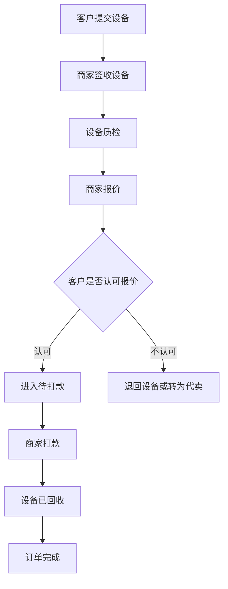
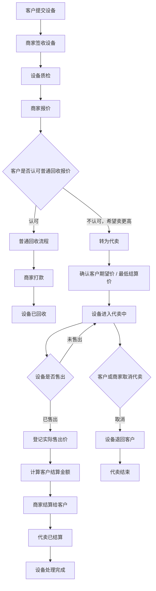
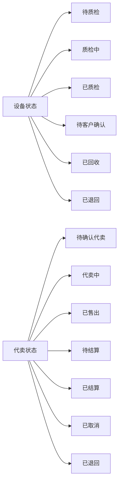
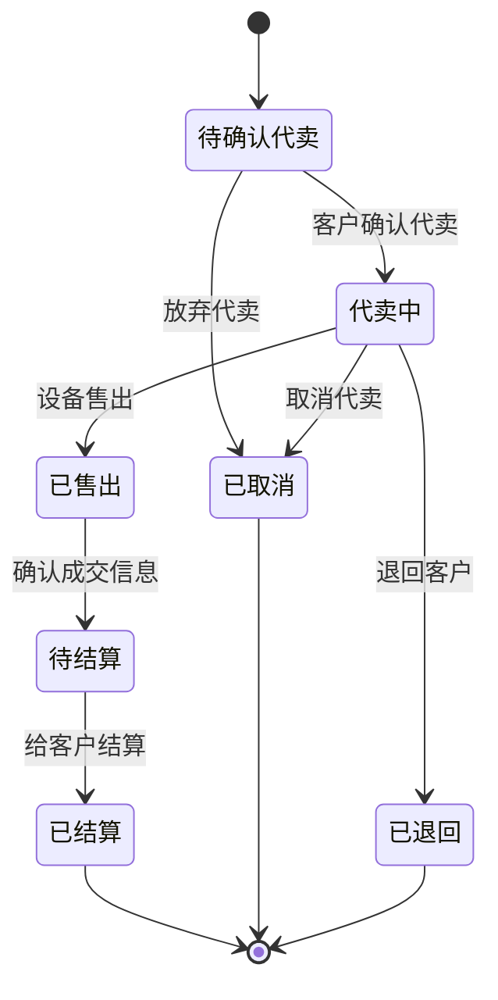
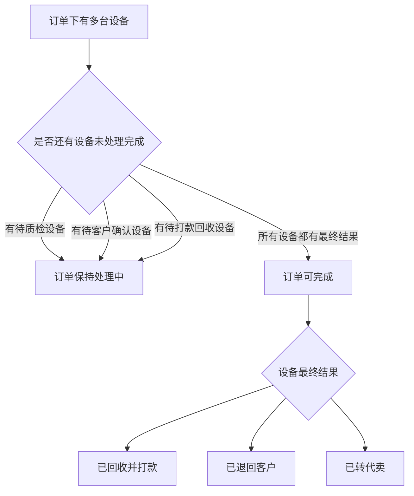
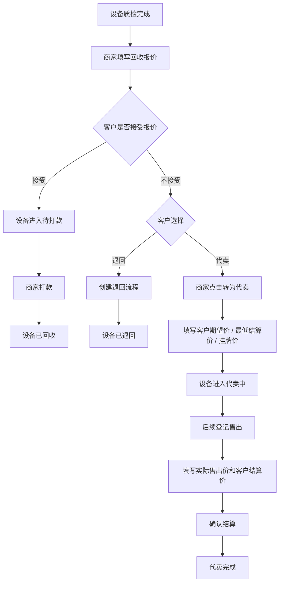
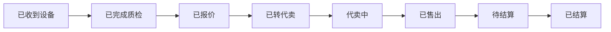

# 二手机回收与代卖业务流程说明

## 1. 业务背景

在二手机回收业务中，客户提交设备后，商家通常会先进行质检和报价。

常规情况下，客户认可报价后，商家直接打款完成回收。

但在实际业务中，也会出现一种情况：

> 商家报价后，客户认为价格偏低，希望设备能卖得更高。

这时设备就不适合继续按照“普通回收”处理，而应该进入“代卖”流程。

代卖的核心逻辑是：

- 设备仍然属于客户委托处理的设备
- 商家帮助客户出售设备
- 设备售出后，再根据实际成交价给客户结算
- 商家的收益来自服务费或成交差价

---

## 2. 普通回收流程

普通回收适用于客户认可商家的回收报价，并希望快速回款的场景。

### 普通回收特点

| 项目 | 说明 |
|---|---|
| 适用场景 | 客户认可报价，希望快速回款 |
| 核心金额 | 回收价 |
| 打款时间 | 客户确认报价后即可打款 |
| 设备归属 | 打款后设备进入商家库存 |
| 业务结果 | 已回收 / 已退回 |

---

## 3. 代卖流程

代卖适用于客户不满意当前回收报价，希望通过出售获得更高收益的场景。

例如：

| 项目 | 金额 |
|---|---:|
| 商家回收报价 | 2000 元 |
| 设备实际售出 | 2200 元 |
| 给客户结算 | 2100 元 |
| 商家服务收益 | 100 元 |

### 代卖特点

| 项目 | 说明 |
|---|---|
| 适用场景 | 客户认为报价偏低，希望卖出更高价格 |
| 核心金额 | 回收报价、客户期望价、实际售出价、客户结算价 |
| 打款时间 | 设备售出并确认结算后 |
| 设备归属 | 代卖期间仍属于客户委托处理 |
| 商家收益 | 服务费或成交差价 |
| 业务结果 | 代卖已结算 / 取消代卖 / 退回客户 |

---

## 4. 设备状态与代卖状态的关系

为了避免业务混乱，建议把“设备质检状态”和“代卖状态”分开。

设备质检状态表示设备当前走到哪个业务环节。

代卖状态只在设备进入代卖后使用。

### 为什么要拆开？

如果只用一个“设备状态”来表示所有情况，会出现这些问题：

- 设备是“已质检”还是“代卖中”表达不清
- 代卖中设备是否算库存成本不清
- 已售出但未结算时，订单是否完成不清
- 客户结算金额和商家收益不好追溯
- 后续接入商城销售时，数据会混乱

所以更合理的方式是：

> 设备主状态负责质检和回收主流程，代卖状态负责代卖过程。

---

## 5. 代卖状态流转

---

## 6. 订单完成规则

一个订单下面可能有多台设备。

每台设备都可能有不同结果：

- 直接回收
- 退回客户
- 进入代卖
- 代卖已结算

当前实现采用“主回收订单”和“代卖订单”分离的口径：

- 主回收订单只负责签收、质检、报价、确认、回收打款、退回、转代卖
- 设备转入代卖后，在主回收订单中视为一个终态结果
- 后续上架、售出、结算、取消代卖，由独立代卖订单追踪
- 主回收订单可以完成或关闭，不需要等待代卖最终售出
- 代卖订单保留来源订单和来源设备，方便从原订单跳转追溯

### 示例

客户提交 10 台设备：

| 设备结果 | 数量 | 是否完成 |
|---|---:|---|
| 已回收并打款 | 6 台 | 是 |
| 已退回 | 2 台 | 是 |
| 已转代卖 | 1 台 | 是，后续看代卖订单 |
| 待客户确认 | 1 台 | 否 |

此时订单不应该完成。

如果最终变成：

| 设备结果 | 数量 | 是否完成 |
|---|---:|---|
| 已回收并打款 | 6 台 | 是 |
| 已退回 | 2 台 | 是 |
| 已转代卖 | 2 台 | 是，后续看代卖订单 |

此时订单可以完成。

---

## 7. 后台操作流程

---

## 8. 商家需要看到的数据

代卖业务上线后，后台建议增加以下数据：

| 数据 | 作用 |
|---|---|
| 代卖中设备数 | 知道当前有多少设备还在出售 |
| 已售待结算设备数 | 防止售出后忘记给客户结算 |
| 代卖成交金额 | 统计代卖设备实际卖了多少钱 |
| 客户结算金额 | 统计需要给客户结算多少钱 |
| 代卖服务收益 | 统计商家通过代卖赚了多少钱 |
| 超时代卖设备 | 识别长时间未售出的设备 |
| 代卖平均周期 | 评估代卖效率 |

---

## 9. 客户侧展示建议

客户不需要看到复杂的内部操作，只需要看到清晰的进度。

客户侧可以展示：

| 展示项 | 示例 |
|---|---|
| 当前状态 | 代卖中 |
| 回收报价 | 2000 元 |
| 客户期望价 | 2300 元 |
| 最低结算价 | 2100 元 |
| 实际售出价 | 2200 元 |
| 客户结算金额 | 2100 元 |
| 结算时间 | 2026-05-25 15:30 |

---

## 10. 总结

代卖不是普通回收的一个简单状态，而是一条独立的设备处理流程。

合理的设计应该是：

- 普通回收继续走现有报价、确认、打款流程
- 客户不认可报价时，可以选择退回或转代卖
- 代卖设备单独记录代卖状态、成交金额、结算金额和服务收益
- 订单是否完成，根据订单下所有设备的最终处理结果判断
- 后台能够追踪每台设备的代卖过程和结算记录

这样既能满足普通回收的高效率，也能支持客户希望“卖更高价”的业务场景。
