# 财务插件流程图设计

## 目标

这份文档用于给店内财务审核流程。

系统目标不是替代专业财务，而是把日常经营中的业务单据、应收应付、收付款、折账、经营费用、利润分析统一记录清楚，方便财务对账、老板看经营情况。

适用场景：

- 手机回收
- 二手机销售
- 同行批发
- 客户既供货又拿货
- 日常经营费用记录
- 应收应付管理
- 折账抵扣
- 利润统计

## 1. 财务插件总流程

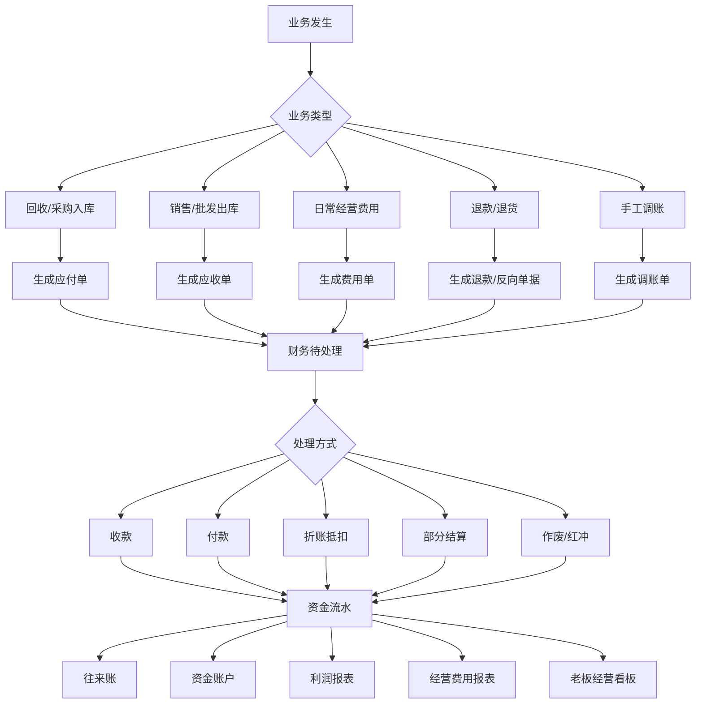

## 2. 往来单位账流程

同一个人可能既是上游，也是下游。

例如：

- 他给我们货，我们欠他钱，产生应付。
- 他从我们这里拿货，他欠我们钱，产生应收。
- 两边可以互相折账。

所以系统不建议分成单独的客户表、供应商表，而是统一为“往来单位”。

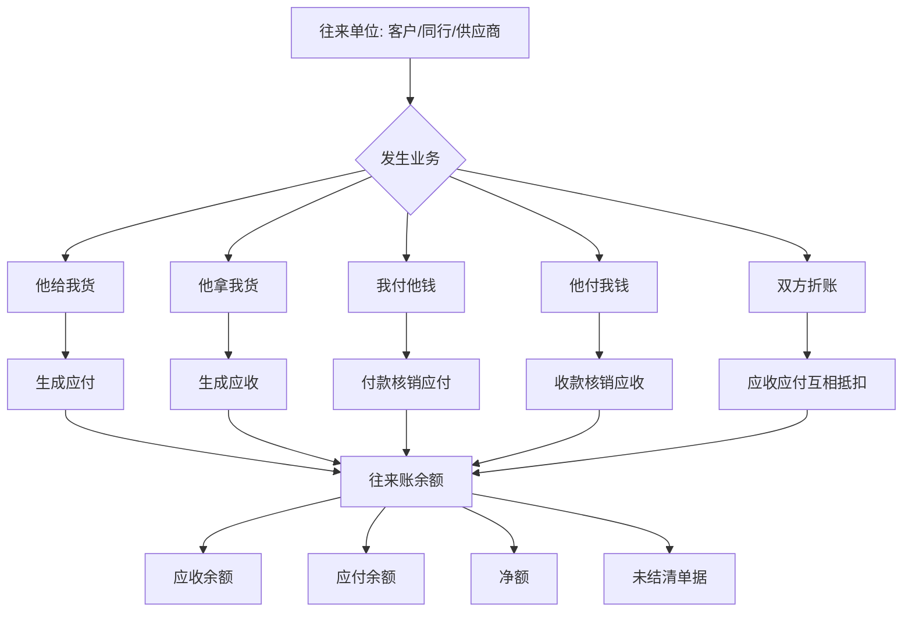

### 财务需要确认

- 是否接受“客户、供应商、同行统一为往来单位”的设计？
- 是否需要给往来单位增加信用额度？
- 是否需要结算周期，例如日结、周结、月结？
- 是否需要区分个人、公司、同行、平台？

## 3. 回收入库产生应付

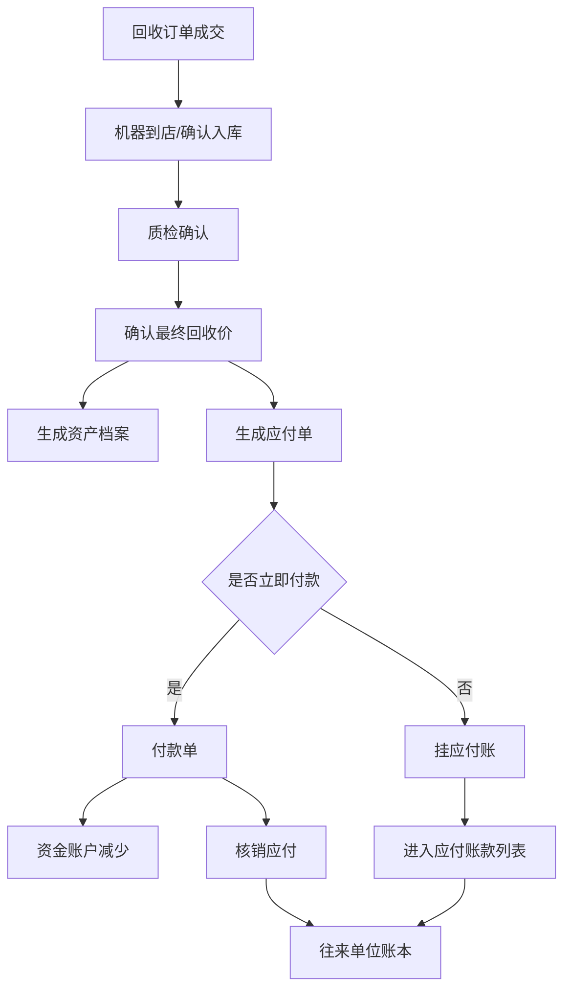

### 注意事项

- 回收价格确认后才建议生成正式应付。
- 如果质检后改价，需要保留改价记录。
- 已经付款的应付单不能直接删除，只能走红冲或反向调整。

## 4. 销售出库产生应收

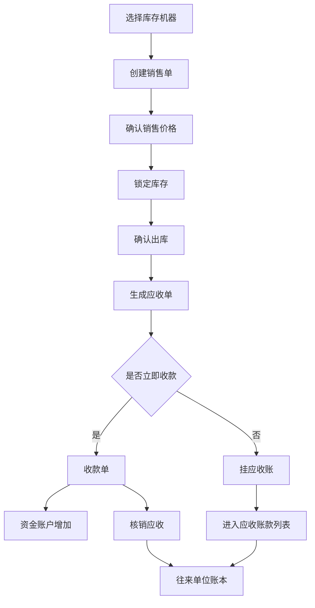

### 注意事项

- 销售出库前需要锁定库存，避免同一台机器重复销售。
- 同行批发可以先出库后挂账。
- 商城订单可以自动生成销售单和应收单。

## 5. 折账流程

折账是这个系统的重点。

例如：

```text
张三给我们一台机器，应付 3000。
张三又从我们这里拿一台机器，应收 4500。
财务做折账后，系统显示还需要收张三 1500。
```

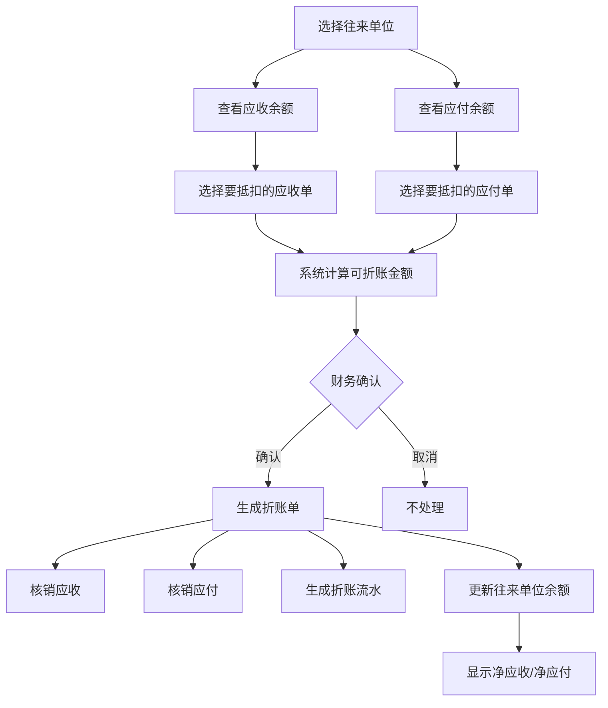

### 折账规则建议

- 折账必须生成独立折账单。
- 折账不能只修改余额。
- 折账单需要记录操作人、时间、应收单、应付单、抵扣金额、备注。
- 折账后如果要撤销，不能直接删除，应走作废或反向折账。
- 大额折账建议需要主管审核。

### 财务需要确认

- 折账是否允许部分抵扣？
- 折账是否需要审核？
- 折账作废由谁操作？
- 折账是否需要打印或导出对账单？

## 6. 日常经营费用流程

财务插件不能只看业务收入和成本，还要看经营费用。

常见费用：

- 房租
- 水电
- 工资
- 物流费
- 维修费
- 平台费
- 办公用品
- 招待费
- 广告推广
- 交通差旅
- 设备耗材
- 其他日常消费

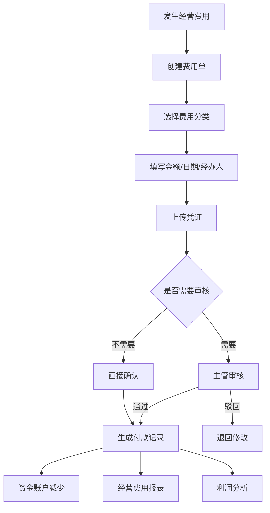

### 费用分类建议

| 一级分类 | 二级分类示例 |
| --- | --- |
| 场地费用 | 房租、物业、水电、网络 |
| 人员费用 | 工资、提成、社保、奖金 |
| 交易费用 | 物流费、包装费、平台服务费、支付手续费 |
| 维修费用 | 配件、维修人工、检测费用 |
| 推广费用 | 广告、短视频投流、地推物料 |
| 办公费用 | 办公用品、打印耗材、设备维修 |
| 招待差旅 | 餐饮、交通、住宿 |
| 其他费用 | 临时费用、无法归类费用 |

### 财务需要确认

- 费用分类是否够用？
- 是否需要按门店、员工、业务线分摊费用？
- 是否需要上传发票或付款截图？
- 哪些费用需要审批？

## 7. 资金账户流程

系统需要记录钱从哪个账户进出。

账户示例：

- 现金
- 微信
- 支付宝
- 银行卡
- 对公账户
- 平台账户
- 员工备用金

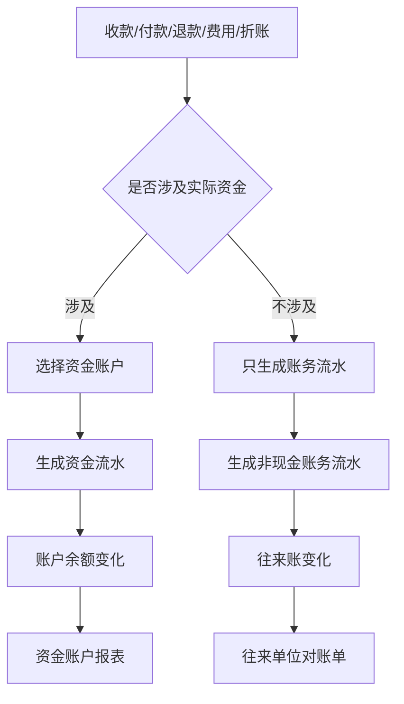

### 注意事项

- 折账通常不产生实际资金进出，但会影响应收应付余额。
- 收款、付款、退款、费用支出会影响资金账户余额。
- 资金账户流水不能随意删除。

## 8. 退款和退货流程

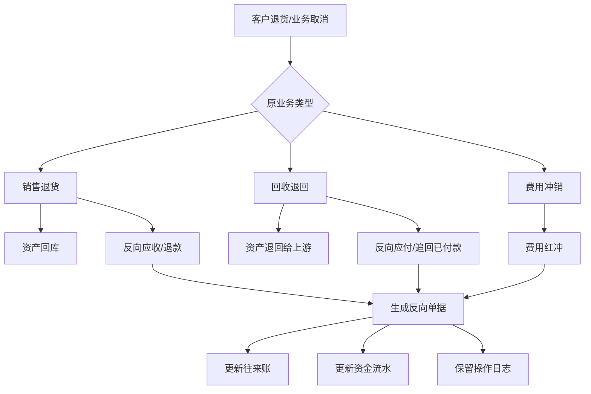

### 注意事项

- 不建议直接删除原始单据。
- 退款、退货、冲销都要生成反向记录。
- 已结算单据发生退货，需要重新计算利润。

## 9. 调账流程

调账用于修正历史错误或特殊情况。

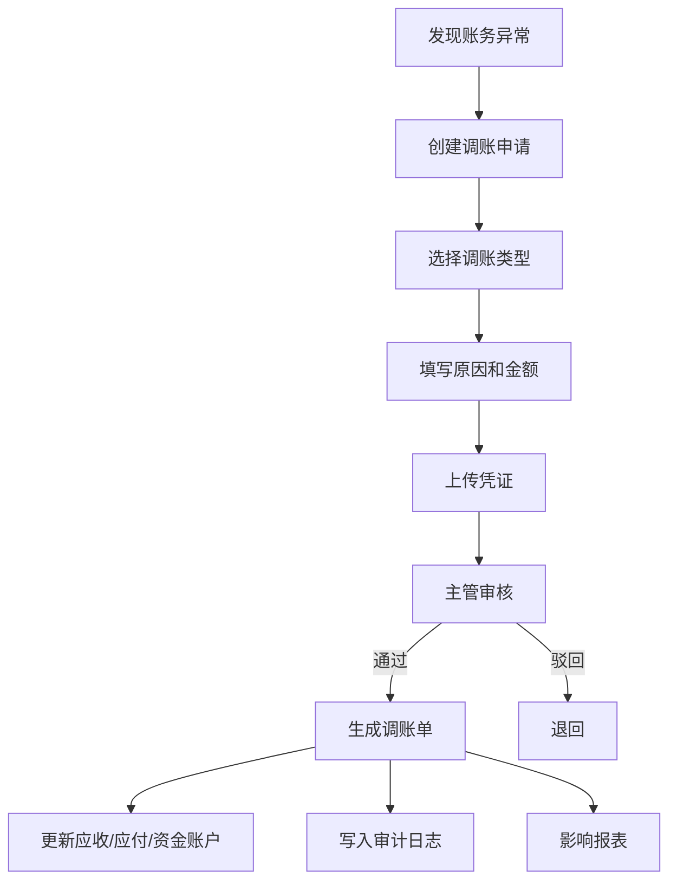

### 调账类型示例

- 应收调增
- 应收调减
- 应付调增
- 应付调减
- 资金账户调增
- 资金账户调减
- 成本调整
- 费用调整

### 财务需要确认

- 哪些人可以发起调账？
- 哪些人可以审核调账？
- 多大金额需要老板审核？
- 调账是否允许影响历史利润？

## 10. 报表流程

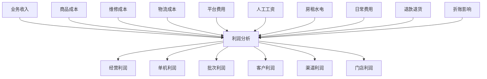

### 报表建议

| 报表 | 用途 |
| --- | --- |
| 应收明细表 | 看谁欠我们钱 |
| 应付明细表 | 看我们欠谁钱 |
| 往来单位对账单 | 看某个客户/同行完整往来 |
| 折账明细表 | 看所有抵扣记录 |
| 收款明细表 | 看实际收了多少钱 |
| 付款明细表 | 看实际付了多少钱 |
| 经营费用表 | 看日常开支 |
| 资金账户流水表 | 看每个账户钱的进出 |
| 单机利润表 | 看每台机器赚多少钱 |
| 批次利润表 | 看一批货赚多少钱 |
| 门店利润表 | 看门店经营结果 |

## 11. 权限设计

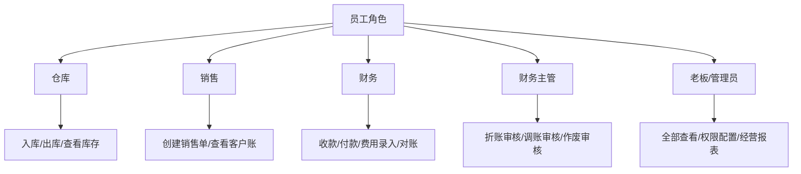

### 高风险权限

以下操作建议单独授权：

- 修改成本
- 修改销售价格
- 作废收款单
- 作废付款单
- 作废折账单
- 调账
- 删除或作废费用单
- 反审核
- 修改已出库资产
- 修改已结算单据
- 导出财务报表

## 12. 单据清单

| 单据 | 说明 |
| --- | --- |
| 应收单 | 客户/同行欠我们的钱 |
| 应付单 | 我们欠客户/供应商/同行的钱 |
| 收款单 | 实际收到钱 |
| 付款单 | 实际付出去钱 |
| 折账单 | 应收和应付互相抵扣 |
| 费用单 | 房租、水电、工资、物流等经营费用 |
| 退款单 | 退钱给客户 |
| 调账单 | 修正账务异常 |
| 资金流水 | 每笔资金变化 |
| 往来账流水 | 每个往来单位的账务变化 |

## 13. 财务审核问题清单

请财务重点确认以下问题：

1. 往来单位是否可以统一客户、供应商、同行？
2. 应收、应付、收款、付款的定义是否符合店内习惯？
3. 折账流程是否符合实际操作？
4. 折账是否需要审核？
5. 部分收款、部分付款是否常见？
6. 付款后改价应该怎么处理？
7. 收错款、付错款应该怎么处理？
8. 费用分类是否够用？
9. 哪些费用需要审批？
10. 哪些单据不能删除，只能红冲？
11. 资金账户需要哪些类型？
12. 是否需要按门店、员工、渠道统计利润？
13. 老板最关心哪些报表？
14. 月底对账需要导出哪些表？
15. 是否需要打印对账单给同行或客户确认？

## 14. 建议第一版范围

第一版建议先做这些：

- 往来单位
- 应收单
- 应付单
- 收款单
- 付款单
- 折账单
- 费用单
- 资金账户
- 资金流水
- 往来账流水
- 应收应付报表
- 折账明细报表
- 经营费用报表
- 基础利润报表

后续再扩展：

- 审批流
- 多门店分账
- 员工业绩
- 费用分摊
- 发票管理
- 自动生成凭证
- 对接专业财务软件

