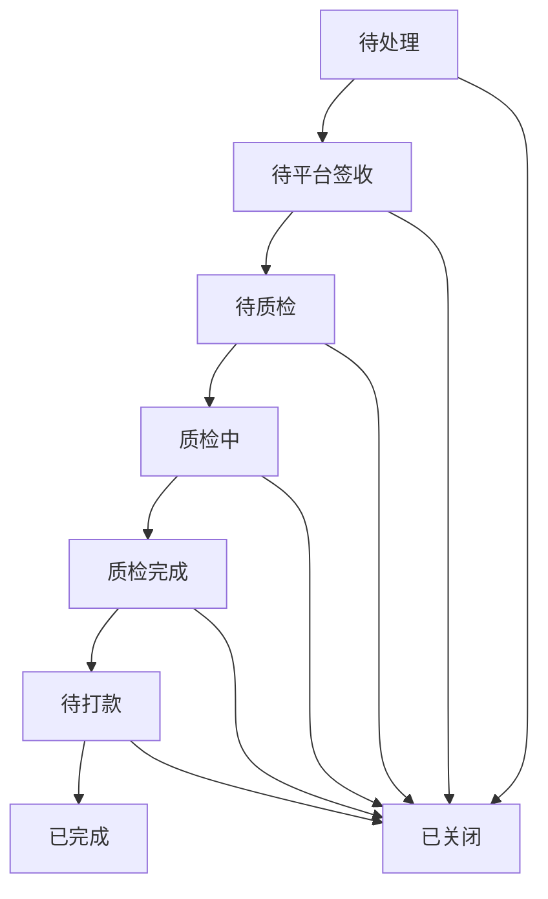

# 手机回收价格插件

## 订单状态说明

订单状态使用统一的数字状态码，具体如下：

| 状态码 | 状态名称 | 说明 |
|--------|----------|------|
| 0 | 待处理 | 订单初始状态 |
| 1 | 待平台签收 | 等待平台确认签收设备 |
| 2 | 待质检 | 设备已签收，等待开始质检 |
| 3 | 质检中 | 正在进行设备质检 |
| 4 | 质检完成 | 设备质检已完成 |
| 5 | 待打款 | 等待向用户支付款项 |
| 6 | 已完成 | 订单已完成 |
| -1 | 已关闭 | 订单已关闭（包含取消、退回等终止状态） |

## 状态流转说明

订单状态按以下流程进行流转：



## 接口说明

### 字典接口

获取订单状态字典：
- 请求方式：GET
- 接口路径：`/dict/recycle_order`
- 返回示例：
```json
{
    "code": 0,
    "msg": "success",
    "data": {
        "0": {
            "name": "待处理",
            "status": 0,
            "action": ["confirm", "close"]
        },
        "1": {
            "name": "待平台签收",
            "status": 1,
            "action": ["confirm", "close"]
        }
        // ... 其他状态
    }
}
```

## 更新日志

### 2025-02-23
- 统一订单状态定义，使用数字状态码
- 添加字典接口，统一状态管理
- 优化状态流转逻辑，简化状态处理
- 合并取消和退回状态为统一的"已关闭"状态
