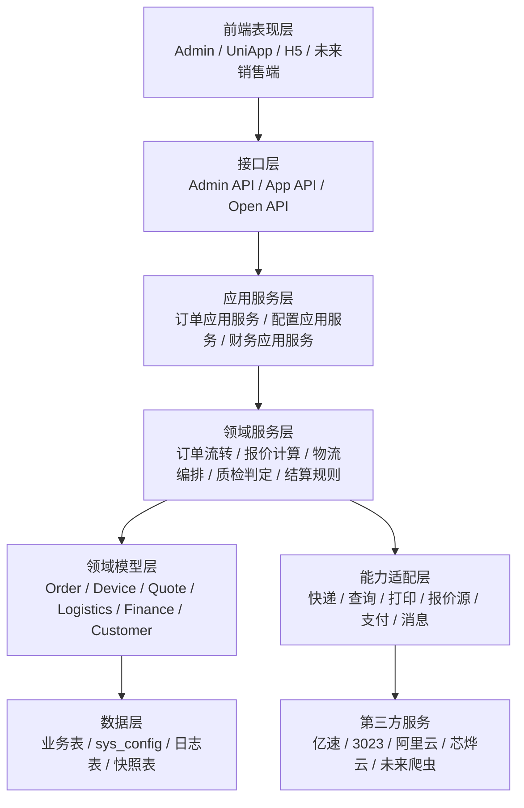
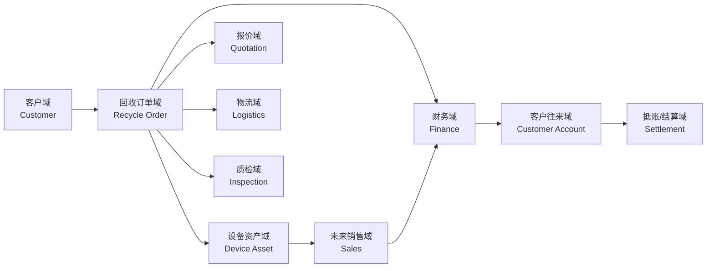
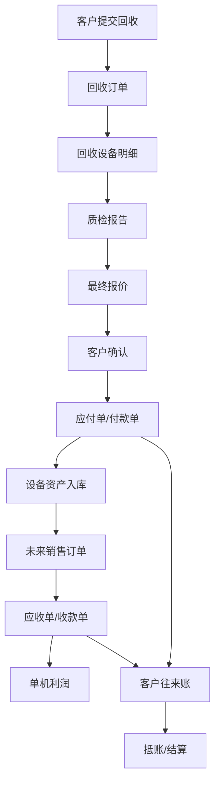
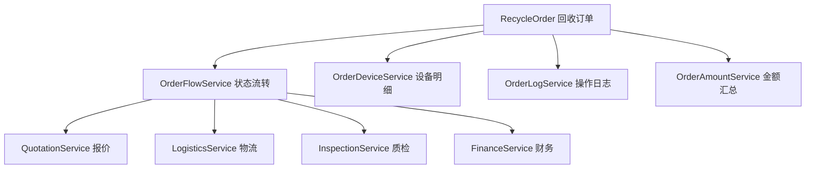
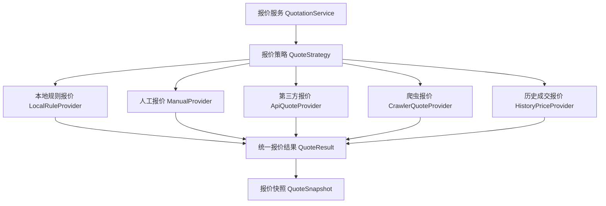
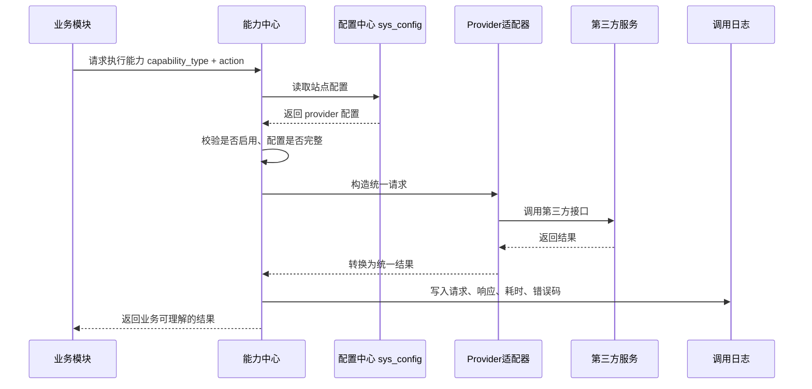
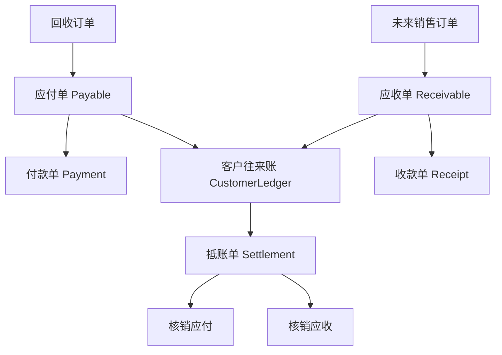
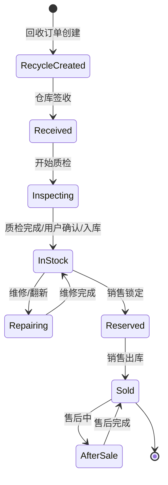
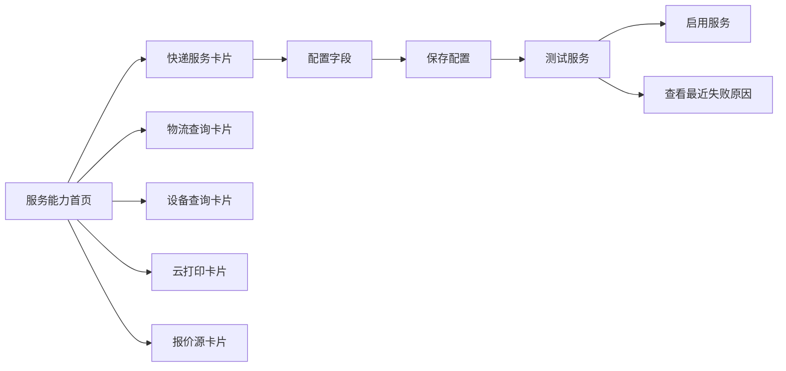
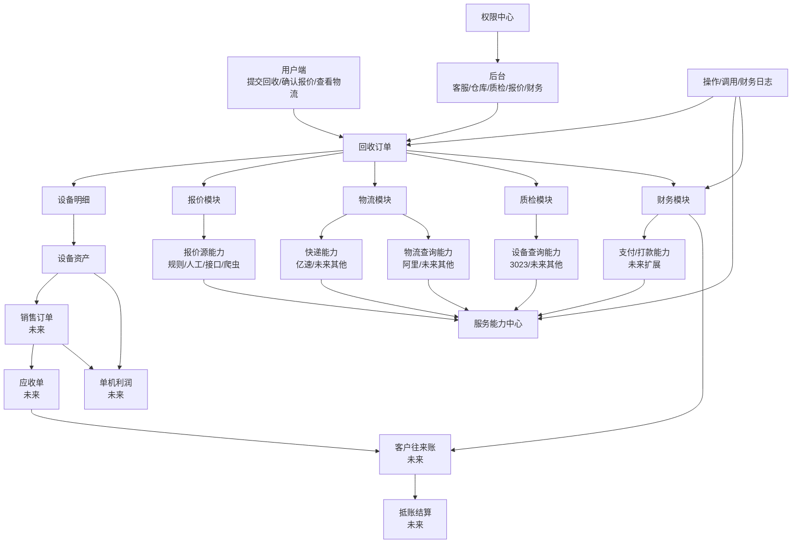

# 回收系统 2.0 总体架构蓝图

> 目标：先把完整架构想清楚，但不把第一期开发拖成完整 ERP。  
> 当前系统先做“回收业务产品化”，架构上预留“买卖一体、客户往来、抵账、ERP、销售、库存、利润、人力绩效”的扩展边界。

这份文档不是马上全部开发的清单，而是后续重构、新插件、二次开发、商业化交付都要遵守的系统蓝图。

---

## 1. 结论先行

### 1.1 这套系统未来到底是什么

它不应该只是一个“回收手机插件”，而应该设计成：

```text
设备交易经营系统 = 回收采购 + 质检定价 + 设备资产 + 销售出库 + 客户往来 + 财务结算 + 第三方能力中心
```

当前第一阶段只需要把“回收采购”做好，但数据结构和模块边界必须允许未来自然扩展到“销售、库存、抵账、利润、ERP”。

### 1.2 当前不做什么

| 暂不做 | 原因 | 架构上如何预留 |
| --- | --- | --- |
| 完整 ERP | 范围太大，会拖死回收 2.0 | 先定义财务单据、设备资产、客户往来接口 |
| 完整销售系统 | 当前核心还是回收 | 预留销售订单模块和设备出库状态 |
| 完整人力/KPI | 与当前回收上线目标距离较远 | 操作人、归属销售、业绩归属字段先预留 |
| 月结/关账 | 财务严肃性高，后置 | 流水不可变、冲正机制先定好 |
| 多仓复杂库存 | 初期可能用不到 | 设备资产上预留仓库、库位、库存状态 |

### 1.3 第一阶段必须做对什么

| 必须做对 | 说明 |
| --- | --- |
| 回收订单主流程 | 用户下单、寄件、签收、质检、报价、确认、打款、完成 |
| 设备资产化 | 每一台机器最终要成为可追踪资产，而不是只挂在订单里的明细 |
| 报价体系可扩展 | 人工报价、规则报价、第三方报价、未来爬虫报价都能接 |
| 第三方能力中心 | 快递、查询、打印、报价源都走统一配置和诊断 |
| 权限闭环 | 菜单权限、按钮权限、接口权限、操作日志都要闭环 |
| 财务基础抽象 | 打款不是简单改订单状态，要沉淀为付款单/应付单的雏形 |
| 客户往来预留 | 未来同一个客户买和卖都可以进入往来账，并支持抵账 |

---

## 2. 系统分层架构

### 2.1 总体分层



### 2.2 每一层的责任

| 层级 | 责任 | 禁止事项 |
| --- | --- | --- |
| 前端表现层 | 页面展示、交互、表单、权限显示 | 不写死业务状态流转规则 |
| 接口层 | 参数校验、登录态、权限、返回格式 | 不直接拼第三方请求 |
| 应用服务层 | 组织业务用例，例如“创建快递单” | 不把第三方 SDK 逻辑散落在各处 |
| 领域服务层 | 核心规则，例如订单能否流转、报价如何确认 | 不依赖具体页面 |
| 领域模型层 | 业务对象和状态 | 不关心前端页面怎么展示 |
| 能力适配层 | 接入第三方或内部服务 | 不反向修改核心业务规则 |
| 数据层 | 存储事实、快照、日志、配置 | 不用一堆散乱 JSON 替代核心表 |

---

## 3. 业务域划分

### 3.1 核心业务域



### 3.2 模块职责表

| 模块 | 当前阶段 | 未来扩展 | 关键对象 |
| --- | --- | --- | --- |
| 客户模块 | 记录回收用户信息 | 买卖一体客户档案、客户分层、信用额度 | `Customer` |
| 回收订单模块 | 回收主流程 | 采购单、批量回收、B 端回收 | `RecycleOrder` |
| 设备资产模块 | 回收设备明细和质检结果 | 库存、销售、利润、售后、串号追踪 | `DeviceAsset` |
| 报价模块 | 初始报价、最终报价 | 爬虫报价、行情报价、渠道报价、报价策略 | `Quote`, `QuoteSnapshot` |
| 物流模块 | 寄件、退回、物流查询 | 多快递、多仓发货、销售出库物流 | `LogisticsOrder` |
| 质检模块 | 检测项、扣费、图片 | 质检模板、质检工单、复检、评级 | `InspectionReport` |
| 财务模块 | 回收打款 | 应付、应收、收款、付款、抵账、对账 | `Payable`, `Receivable`, `Payment` |
| 客户往来模块 | 先预留 | 应收应付汇总、客户余额、抵账 | `CustomerLedger` |
| 销售模块 | 暂不做 | 销售订单、出库、销售利润 | `SalesOrder` |
| 能力中心 | 第三方配置、测试、调用日志 | 内部服务、插件化 provider、服务市场 | `CapabilityProvider` |
| 权限模块 | 菜单/按钮/接口权限 | 岗位、数据权限、审批权限 | `Permission` |

---

## 4. 核心数据主线

### 4.1 为什么必须有“设备资产”

如果系统未来要做利润、销售、ERP、客户往来，就不能只围绕“订单”建模。

回收订单解决的是：

```text
我从谁那里收了什么机器，多少钱收，怎么寄过来，怎么打款。
```

设备资产解决的是：

```text
这台机器从哪里来，现在在哪里，成本是多少，卖给了谁，赚了多少钱。
```

所以未来所有核心经营分析都要落到单机资产上。

### 4.2 数据主线



### 4.3 单机利润公式

未来销售接入后，单机利润可以这样算：

```text
单机毛利 = 销售收入 - 回收成本 - 维修成本 - 物流成本 - 平台/支付手续费 - 其他分摊成本
```

第一期不需要把所有成本都做全，但字段和数据结构不能堵死。

| 成本项 | 当前是否要做 | 预留方式 |
| --- | --- | --- |
| 回收成本 | 要做 | 设备最终回收价 |
| 物流成本 | 可先手工 | 物流单上预留成本字段 |
| 维修成本 | 暂不做 | 设备资产成本明细表预留 |
| 平台手续费 | 暂不做 | 财务费用明细预留 |
| 人工成本 | 暂不做 | 未来按规则分摊 |

---

## 5. 订单架构

### 5.1 订单不能承担所有事情

订单模块只负责主流程，不应该直接承担报价、物流、质检、财务、第三方调用的全部细节。



### 5.2 订单状态拆分

旧系统容易乱，是因为一个状态字段试图表达所有事情。新版必须拆状态：

| 状态维度 | 字段建议 | 说明 |
| --- | --- | --- |
| 主状态 | `order_status` | 页面主流程，例如待寄件、待质检、待打款 |
| 物流状态 | `logistics_status` | 是否下单、运输中、签收、异常 |
| 质检状态 | `inspection_status` | 待质检、质检中、已质检、复核中 |
| 报价状态 | `quote_status` | 初始报价、最终报价、用户已确认/拒绝 |
| 财务状态 | `finance_status` | 待付款、付款中、已付款、付款失败 |
| 售后/退回状态 | `return_status` | 无退回、退回中、已退回 |

### 5.3 订单流转原则

| 原则 | 说明 |
| --- | --- |
| 所有状态变化必须走领域服务 | 不能在控制器、页面、第三方回调里随便改状态 |
| 状态变化必须写日志 | 谁、什么时间、从什么状态到什么状态、原因是什么 |
| 金额变化必须留快照 | 初始报价、质检扣费、最终报价都要可追溯 |
| 第三方失败不直接污染主状态 | 失败要记录能力调用日志，业务层决定是否重试或人工处理 |
| 用户确认是关键节点 | 最终报价未经用户确认，不能进入付款 |

---

## 6. 报价架构

### 6.1 报价不是一个价格字段

报价至少包含：

| 对象 | 说明 |
| --- | --- |
| 报价请求 | 用户选择的机型、规格、成色、问题项 |
| 报价来源 | 人工、规则、第三方接口、爬虫、历史成交 |
| 报价快照 | 当时参与计算的规则、价格、扣费项 |
| 报价结果 | 初始价、最终价、有效期、用户确认状态 |

### 6.2 报价源扩展

未来接爬虫时，不应该改订单流程，只新增报价源 provider。



### 6.3 报价扩展点

| 扩展点 | 用途 |
| --- | --- |
| `QuoteProviderInterface` | 统一不同报价来源 |
| `QuoteStrategy` | 决定多个报价来源如何组合 |
| `QuoteSnapshot` | 保存当时价格依据 |
| `QuoteAdjustment` | 人工加价/扣价 |
| `QuoteValidity` | 有效期和过期规则 |
| `QuoteAuditLog` | 报价修改审计 |

---

## 7. 第三方能力中心架构

### 7.1 能力中心的定位

第三方服务不应该散落在订单、物流、打印、查询代码里。它应该统一沉淀为“能力中心”。

```text
能力中心 = provider 注册 + 配置 schema + 配置保存 + 连通性测试 + 调用日志 + 错误诊断 + 启停控制
```

### 7.2 能力分类

| 能力类型 | 当前 provider | 未来 provider | 业务使用方 |
| --- | --- | --- | --- |
| 快递下单 | 亿速 | 顺丰、京东、菜鸟 | 物流模块 |
| 物流查询 | 阿里云快递查询 | 快递鸟、聚合数据 | 物流模块 |
| 设备查询 | 3023 | 爱思、GSX、其他渠道 | 质检/报价模块 |
| 云打印 | 芯烨云 | 飞鹅、佳博 | 打印模块 |
| 报价源 | 暂无统一 | 爬虫、第三方行情 | 报价模块 |
| 支付/打款 | 暂无统一 | 微信支付、支付宝、银行卡代付 | 财务模块 |
| 通知 | 微信订阅消息 | 短信、企微、邮件 | 通知模块 |

### 7.3 能力中心调用流程



### 7.4 Provider 设计原则

| 原则 | 说明 |
| --- | --- |
| Provider 只做适配 | 不写订单状态、不写业务金额 |
| 配置必须来自配置中心 | 不允许在代码里硬编码账号、URL、端口、密钥 |
| 每个 provider 必须能测试 | 保存配置前后都能做连通性/配置完整性检查 |
| 返回结果必须标准化 | 第三方字段不能直接传遍业务系统 |
| 错误必须可诊断 | 用户看到“配置缺失/密钥错误/第三方超时”，不是 PHP 报错 |

---

## 8. 财务与客户往来架构

### 8.1 为什么现在就要设计财务抽象

回收业务现在看起来只是“给客户打款”，但未来如果接销售，就会出现：

```text
客户卖给我一台机器 -> 我应付客户
客户从我这里买一台机器 -> 客户应付我
双方可以抵账 -> 只结差额
```

这不是完整 ERP，但这是买卖一体系统的核心基础。

### 8.2 财务对象关系



### 8.3 抵账定义

“抵账”不是直接把订单金额改掉，而是新增一张结算/抵账单，对应收和应付做核销。

| 场景 | 业务含义 | 系统处理 |
| --- | --- | --- |
| 客户卖给我 3000，又从我这里买 4500 | 客户还需要付我 1500 | 应付 3000 和应收 3000 抵掉，剩余应收 1500 |
| 客户卖给我 6000，又从我这里买 3000 | 我还需要付客户 3000 | 应收 3000 和应付 3000 抵掉，剩余应付 3000 |
| 多笔订单互抵 | 多张应收/应付按规则核销 | 生成抵账单和抵账明细 |

### 8.4 往来余额公式

```text
客户往来余额 = 未结应收金额 - 未结应付金额
```

| 结果 | 含义 |
| --- | --- |
| `> 0` | 客户欠我们钱 |
| `< 0` | 我们欠客户钱 |
| `= 0` | 双方已结清 |

### 8.5 财务架构原则

| 原则 | 说明 |
| --- | --- |
| 原始单据不可随意改 | 应收、应付、付款、收款一旦确认，修改要走冲正/作废 |
| 核销必须有单据 | 抵账必须生成 settlement，不允许直接扣余额 |
| 账务流水不可变 | ledger 只追加，不覆盖 |
| 业务单和财务单分离 | 订单完成不等于财务完成，财务完成不等于业务可删除 |
| 每笔钱都有来源 | 来源单据、客户、设备、操作人、时间必须可查 |

---

## 9. 未来销售与库存架构预留

### 9.1 设备从回收到销售的生命周期



### 9.2 销售接入时需要的最小对象

| 对象 | 说明 |
| --- | --- |
| `SalesOrder` | 销售订单，记录卖给谁、卖什么、多少钱 |
| `SalesOrderItem` | 销售明细，绑定设备资产 |
| `Receivable` | 销售产生应收 |
| `Receipt` | 客户付款记录 |
| `OutboundOrder` | 出库单 |
| `SalesReturn` | 销售退货 |
| `ProfitSnapshot` | 销售完成时锁定利润快照 |

### 9.3 库存不一定第一期做，但字段要预留

| 字段 | 说明 |
| --- | --- |
| `asset_status` | 待入库、在库、锁定、已售、退回、报废 |
| `warehouse_id` | 仓库 |
| `location_id` | 库位 |
| `cost_amount` | 当前成本 |
| `sale_amount` | 销售金额 |
| `profit_amount` | 利润快照 |
| `owner_site_id` | 所属站点 |
| `operator_id` | 当前责任人 |

---

## 10. 权限架构

### 10.1 权限闭环

权限不能只停留在“菜单配置里写了”。完整闭环是：

```text
定义权限 -> 同步权限 -> 角色授权 -> 登录获取 -> 前端使用 -> 后端校验 -> 操作审计
```

### 10.2 权限分层

| 权限层 | 用途 | 示例 |
| --- | --- | --- |
| 菜单权限 | 控制页面是否可见 | 回收订单、配置中心、财务打款 |
| 按钮权限 | 控制页面操作是否可见 | 确认签收、提交报价、确认打款 |
| 接口权限 | 后端强制校验 | `POST recycle/order/pay` |
| 数据权限 | 未来控制可见数据范围 | 只看自己订单、只看某门店 |
| 审批权限 | 未来控制高风险操作 | 大额改价、作废付款、冲正单据 |

### 10.3 回收核心按钮权限

| 页面 | 按钮/动作 | 权限 key 建议 |
| --- | --- | --- |
| 回收订单 | 创建订单 | `recycle.order.create` |
| 回收订单 | 修改订单 | `recycle.order.update` |
| 回收订单 | 取消订单 | `recycle.order.cancel` |
| 回收订单 | 确认签收 | `recycle.order.receive` |
| 质检工作台 | 开始质检 | `recycle.inspection.start` |
| 质检工作台 | 提交质检 | `recycle.inspection.submit` |
| 报价管理 | 提交最终报价 | `recycle.quote.final_submit` |
| 财务打款 | 确认打款 | `recycle.finance.pay_confirm` |
| 配置中心 | 修改第三方配置 | `recycle.capability.config_update` |
| 配置中心 | 测试第三方服务 | `recycle.capability.test` |

---

## 11. 前端产品架构

### 11.1 后台不应该按技术模块摆页面

用户不关心“provider、adapter、config schema”，用户关心的是“我现在要完成什么工作”。

后台建议按工作场景组织：

| 一级导航 | 二级页面 | 面向角色 |
| --- | --- | --- |
| 工作台 | 今日待处理、异常提醒、关键数据 | 管理员、运营 |
| 回收订单 | 订单列表、订单详情、异常订单 | 客服、运营 |
| 签收质检 | 签收工作台、质检工作台、设备查询 | 仓库、质检员 |
| 报价中心 | 报价规则、待报价、报价记录 | 报价员 |
| 财务结算 | 待打款、打款记录、未来客户往来 | 财务 |
| 设备资产 | 设备列表、设备详情、未来库存 | 仓库、老板 |
| 服务能力 | 快递、查询、打印、报价源、调用日志 | 管理员、交付 |
| 系统设置 | 权限、基础配置、通知配置 | 管理员 |

### 11.2 配置中心的用户体验

配置中心不能让用户看到一堆复杂 JSON。应该是：

```text
能力卡片 -> 当前状态 -> 配置表单 -> 测试连接 -> 最近错误 -> 使用说明
```



### 11.3 订单详情页建议结构

| 区块 | 内容 |
| --- | --- |
| 顶部摘要 | 订单号、客户、主状态、最终金额、风险提示 |
| 流程进度 | 下单、寄件、签收、质检、报价、确认、打款 |
| 设备信息 | 机型、IMEI、质检结果、价格 |
| 物流信息 | 寄件物流、退回物流、轨迹 |
| 报价信息 | 初始报价、最终报价、扣费项、报价快照 |
| 财务信息 | 应付金额、付款状态、付款凭证 |
| 操作区 | 根据状态和权限展示按钮 |
| 日志区 | 状态日志、操作日志、第三方调用日志 |

---

## 12. 后端代码架构建议

### 12.1 目录建议

如果继续沿用当前插件，可以逐步整理为：

```text
addon/recycle
├── app
│   ├── adminapi/controller
│   ├── api/controller
│   ├── service
│   │   ├── admin
│   │   ├── api
│   │   └── core
│   │       ├── order
│   │       ├── device
│   │       ├── quotation
│   │       ├── logistics
│   │       ├── inspection
│   │       ├── finance
│   │       ├── capability
│   │       └── permission
│   ├── model
│   ├── dict
│   ├── listener
│   └── job
├── database
├── docs
└── tests
```

### 12.2 服务命名规范

| 类型 | 命名 | 例子 |
| --- | --- | --- |
| 管理端应用服务 | `app/service/admin/*` | `RecycleOrderAdminService` |
| 用户端应用服务 | `app/service/api/*` | `RecycleOrderApiService` |
| 核心领域服务 | `app/service/core/*` | `CoreRecycleOrderFlowService` |
| 能力适配服务 | `app/service/core/capability/*` | `ExpressProviderYisu` |
| 字典 | `app/dict/*` | `RecycleOrderStatusDict` |
| 模型 | `app/model/*` | `RecycleOrder` |

### 12.3 控制器应该很薄

控制器只做：

| 控制器职责 |
| --- |
| 获取参数 |
| 调用验证器 |
| 调用应用服务 |
| 返回统一响应 |

控制器不应该做：

| 禁止事项 |
| --- |
| 直接调用第三方接口 |
| 直接拼 SQL 处理复杂业务 |
| 直接修改订单状态 |
| 直接计算复杂价格 |
| 直接保存密钥到散落配置 |

---

## 13. 数据表总体规划

### 13.1 第一阶段建议表

| 表 | 说明 |
| --- | --- |
| `recycle_order` | 回收订单主表 |
| `recycle_order_device` | 回收订单设备明细 |
| `recycle_device_asset` | 设备资产表，可由订单设备转入 |
| `recycle_quote` | 报价记录 |
| `recycle_quote_snapshot` | 报价快照 |
| `recycle_inspection_report` | 质检报告 |
| `recycle_inspection_item` | 质检明细 |
| `recycle_logistics_order` | 物流单 |
| `recycle_payment_record` | 付款记录 |
| `recycle_operation_log` | 操作日志 |
| `recycle_capability_log` | 第三方能力调用日志 |
| `sys_config` | 第三方配置、基础配置 |

### 13.2 未来财务/销售扩展表

| 表 | 说明 | 什么时候做 |
| --- | --- | --- |
| `trade_customer_account` | 客户往来账户 | 做买卖一体时 |
| `trade_receivable` | 应收单 | 接销售时 |
| `trade_payable` | 应付单 | 回收财务升级时 |
| `trade_receipt` | 收款单 | 接销售时 |
| `trade_payment` | 付款单 | 回收财务升级时 |
| `trade_settlement` | 抵账/结算单 | 做客户往来时 |
| `trade_settlement_item` | 抵账明细 | 做客户往来时 |
| `trade_customer_ledger` | 客户往来流水 | 做客户往来时 |
| `sales_order` | 销售订单 | 接销售系统时 |
| `sales_order_item` | 销售明细 | 接销售系统时 |
| `stock_warehouse` | 仓库 | 做库存时 |
| `stock_movement` | 库存流水 | 做库存时 |

### 13.3 sys_config 的使用边界

`sys_config` 适合放配置，不适合放业务数据。

| 可以放 `sys_config` | 不应该放 `sys_config` |
| --- | --- |
| 第三方账号密钥 | 订单 |
| 第三方接口地址 | 设备 |
| 打印机配置 | 质检报告 |
| 快递服务开关 | 报价快照 |
| 报价源开关 | 财务流水 |
| 通知模板配置 | 客户往来账 |

---

## 14. 事件与日志架构

### 14.1 关键业务事件

未来系统变大后，很多模块不能互相硬调用，可以通过事件解耦。

| 事件 | 触发时机 | 订阅方 |
| --- | --- | --- |
| `RecycleOrderCreated` | 回收订单创建 | 通知、统计 |
| `LogisticsCreated` | 快递单创建 | 订单日志、通知 |
| `PackageReceived` | 仓库签收 | 质检、打印 |
| `InspectionCompleted` | 质检完成 | 报价 |
| `FinalQuoteSubmitted` | 最终报价提交 | 用户通知 |
| `UserQuoteAccepted` | 用户接受报价 | 财务 |
| `PaymentConfirmed` | 财务确认付款 | 订单、设备资产 |
| `DeviceAssetCreated` | 设备入库 | 库存、未来销售 |
| `ReceivableCreated` | 未来销售产生应收 | 客户往来 |
| `PayableCreated` | 回收产生应付 | 客户往来 |
| `SettlementConfirmed` | 抵账确认 | 财务、客户往来 |

### 14.2 日志类型

| 日志 | 说明 |
| --- | --- |
| 订单状态日志 | 记录状态变化 |
| 操作日志 | 记录后台人员操作 |
| 报价日志 | 记录报价来源、计算过程、人工调整 |
| 第三方调用日志 | 请求、响应、耗时、错误 |
| 财务日志 | 付款、收款、抵账、作废、冲正 |
| 权限审计日志 | 谁操作了高风险动作 |

---

## 15. 插件策略：旧插件改造还是新插件

### 15.1 两种路线

| 路线 | 优点 | 缺点 | 适合情况 |
| --- | --- | --- | --- |
| 原插件继续重构 | 复用当前代码和页面，迁移压力小 | 容易被旧结构拖住 | 快速上线 2.0 小版本 |
| 新插件重建 | 架构干净，适合产品化 | 需要迁移旧数据和功能 | 做商业化长期版本 |

### 15.2 我的建议

短期不要马上推倒重来。先把当前插件整理出“能力中心、权限闭环、订单状态、配置中心”这些关键底座。

当以下条件出现时，再考虑新插件：

| 条件 | 说明 |
| --- | --- |
| 订单状态和数据表已经无法兼容 | 继续改会越来越乱 |
| 销售/客户往来要正式上线 | 旧插件边界不够 |
| 要作为标准产品售卖 | 需要更干净的交付结构 |
| 需要多客户部署和升级 | 需要稳定迁移脚本和版本管理 |

---

## 16. 分阶段落地路线

### 16.1 阶段 0：架构收敛

| 目标 | 输出 |
| --- | --- |
| 确定业务边界 | 完整流程文档、架构蓝图、权限文档 |
| 明确不做什么 | 暂不做完整 ERP/销售/KPI |
| 明确核心对象 | 订单、设备、报价、物流、质检、财务、能力中心 |

### 16.2 阶段 1：回收 2.0 可交付版

| 模块 | 要做 |
| --- | --- |
| 订单 | 状态机整理、操作日志、异常处理 |
| 报价 | 报价快照、最终报价、人工调整 |
| 物流 | 亿速快递、阿里查询、退回物流 |
| 质检 | 质检报告、图片、扣费项 |
| 财务 | 打款记录、凭证、付款状态 |
| 能力中心 | 第三方配置、测试、日志、启停 |
| 权限 | 菜单、按钮、接口权限闭环 |
| 前端 | 工作台化、页面统一、降低配置复杂度 |

### 16.3 阶段 2：设备资产与经营分析

| 模块 | 要做 |
| --- | --- |
| 设备资产 | 设备资产表、入库状态、成本 |
| 利润雏形 | 单机成本、回收金额、物流成本 |
| 数据看板 | 月度回收量、金额、完成率、异常率 |
| 报价升级 | 历史价格、规则引擎、报价复核 |

### 16.4 阶段 3：买卖一体基础

| 模块 | 要做 |
| --- | --- |
| 销售订单 | 销售出库、设备绑定 |
| 应收应付 | 销售产生应收，回收产生应付 |
| 客户往来 | 客户余额、往来明细 |
| 抵账 | 应收应付抵扣，生成结算单 |
| 利润 | 单机利润、型号利润、月份利润 |

### 16.5 阶段 4：ERP/人力/更大系统

| 模块 | 要做 |
| --- | --- |
| ERP 对接 | 单据同步、财务凭证、库存同步 |
| 销售管理 | 销售线索、客户跟进、渠道 |
| KPI | 销售任务、回收任务、提成结算 |
| 月结 | 关账、调账、冲正、报表锁定 |
| 多组织 | 多门店、多仓、多角色数据权限 |

---

## 17. MVP 边界

### 17.1 第一版只做这些

```text
回收订单 + 报价 + 物流 + 质检 + 打款 + 能力中心 + 权限闭环 + 基础设备资产
```

### 17.2 第一版不做这些

```text
完整销售系统、完整 ERP、完整库存、多仓调拨、月结、KPI、人力管理、复杂财务凭证
```

### 17.3 但第一版必须预留这些

| 预留点 | 为什么 |
| --- | --- |
| 设备资产编号 | 未来销售和利润必须靠它 |
| 客户统一 ID | 未来买卖一体和抵账必须靠它 |
| 应付抽象 | 回收打款未来要进入客户往来 |
| 订单事件 | 未来模块解耦 |
| 操作日志 | 产品化交付和责任追踪 |
| 能力中心 | 后续第三方服务越来越多 |
| 权限 key 规范 | 后续模块越来越多，不能乱 |

---

## 18. 关键风险和规避方案

| 风险 | 表现 | 规避方案 |
| --- | --- | --- |
| 范围失控 | 回收还没做好就开始做 ERP | 明确分阶段，第一期只做回收 2.0 |
| 订单表过重 | 所有字段都塞订单表 | 拆设备、报价、物流、财务、日志 |
| 第三方继续硬编码 | 改一个接口到处改 | 能力中心统一 provider |
| 报价无法追溯 | 用户问为什么扣钱说不清 | 报价快照和扣费明细 |
| 财务金额不可信 | 付款、抵账、改价混在一起 | 财务单据化，流水不可变 |
| 权限只有配置没有使用 | 按钮和接口谁都能调 | 前端按钮控制 + 后端接口校验 |
| 页面复杂不好卖 | 配置页面像开发工具 | 按业务场景设计页面 |
| 后期接销售推翻重做 | 设备没有资产化 | 第一阶段就建立设备资产概念 |

---

## 19. 推荐的核心命名

### 19.1 产品命名

| 场景 | 推荐名称 |
| --- | --- |
| 当前插件 | 回收系统 2.0 |
| 未来大系统 | 设备交易经营系统 |
| 第三方配置 | 服务能力中心 |
| 客户应收应付 | 客户往来账 |
| 应收应付抵扣 | 抵账/往来结算 |
| 单台机器 | 设备资产 |

### 19.2 模块英文命名

| 中文 | 英文建议 |
| --- | --- |
| 回收 | `recycle` |
| 设备资产 | `device_asset` |
| 报价 | `quotation` |
| 质检 | `inspection` |
| 物流 | `logistics` |
| 财务 | `finance` |
| 能力中心 | `capability` |
| 客户往来 | `customer_account` |
| 抵账结算 | `settlement` |
| 销售 | `sales` |

---

## 20. 最终架构图



---

## 21. 下一步建议

建议下一步不要直接进入“大 ERP 开发”，而是按下面顺序推进：

| 顺序 | 工作 | 目的 |
| --- | --- | --- |
| 1 | 确认本文档的模块边界 | 防止后续边做边变 |
| 2 | 把当前回收订单状态重新核对 | 找出旧代码最乱的点 |
| 3 | 统一后台页面信息架构 | 让产品变得好卖、好用 |
| 4 | 完成权限闭环 | 解决有 set 没有 get/use 的问题 |
| 5 | 完成能力中心页面升级 | 第三方配置真正变成可交付功能 |
| 6 | 设计设备资产表 | 为未来销售和利润打基础 |
| 7 | 再讨论客户往来和抵账细节 | 不急着做，但要定模型 |

---

## 22. 一句话原则

```text
第一期只做回收 2.0，但架构上按“设备交易经营系统”设计。
```

这样不会把当前项目拖成庞大的 ERP，也不会让未来接销售、抵账、利润、ERP 时推倒重来。
