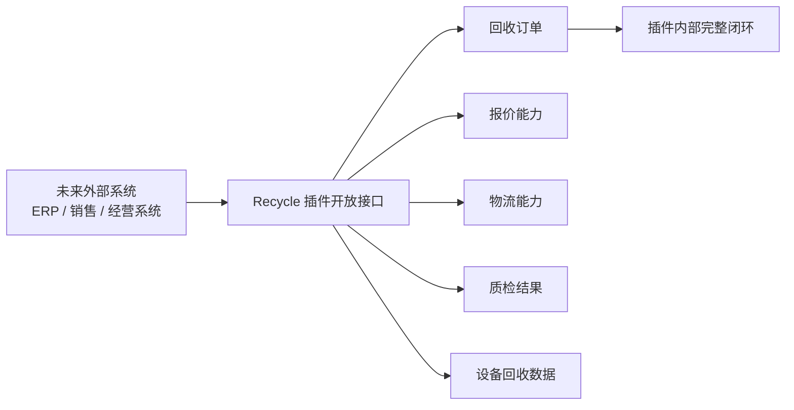
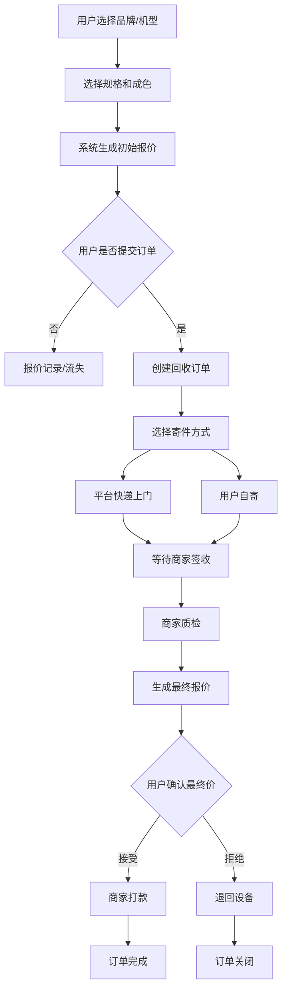
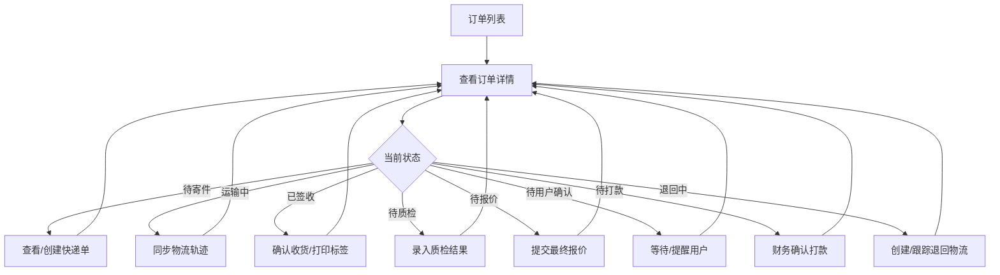
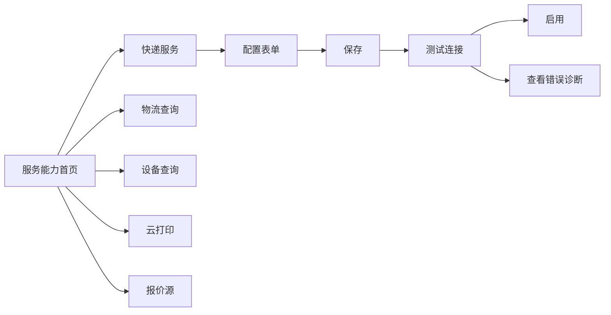
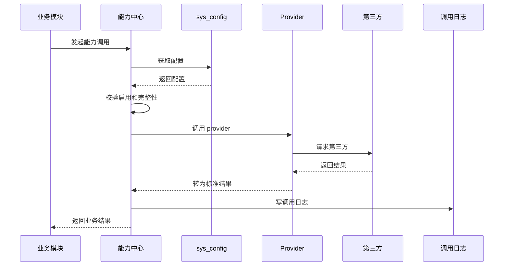
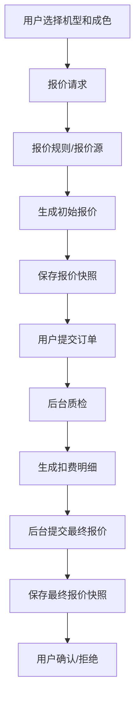

# 回收插件 2.0 商业化聚焦方案

> 目标：不做大 ERP，不做销售系统，不做复杂客户往来。  
> 当前只把 `recycle` 插件本身做到最好：可商用、体验好、代码质量高、第三方能力可配置、后续易扩展。

这份文档用于替代“范围过大的大系统规划”，作为当前 `recycle` 插件后续重构和产品打磨的主准绳。

---

## 1. 当前战略收敛

### 1.1 现在要做什么

当前版本的目标不是“设备交易经营系统”，而是：

```text
一个高质量、可交付、可商用、可扩展的手机回收插件
```

它应该解决客户最核心的需求：

| 核心能力 | 说明 |
| --- | --- |
| 报价 | 用户能快速获得初始报价，后台能生成最终报价，报价过程可追溯 |
| 订单 | 用户能下单、寄件、确认报价、收款；后台能跟进完整订单流程 |
| 物流 | 支持平台快递、自寄、物流查询、退回物流 |
| 质检 | 后台能录入质检结果、扣费项、图片和最终价格依据 |
| 打款 | 后台能记录打款状态、凭证和异常 |
| 第三方 API | 快递、查询、打印、报价源等能力可配置、可测试、可诊断 |
| 后台体验 | 页面清晰、操作顺手、状态明确、异常可处理 |
| 插件化 | 后续如果接入其他系统，`recycle` 可以作为独立业务插件存在 |

### 1.2 现在不做什么

| 暂不做 | 原因 |
| --- | --- |
| ERP | 范围过大，会影响当前回收插件交付 |
| 销售系统 | 当前业务核心是回收，不做买卖一体 |
| 客户往来/抵账 | 暂时不是当前插件上线核心 |
| 人力/KPI | 和当前回收流程关系不直接 |
| 多仓复杂库存 | 当前只需要回收订单和设备管理 |
| 月结/财务凭证 | 当前只做打款记录和基础财务状态 |

### 1.3 未来怎么扩展

未来如果接入别的系统，`recycle` 应该作为一个独立插件被接入，而不是被大系统吞掉。



---

## 2. 产品定位

### 2.1 一句话定位

```text
让商家可以快速上线手机回收业务，并且不用开发人员维护第三方接口和复杂流程。
```

### 2.2 面向客户的价值

| 客户痛点 | 插件要解决的问题 |
| --- | --- |
| 不会配置第三方接口 | 服务能力中心提供表单化配置、测试和错误诊断 |
| 订单流程乱 | 订单状态清晰，下一步动作明确 |
| 报价说不清 | 初始报价、最终报价、质检扣费都可追溯 |
| 客服处理效率低 | 后台工作台显示待处理和异常 |
| 物流跟踪麻烦 | 快递下单、轨迹查询、退回物流统一管理 |
| 打款容易漏 | 待打款列表、凭证、状态流转清晰 |
| 系统不好交付 | 配置中心、权限、文档和测试路径完善 |

### 2.3 商业化标准

| 标准 | 要求 |
| --- | --- |
| 能卖 | 客户看得懂页面，知道怎么用 |
| 能交付 | 交付人员能按文档配置上线 |
| 能维护 | 第三方接口变更不需要到处改代码 |
| 能排错 | 后台能看到配置缺失、接口失败、最近错误 |
| 能扩展 | 后续新增报价源、快递、查询、打印不推翻结构 |
| 能升级 | 数据表、配置、权限有版本意识 |

---

## 3. 当前模块边界

### 3.1 保留并打磨的模块

| 模块 | 当前定位 | 打磨方向 |
| --- | --- | --- |
| 用户端报价 | 用户提交机型和成色，获取初始报价 | 表单更顺、价格更可信、报价快照可追溯 |
| 用户端订单 | 用户提交回收订单、选择寄件方式、确认最终价 | 状态更清楚，步骤更少，异常提示更友好 |
| 后台订单 | 商家处理订单主流程 | 列表更好筛选，详情页信息分区清楚，操作按钮按状态出现 |
| 物流模块 | 平台快递、自寄、轨迹查询、退回 | 统一物流单，统一查询，统一异常 |
| 质检模块 | 录入检测结果和扣费 | 质检项结构化，最终报价有依据 |
| 报价模块 | 初始报价和最终报价 | 报价规则、人工调整、第三方/未来爬虫可扩展 |
| 打款模块 | 记录付款状态和凭证 | 待打款队列、付款记录、失败原因 |
| 第三方能力 | 快递、查询、打印、3023、阿里等 | 配置中心、provider、调用日志、测试连接 |
| 权限模块 | 菜单和按钮权限 | 补齐 get/use/enforce，前后端都生效 |
| 打印模块 | 标签/面单/小票打印 | 配置统一，模板清晰，失败可查 |

### 3.2 不把当前插件变成什么

| 不变成 | 原因 |
| --- | --- |
| 财务系统 | 当前只需要回收打款，不做完整财务 |
| 库存系统 | 当前设备只是回收流程的一部分，不做复杂库存 |
| 销售系统 | 不做售卖、出库、利润 |
| CRM | 不做销售线索、客户跟进、业绩任务 |

---

## 4. 核心业务流程

### 4.1 用户侧主流程



### 4.2 后台侧主流程



### 4.3 订单详情页应该围绕“下一步动作”

订单详情不是把所有字段堆出来，而是回答三个问题：

| 问题 | 页面要表达 |
| --- | --- |
| 现在订单到哪一步了 | 顶部状态、流程进度、异常提示 |
| 我现在能做什么 | 根据状态和权限显示主要按钮 |
| 为什么是这个金额/状态 | 报价、质检、物流、打款、日志可追溯 |

---

## 5. 用户体验改造重点

### 5.1 后台信息架构

建议后台菜单收敛成：

| 一级菜单 | 页面 | 说明 |
| --- | --- | --- |
| 回收工作台 | 待处理、异常、今日数据 | 进入后台先看到重点 |
| 回收订单 | 订单列表、订单详情 | 核心处理入口 |
| 报价管理 | 报价规则、报价记录、最终报价 | 价格相关集中管理 |
| 质检管理 | 质检模板、质检记录 | 检测和扣费依据 |
| 物流管理 | 快递单、物流轨迹、退回单 | 物流相关集中管理 |
| 财务打款 | 待打款、打款记录 | 财务只看该处理的钱 |
| 服务能力 | 快递、查询、打印、第三方配置 | 第三方配置统一入口 |
| 系统设置 | 权限、基础设置 | 管理员配置 |

### 5.2 订单列表体验

| 改造点 | 目标 |
| --- | --- |
| 状态分组 tab | 快速进入待处理状态 |
| 高级筛选 | 按订单号、手机号、IMEI、物流单号、状态、时间筛选 |
| 批量操作 | 批量同步物流、批量导出 |
| 异常标识 | 物流异常、报价待确认超时、打款失败明显提示 |
| 下一步动作 | 列表直接显示“待签收/待质检/待打款” |
| 权限控制 | 没权限的按钮不显示或禁用 |

### 5.3 订单详情体验

| 区块 | 内容 |
| --- | --- |
| 顶部摘要 | 订单号、客户、当前状态、最终金额、异常提示 |
| 流程进度 | 下单、寄件、签收、质检、报价、确认、打款 |
| 主要操作 | 当前状态下最重要的按钮 |
| 设备信息 | 机型、规格、IMEI、SN、图片 |
| 报价信息 | 初始报价、扣费项、最终报价、用户确认 |
| 质检信息 | 质检项、检测结果、图片、备注 |
| 物流信息 | 寄件物流、轨迹、退回物流 |
| 财务信息 | 待打款金额、打款方式、凭证、付款状态 |
| 日志信息 | 操作日志、状态日志、第三方调用日志 |

### 5.4 服务能力中心体验

服务能力中心要从“技术配置页”变成“交付工具”。

每个能力卡片展示：

| 信息 | 说明 |
| --- | --- |
| 服务名称 | 例如亿速快递、阿里物流查询、3023 查询、芯烨云打印 |
| 启用状态 | 启用/停用/配置不完整 |
| 配置状态 | 已配置/缺少密钥/缺少接口地址 |
| 最近调用 | 最近成功时间、最近失败原因 |
| 操作 | 配置、测试、查看日志、启用/停用 |



---

## 6. 代码质量改造原则

### 6.1 重构目标

| 当前问题 | 改造目标 |
| --- | --- |
| 硬编码第三方配置 | 全部进入 `sys_config` + 配置中心 |
| 控制器/页面直接调第三方 | 统一走能力中心 provider |
| 状态字段混乱 | 拆分订单状态、物流状态、报价状态、质检状态、打款状态 |
| 价格来源不清 | 报价快照、扣费明细、人工调整记录 |
| 页面逻辑重 | 前端 composable/service 化 |
| 权限有配置没使用 | 菜单、按钮、接口权限闭环 |
| 错误难排查 | 第三方调用日志和业务操作日志 |

### 6.2 后端分层

```text
Controller
  只负责参数、权限、调用服务、返回结果

Admin/API Service
  负责后台/用户端业务用例

Core Domain Service
  负责订单流转、报价计算、物流编排、质检、打款等核心规则

Provider Adapter
  负责第三方接口适配，不直接修改业务状态

Model/Repository
  负责数据读写
```

### 6.3 前端分层

```text
view 页面
  负责布局和交互

components 组件
  负责订单卡片、状态标签、报价区块、物流区块等复用 UI

composables
  负责状态、筛选、表格、弹窗、权限等页面逻辑

api
  负责接口请求封装

dict/constants
  负责状态、选项、展示文案
```

### 6.4 禁止继续出现的代码

| 禁止事项 | 替代方案 |
| --- | --- |
| 在业务代码里写死 API 地址、密钥、端口 | 配置中心 |
| 在多个地方复制同一套第三方请求 | provider |
| 页面里硬判断一堆状态数字 | 状态字典 + 状态能力方法 |
| 修改订单状态不写日志 | 统一状态流转服务 |
| 价格直接覆盖没有记录 | 报价快照 + 调整记录 |
| 按钮只靠前端隐藏 | 后端接口也必须校验权限 |

---

## 7. 第三方能力中心标准

### 7.1 当前必须支持的能力

| 能力 | 当前选择 | 说明 |
| --- | --- | --- |
| 快递下单 | 亿速 | 安果暂时不要 |
| 物流查询 | 阿里物流查询 | 配置接口地址和密钥 |
| 设备查询 | 3023 | 配置 base_url、api_key 等 |
| 云打印 | 芯烨云 | 配置打印机和接口 |
| 报价源 | 先保留扩展位 | 未来可接爬虫或第三方行情 |

### 7.2 每个 provider 必须具备

| 能力 | 说明 |
| --- | --- |
| 配置 schema | 后端定义字段，前端按 schema 渲染 |
| 配置校验 | 判断是否完整 |
| 测试连接 | 后台能点击测试 |
| 标准请求 | 业务层传入统一参数 |
| 标准响应 | provider 转换成系统内部结果 |
| 错误诊断 | 返回用户能看懂的错误 |
| 调用日志 | 记录请求、响应、耗时、状态 |
| 启停控制 | 可以禁用某个 provider |

### 7.3 第三方调用原则



---

## 8. 报价模块打磨

### 8.1 报价要解决的问题

| 问题 | 解决方案 |
| --- | --- |
| 用户看到的价格从哪里来 | 初始报价快照 |
| 质检后为什么变价 | 扣费项和质检结果 |
| 后台人工改价有没有记录 | 人工调整记录 |
| 未来爬虫怎么接入 | 报价源 provider |
| 报价过期怎么办 | 报价有效期 |

### 8.2 报价流程



### 8.3 未来爬虫扩展方式

爬虫不要直接写进订单流程。未来只新增一个报价源：

```text
CrawlerQuoteProvider
```

它只负责返回标准报价结果，订单和报价流程不需要因为爬虫而重写。

---

## 9. 权限和安全

### 9.1 权限闭环

```text
定义权限 -> 同步菜单 -> 角色授权 -> 登录获取 -> 前端控制 -> 后端校验 -> 操作审计
```

### 9.2 当前必须落地的权限

| 权限 | 说明 |
| --- | --- |
| 订单查看 | 是否能看订单 |
| 订单编辑 | 是否能修改订单基础信息 |
| 确认签收 | 仓库权限 |
| 提交质检 | 质检权限 |
| 提交最终报价 | 报价权限 |
| 确认打款 | 财务权限 |
| 配置第三方 | 管理员/交付权限 |
| 测试第三方服务 | 管理员/交付权限 |
| 查看调用日志 | 管理员/交付/技术支持权限 |

### 9.3 高风险操作必须记录

| 操作 | 需要记录 |
| --- | --- |
| 修改最终报价 | 原价格、新价格、原因、操作人 |
| 确认打款 | 金额、方式、凭证、操作人 |
| 取消订单 | 原因、操作人 |
| 作废快递单 | 原因、第三方结果 |
| 修改第三方配置 | 修改字段、操作人、时间 |

---

## 10. 当前插件作为未来接入点

### 10.1 未来被其他系统接入时提供什么

| 接入能力 | 说明 |
| --- | --- |
| 创建回收订单 | 外部系统可以创建回收单 |
| 查询订单状态 | 外部系统可以同步订单进度 |
| 查询报价结果 | 获取初始报价、最终报价 |
| 查询质检结果 | 获取质检项和图片 |
| 查询物流状态 | 获取寄件/退回物流 |
| 接收订单事件 | 订单完成、用户拒绝、打款成功等事件 |
| 导出业务数据 | 订单、报价、质检、打款记录 |

### 10.2 插件边界

`recycle` 插件内部自己完成回收闭环：

```text
报价 -> 下单 -> 寄件 -> 签收 -> 质检 -> 最终报价 -> 用户确认 -> 打款 -> 完成/退回
```

外部系统只通过接口或事件接入，不应该直接改插件内部表。

---

## 11. 开发优先级

### 11.1 第一优先级：用户体验和稳定性

| 工作 | 目标 |
| --- | --- |
| 重做后台订单体验 | 订单状态清晰、操作明确 |
| 统一服务能力中心 | 第三方配置好用、可测试 |
| 补齐权限使用 | 按钮和接口都受控 |
| 完善错误提示 | 用户知道哪里配置错、哪里调用失败 |
| 增加操作日志 | 关键动作可追踪 |

### 11.2 第二优先级：代码质量

| 工作 | 目标 |
| --- | --- |
| 订单状态流转服务化 | 不到处改状态 |
| 第三方 provider 标准化 | 不硬编码、不散落 |
| 报价快照结构化 | 价格可追溯 |
| 前端组件拆分 | 页面不臃肿 |
| 字典和状态统一 | 不写死状态数字和文案 |

### 11.3 第三优先级：商业化交付

| 工作 | 目标 |
| --- | --- |
| 安装/初始化配置 | 新客户快速上线 |
| 配置检查页 | 一眼知道系统能不能用 |
| 使用文档 | 交付人员可以按步骤配置 |
| 测试清单 | 每次交付都能验收 |
| 升级脚本 | 后续版本可维护 |

---

## 12. 验收标准

### 12.1 产品验收

| 场景 | 标准 |
| --- | --- |
| 用户报价 | 用户能顺利获得报价，报价结果清楚 |
| 用户下单 | 用户能完成寄件方式选择和订单提交 |
| 后台处理 | 后台能从订单列表一路处理到完成 |
| 质检报价 | 质检结果和最终报价有依据 |
| 财务打款 | 待打款、已打款、失败状态明确 |
| 物流 | 快递下单、物流查询、退回流程可用 |
| 第三方配置 | 配置、测试、错误诊断可用 |
| 权限 | 不同角色看到不同按钮，接口也校验 |

### 12.2 代码验收

| 标准 | 要求 |
| --- | --- |
| 不新增硬编码第三方配置 | 所有第三方配置走配置中心 |
| 控制器保持轻量 | 不写复杂业务 |
| 状态变更集中 | 订单状态变化走统一服务 |
| 关键操作有日志 | 报价、打款、配置、状态流转 |
| 前端页面可维护 | 组件、composable、api 分层清楚 |
| 错误可诊断 | 第三方失败有日志和可读错误 |

---

## 13. 推荐下一步

下一步不要再扩范围，建议直接按当前插件做三件事：

| 顺序 | 工作 | 输出 |
| --- | --- | --- |
| 1 | 梳理现有页面体验 | 后台菜单和页面改造清单 |
| 2 | 梳理现有代码问题 | 后端/前端重构任务表 |
| 3 | 先做服务能力中心和权限闭环 | 让第三方配置、权限、日志变成产品能力 |

---

## 14. 最终原则

```text
只做回收，但把回收做到极致。
```

当前 `recycle` 插件的方向应该是：

```text
好配置、好使用、好交付、好排错、好扩展。
```

未来需要更大的业务系统时，让更大的系统来接入 `recycle`，而不是现在就把 `recycle` 做成一个庞大的系统。
