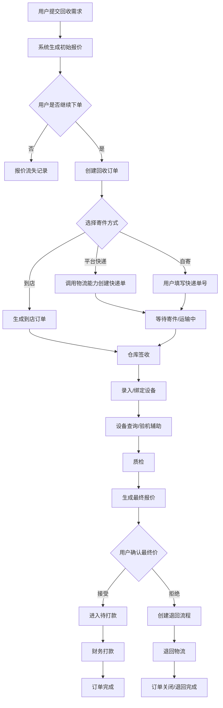
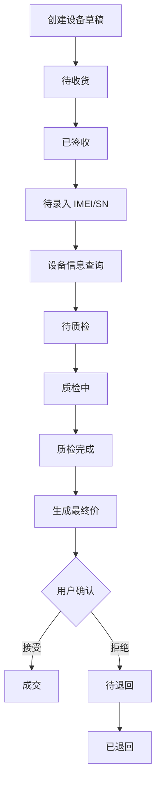
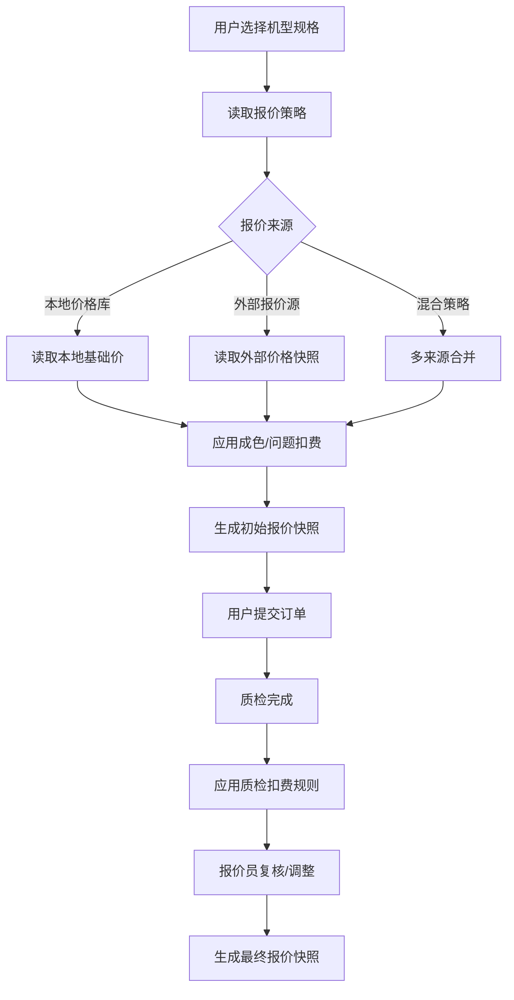
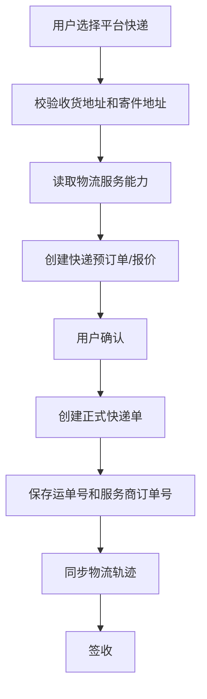
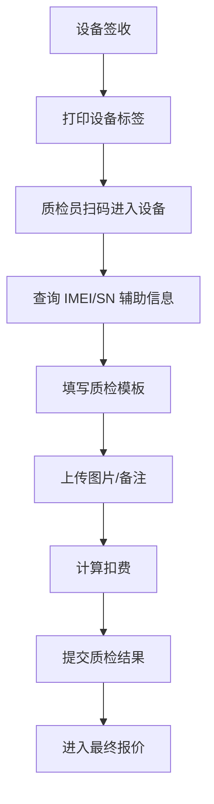
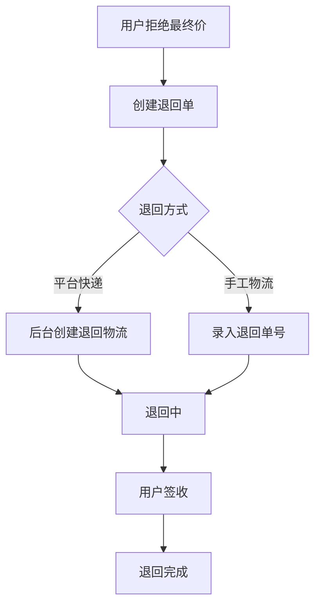
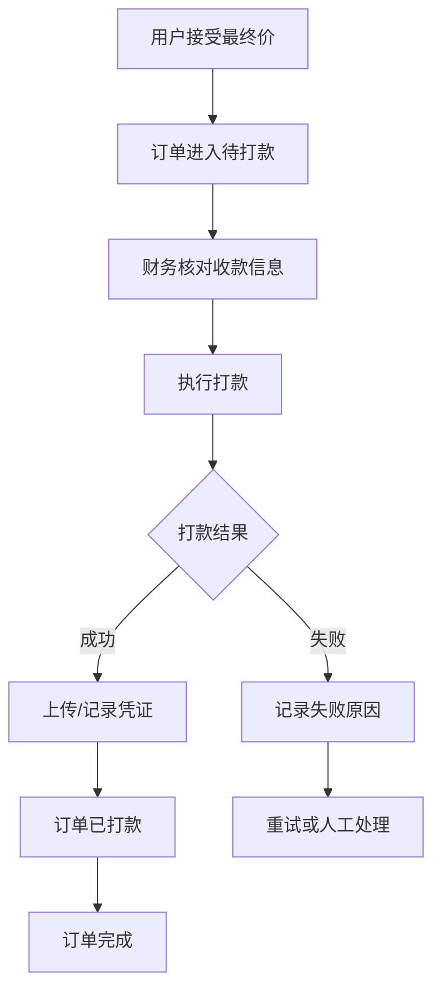
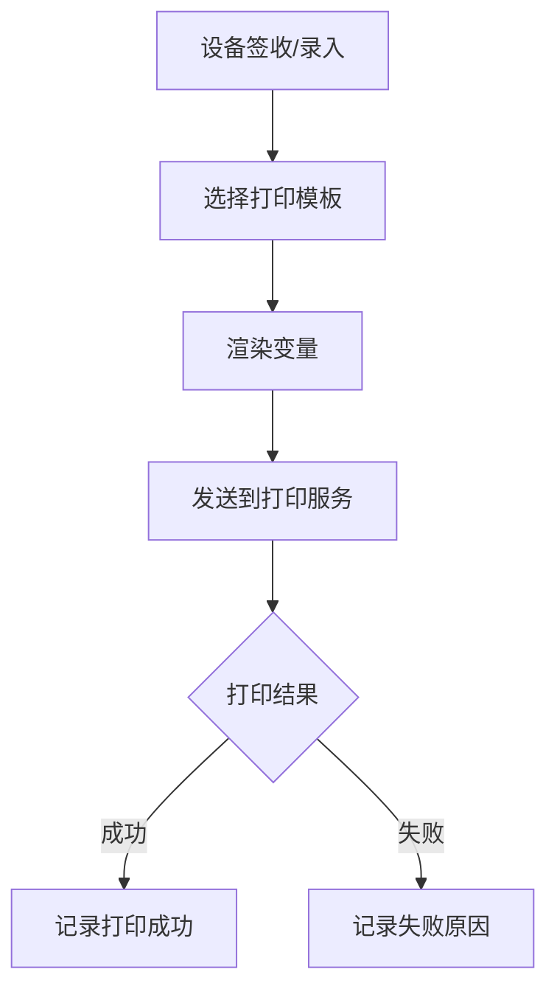

# 回收系统 2.0 完整流程化设计文档

> 目标：把当前回收插件从“可运行的业务代码”升级为“可销售、可交付、可扩展、可长期维护”的产品级系统。

本文档先定义业务流程、状态机、模块边界、扩展点和后台体验。后续是否继续改旧插件，或者新建 `device_recycle` / `phone_recycle` 新插件，都应以本文档为蓝本。

---

## 1. 产品定位

### 1.1 产品目标

| 目标 | 说明 |
| --- | --- |
| 可销售 | 客户拿到系统后能理解、能配置、能上线，而不是只能开发人员维护 |
| 可交付 | 交付人员能快速配置物流、查询、打印、报价等服务 |
| 可扩展 | 后续接报价爬虫、更多快递、更多查询服务、支付打款、通知等，不推倒重写 |
| 可维护 | 核心流程、第三方能力、报价规则、质检规则清晰分层 |
| 可追踪 | 每个关键操作、第三方调用、价格变化、状态变化都有日志 |
| 可诊断 | 配置是否完整、服务是否可用、最近失败原因在后台可见 |

### 1.2 产品原则

| 原则 | 要求 |
| --- | --- |
| 核心业务不绑定第三方 | 订单流程不能直接写死亿速、3023、阿里、爬虫 |
| 状态机驱动流程 | 订单、设备、物流、报价、打款必须有明确状态流转 |
| 配置中心 schema 化 | 服务配置字段由后端定义，前端动态渲染 |
| 每个能力可测试 | 物流、查询、打印、报价源等配置后必须能测试 |
| 每个结果留快照 | 报价、质检、第三方查询结果都要保存当时快照 |
| 页面面向用户场景 | 用户看到的是“快递下单、设备查询、报价同步”，不是 provider JSON |
| 旧代码只作参考 | 不再以旧结构为中心补丁式开发 |

---

## 2. 用户角色

### 2.1 后台角色

| 角色 | 职责 | 常用页面 |
| --- | --- | --- |
| 管理员 | 全局配置、权限、服务能力、规则管理 | 工作台、服务能力中心、报价中心、订单管理 |
| 交付人员 | 帮客户配置系统、测试第三方服务 | 服务能力中心、打印配置、报价配置 |
| 客服/运营 | 创建订单、跟进用户、处理异常 | 订单列表、订单详情、用户沟通 |
| 仓库人员 | 签收包裹、登记设备、打印标签 | 签收工作台、设备录入、打印标签 |
| 质检员 | 检测设备、录入质检项、上传图片 | 质检工作台、设备详情 |
| 报价员 | 复核质检结果、给出最终报价 | 待报价列表、报价详情 |
| 财务 | 打款、记录凭证、处理失败打款 | 财务打款、打款记录 |
| 老板/管理层 | 查看经营数据、利润、效率 | 数据概况、统计分析 |

### 2.2 用户端角色

| 角色 | 行为 |
| --- | --- |
| C 端用户 | 选择机型、获取报价、寄件、确认最终价、收款 |
| B 端商家/批量客户 | 批量提交设备、批量寄件、查看结算 |

---

## 3. 系统模块边界

| 模块 | 说明 | 边界 |
| --- | --- | --- |
| 订单模块 | 回收订单主流程 | 管状态、流转、用户、金额汇总，不直接调第三方 |
| 设备模块 | 订单下设备明细 | 管 IMEI、SN、机型、质检、设备最终价 |
| 报价模块 | 初始报价、最终报价、报价规则、报价源 | 管价格计算和报价快照，不管物流和打款 |
| 物流模块 | 平台快递、自寄、到店、退回物流 | 管物流单、轨迹、签收，不管订单价格 |
| 质检模块 | 质检模板、质检项、扣费项、检测结果 | 管检测过程，不直接打款 |
| 财务模块 | 打款、凭证、对账、失败重试 | 管付款状态和资金记录 |
| 服务能力中心 | 第三方/内部能力配置、测试、启停、日志 | 管 provider、配置、执行、诊断 |
| 打印模块 | 设备标签、订单标签、打印模板、打印记录 | 管模板和打印任务 |
| 通知模块 | 微信订阅消息、短信、站内通知 | 管消息模板和发送记录 |
| 统计模块 | 订单、利润、效率、成本统计 | 只读分析，不改变业务状态 |

---

## 4. 核心业务全流程

### 4.1 总流程



### 4.2 用户端流程

| 步骤 | 页面/动作 | 系统处理 | 关键数据 |
| --- | --- | --- | --- |
| 1 | 用户选择回收品类 | 加载品类、品牌、机型 | `category_id`, `brand_id`, `model_id` |
| 2 | 用户选择规格 | 加载容量、颜色、网络、版本等 | `sku_id`, `spec_values` |
| 3 | 用户填写成色/问题 | 匹配扣费规则 | `condition_items` |
| 4 | 系统显示初始报价 | 计算并生成报价快照 | `initial_price`, `quotation_snapshot_id` |
| 5 | 用户确认下单 | 创建订单和设备草稿 | `order_no`, `device_no` |
| 6 | 用户选择寄件方式 | 平台快递/自寄/到店 | `delivery_type` |
| 7 | 平台快递下单 | 调用物流能力 | `provider`, `express_no`, `delivery_order_id` |
| 8 | 用户查看物流 | 查询轨迹 | `logistics_trace` |
| 9 | 商家质检后用户确认 | 用户接受/拒绝最终价 | `confirm_status`, `confirm_time` |
| 10 | 用户收款或退回 | 财务打款/退回物流 | `payment_record`, `return_express_no` |

### 4.3 后台订单流程

| 阶段 | 操作人 | 动作 | 系统行为 |
| --- | --- | --- | --- |
| 待寄件 | 客服/用户 | 修改地址、取消订单、创建快递单 | 校验订单可操作状态 |
| 运输中 | 客服/仓库 | 查看轨迹、同步物流 | 记录物流事件 |
| 已签收 | 仓库 | 确认签收、打印标签 | 进入待质检 |
| 待质检 | 质检员 | 绑定 IMEI、查询设备信息 | 创建设备查询记录 |
| 质检中 | 质检员 | 填写质检项、上传图片 | 生成质检结果 |
| 待最终报价 | 报价员 | 根据质检生成最终价 | 生成最终报价快照 |
| 待用户确认 | 客服/用户 | 用户接受或拒绝 | 接受进入待打款，拒绝进入退回 |
| 待打款 | 财务 | 录入打款信息 | 生成打款记录 |
| 已完成 | 系统 | 完成归档 | 写入完成时间和统计 |
| 退回中 | 客服/仓库 | 创建退回物流 | 追踪退回状态 |

---

## 5. 订单状态机

### 5.1 为什么要拆状态

旧系统容易混乱的原因之一是把“订单主状态、物流状态、质检状态、报价状态、打款状态”混在一起。新版必须拆成多个状态维度。

| 状态维度 | 职责 |
| --- | --- |
| `order_status` | 页面主流程展示 |
| `logistics_status` | 寄件/收货/退回物流进度 |
| `inspection_status` | 质检进度 |
| `price_status` | 报价和用户确认进度 |
| `payment_status` | 打款进度 |
| `return_status` | 退回进度 |

### 5.2 订单主状态

| 状态值 | 名称 | 说明 | 可进入方式 |
| --- | --- | --- | --- |
| `draft` | 草稿 | 用户报价未正式提交 | 用户填写报价 |
| `pending_delivery` | 待寄件 | 订单已创建，等待寄出 | 用户提交订单 |
| `delivery_created` | 已下快递单 | 平台快递已下单 | 创建平台快递 |
| `in_transit` | 运输中 | 物流运输中 | 物流轨迹同步 |
| `received` | 已签收 | 仓库/门店已收货 | 仓库签收 |
| `inspecting` | 质检中 | 设备正在质检 | 质检员开始质检 |
| `pending_final_price` | 待最终报价 | 质检完成，待报价 | 质检完成 |
| `pending_user_confirm` | 待用户确认 | 最终价已生成 | 报价员提交最终价 |
| `pending_payment` | 待打款 | 用户接受最终价 | 用户确认 |
| `paid` | 已打款 | 财务已打款 | 财务确认 |
| `completed` | 已完成 | 流程完成 | 系统归档 |
| `returning` | 退回中 | 用户拒绝或异常退回 | 创建退回单 |
| `returned` | 已退回 | 设备已退回用户 | 退回签收 |
| `cancelled` | 已取消 | 未完成前取消 | 用户/后台取消 |
| `closed` | 已关闭 | 异常关闭 | 管理员关闭 |

### 5.3 物流状态

| 状态值 | 名称 |
| --- | --- |
| `none` | 无物流 |
| `manual_waiting` | 等待用户自寄 |
| `platform_pending` | 平台快递待下单 |
| `platform_created` | 平台快递已下单 |
| `picked_up` | 已揽收 |
| `in_transit` | 运输中 |
| `signed` | 已签收 |
| `cancelled` | 已取消 |
| `exception` | 物流异常 |

### 5.4 质检状态

| 状态值 | 名称 |
| --- | --- |
| `none` | 未质检 |
| `waiting` | 待质检 |
| `processing` | 质检中 |
| `completed` | 已质检 |
| `reviewing` | 复核中 |
| `reviewed` | 已复核 |

### 5.5 报价状态

| 状态值 | 名称 |
| --- | --- |
| `initial_generated` | 已生成初始报价 |
| `waiting_final` | 待最终报价 |
| `final_generated` | 已生成最终报价 |
| `user_accepted` | 用户已接受 |
| `user_rejected` | 用户已拒绝 |
| `expired` | 报价已过期 |

### 5.6 打款状态

| 状态值 | 名称 |
| --- | --- |
| `none` | 无需打款 |
| `waiting` | 待打款 |
| `processing` | 打款中 |
| `success` | 打款成功 |
| `failed` | 打款失败 |
| `cancelled` | 打款取消 |

### 5.7 状态变更日志

所有状态变化必须写入状态日志。

| 字段 | 说明 |
| --- | --- |
| `biz_type` | `order` / `device` / `logistics` / `payment` |
| `biz_id` | 业务 ID |
| `from_status` | 原状态 |
| `to_status` | 新状态 |
| `action` | 操作动作 |
| `operator_type` | 用户/管理员/系统/job |
| `operator_id` | 操作人 ID |
| `remark` | 备注 |
| `context` | JSON 快照 |
| `created_at` | 时间 |

---

## 6. 设备流程

### 6.1 设备和订单关系

一个订单必须支持多设备。

| 场景 | 要求 |
| --- | --- |
| 用户单台回收 | 一个订单一个设备 |
| 批量回收 | 一个订单多个设备 |
| 用户寄错型号 | 质检时可以修正设备型号 |
| 部分成交部分退回 | 设备级成交/退回 |
| 一个包裹多台设备 | 物流是订单级，质检和价格是设备级 |

### 6.2 设备生命周期



### 6.3 设备关键字段

| 字段 | 说明 |
| --- | --- |
| `device_no` | 系统设备编号，用于标签 |
| `order_id` | 所属订单 |
| `category_id` | 品类 |
| `brand_id` | 品牌 |
| `model_id` | 内部型号 |
| `sku_id` | 内部规格 |
| `imei` | IMEI |
| `sn` | 序列号 |
| `initial_price` | 初始报价 |
| `final_price` | 最终报价 |
| `deduction_amount` | 扣费金额 |
| `inspection_status` | 质检状态 |
| `final_status` | 成交/退回/取消 |
| `query_snapshot` | 设备查询结果快照 |
| `inspection_snapshot` | 质检结果快照 |
| `price_snapshot` | 报价快照 |

---

## 7. 报价模块设计

### 7.1 报价目标

报价模块必须支持：

| 能力 | 说明 |
| --- | --- |
| 初始报价 | 用户下单前看到的预估价格 |
| 最终报价 | 质检后生成的真实回收价格 |
| 报价快照 | 历史订单价格不受后续规则变化影响 |
| 多报价来源 | 本地规则、第三方接口、爬虫同步 |
| 规格映射 | 外部平台规格映射到内部规格 |
| 扣费规则 | 根据质检项自动扣费 |
| 人工干预 | 报价员可调整最终价 |

### 7.2 报价流程



### 7.3 报价来源

| 来源类型 | 说明 | 第一版是否做 |
| --- | --- | --- |
| `local` 本地价格库 | 后台维护基础价和扣费规则 | 是 |
| `crawler` 爬虫同步 | 从第三方平台抓取价格 | 第二阶段 |
| `api` 第三方 API | 通过接口获取报价 | 预留 |
| `manual_import` 手工导入 | Excel 导入价格 | 可选 |

### 7.4 报价策略

| 策略 | 说明 |
| --- | --- |
| 固定基础价 | 内部价格库维护每个型号/规格价格 |
| 外部价加减 | 外部价格同步后，按比例或固定金额调整 |
| 多平台取高 | 多个报价源取最高价 |
| 多平台取低 | 多个报价源取最低价 |
| 多平台均价 | 多个报价源取平均价 |
| 渠道差异价 | 不同渠道不同报价 |
| 人工复核价 | 质检后由报价员确认 |

### 7.5 报价快照

每次给用户展示价格，都必须保存快照。

| 快照内容 | 说明 |
| --- | --- |
| 基础价格 | 规则计算前的价格 |
| 来源 | 本地/爬虫/API/手工 |
| 规则版本 | 使用哪个报价规则版本 |
| 用户选择项 | 型号、规格、成色、问题 |
| 扣费明细 | 每项扣费原因和金额 |
| 最终展示价 | 用户看到的价格 |
| 生成时间 | 防止历史价格对不上 |

### 7.6 报价爬虫作为扩展能力

报价爬虫不直接写进报价模块内部，而是作为 `quotation.sync` 服务能力接入。

| 能力 | 说明 |
| --- | --- |
| 配置 | 账号、Cookie、代理、同步范围、同步频率 |
| 测试 | 测试登录、测试抓取一个型号 |
| 执行 | 手动同步、定时同步 |
| 日志 | 每次同步成功/失败数量 |
| 映射 | 外部型号/规格映射到内部 |
| 异常 | Cookie 失效、验证码、风控、规格无法映射 |

---

## 8. 物流模块设计

### 8.1 物流方式

| 方式 | 说明 | 是否第一版支持 |
| --- | --- | --- |
| 平台快递 | 系统调用服务商创建快递单 | 是 |
| 用户自寄 | 用户填写快递公司和单号 | 是 |
| 到店回收 | 用户到门店交货 | 是 |
| 上门回收 | 平台安排上门 | 预留 |

### 8.2 平台快递流程



### 8.3 物流 provider

| 能力 key | provider | 当前策略 |
| --- | --- | --- |
| `logistics.order` | `yisu` | 第一版只支持亿速 |
| `logistics.track` | `ali_express` | 阿里云市场快递查询 |

### 8.4 物流记录

| 记录 | 说明 |
| --- | --- |
| 平台快递订单 | 保存 provider、order_no、express_no、费用、状态 |
| 物流轨迹 | 保存每次同步结果 |
| 退回物流 | 和回收物流分开记录 |
| 异常记录 | 下单失败、取消失败、轨迹异常 |

---

## 9. 质检模块设计

### 9.1 质检模板

质检模板应按品类配置。第一版可以先完整支持手机。

| 层级 | 示例 |
| --- | --- |
| 品类 | 手机、平板、电脑 |
| 检测组 | 外观、屏幕、功能、维修、账号锁 |
| 检测项 | 屏幕划痕、后盖破损、FaceID、摄像头、维修记录 |
| 选项 | 正常、轻微、严重、不可用 |
| 扣费 | 固定金额、比例、公式 |

### 9.2 质检流程



### 9.3 质检结果

| 数据 | 说明 |
| --- | --- |
| 检测项结果 | 每个检测项的选择 |
| 扣费明细 | 每项扣费金额 |
| 图片 | 设备实拍图、问题图 |
| 备注 | 人工说明 |
| 质检员 | 操作人 |
| 质检时间 | 开始和完成时间 |
| 查询结果 | 3023 查询快照 |

---

## 10. 用户确认与退回流程

### 10.1 用户确认最终价

| 动作 | 系统行为 |
| --- | --- |
| 用户接受 | 订单进入待打款 |
| 用户拒绝 | 订单进入退回流程 |
| 用户超时未确认 | 根据配置自动提醒或自动关闭 |
| 后台代确认 | 必须记录操作人和原因 |

### 10.2 退回流程



### 10.3 退回注意事项

| 项 | 要求 |
| --- | --- |
| 设备级退回 | 一个订单多设备时允许部分退回 |
| 退回费用 | 记录承担方：平台/用户/商家 |
| 退回原因 | 用户拒价、无法回收、设备异常等 |
| 退回凭证 | 物流单号、图片、备注 |

---

## 11. 财务打款流程

### 11.1 第一版策略

第一版建议先做人工打款记录，预留自动打款接口。

| 能力 | 第一版 | 后续 |
| --- | --- | --- |
| 人工打款 | 支持 | 持续支持 |
| 打款凭证 | 支持 | 持续支持 |
| 自动打款 | 预留 | 微信/支付宝/银行卡 |
| 对账 | 基础记录 | 后续强化 |

### 11.2 打款流程



### 11.3 打款记录字段

| 字段 | 说明 |
| --- | --- |
| `order_id` | 订单 |
| `member_id` | 用户 |
| `amount` | 打款金额 |
| `payee_name` | 收款人 |
| `payee_account` | 收款账号 |
| `payment_method` | 支付宝/微信/银行卡/现金 |
| `status` | 待打款/成功/失败 |
| `voucher` | 凭证 |
| `operator_id` | 财务人员 |
| `remark` | 备注 |

---

## 12. 服务能力中心

### 12.1 定位

服务能力中心不是“第三方服务配置页”，而是系统所有可插拔能力的统一管理中心。

| 能力 key | 名称 | provider 示例 |
| --- | --- | --- |
| `logistics.order` | 快递下单 | 亿速 |
| `logistics.track` | 物流查询 | 阿里快递查询、快递100 |
| `device.identity` | 设备查询 | 3023 |
| `printer.label` | 标签打印 | 芯烨云 |
| `quotation.sync` | 报价同步 | 爬虫、自有 API |
| `notification.sms` | 短信通知 | 阿里云、腾讯云 |
| `payment.transfer` | 自动打款 | 微信、支付宝 |

### 12.2 页面体验

第一屏展示服务分组和状态。

| 分组 | 能力 |
| --- | --- |
| 物流能力 | 快递下单、物流查询 |
| 设备能力 | 设备查询、保修查询、锁查询 |
| 报价能力 | 报价同步、报价源、规格映射 |
| 打印能力 | 标签打印、模板打印 |
| 通知能力 | 短信、微信订阅消息 |
| 财务能力 | 自动打款、对账 |

卡片展示字段：

| 字段 | 说明 |
| --- | --- |
| 服务名称 | 快递下单 |
| 当前 provider | 亿速 |
| 状态 | 未配置/已禁用/可用/异常 |
| 配置完整度 | 已完成/缺少 AppSecret |
| 最近测试 | 成功/失败/未测试 |
| 操作 | 配置、测试、日志、启停 |

### 12.3 服务状态

| 状态 | 说明 |
| --- | --- |
| `not_configured` | 未配置 |
| `missing_config` | 配置不完整 |
| `disabled` | 已禁用 |
| `untested` | 已配置但未测试 |
| `ready` | 最近测试成功 |
| `failed` | 最近测试失败 |
| `warning` | 可用但有风险，例如余额不足 |
| `deprecated` | 已废弃 |

### 12.4 Provider 统一接口

```php
interface IntegrationProviderInterface
{
    public function getCode(): string;
    public function getName(): string;
    public function getServiceKey(): string;
    public function getConfigSchema(): array;
    public function getSecretFields(): array;
    public function validateConfig(array $config): array;
    public function test(array $config, array $params = []): array;
    public function execute(string $action, array $params): array;
}
```

### 12.5 配置 schema 示例

```json
{
  "service_key": "logistics.order",
  "provider": "yisu",
  "fields": [
    {
      "key": "appid",
      "label": "AppID",
      "type": "input",
      "required": true,
      "secret": false,
      "advanced": false
    },
    {
      "key": "app_secret",
      "label": "AppSecret",
      "type": "password",
      "required": true,
      "secret": true,
      "advanced": false
    },
    {
      "key": "base_url",
      "label": "接口地址",
      "type": "input",
      "required": true,
      "advanced": true,
      "default": "http://open.yisuopen.com"
    }
  ]
}
```

### 12.6 能力中心接口

| 接口 | 说明 |
| --- | --- |
| `GET recycle/integration/overview` | 获取能力总览 |
| `GET recycle/integration/service/:service_key` | 获取单个能力详情 |
| `PUT recycle/integration/service/:service_key` | 保存单个能力配置 |
| `PUT recycle/integration/service/:service_key/status` | 启用/禁用 |
| `POST recycle/integration/service/:service_key/test` | 测试连接 |
| `POST recycle/integration/service/:service_key/action/:action` | 执行动作，例如查询余额、立即同步报价 |
| `GET recycle/integration/service/:service_key/logs` | 查看调用日志 |

---

## 13. 打印模块

### 13.1 打印场景

| 场景 | 说明 |
| --- | --- |
| 设备标签 | 设备签收后打印，一机一标签 |
| 订单标签 | 包裹/订单维度标签 |
| 质检标签 | 质检过程需要的内部标签 |
| 退回标签 | 退回设备时使用 |

### 13.2 标签内容

| 字段 | 设备标签 |
| --- | --- |
| 设备编号 | 必须 |
| 订单号 | 必须 |
| IMEI/SN | 有则打印 |
| 型号 | 必须 |
| 初始报价 | 可选 |
| 条形码/二维码 | 必须 |
| 签收时间 | 可选 |

### 13.3 打印流程



---

## 14. 通知模块

### 14.1 通知节点

| 节点 | 通知对象 | 说明 |
| --- | --- | --- |
| 下单成功 | 用户 | 提醒寄件 |
| 快递下单成功 | 用户 | 告知运单号 |
| 仓库签收 | 用户 | 告知已收到设备 |
| 质检完成 | 用户 | 提醒确认最终价 |
| 用户确认超时 | 用户/客服 | 提醒处理 |
| 打款成功 | 用户 | 告知到账 |
| 退回发出 | 用户 | 告知退回单号 |

### 14.2 通知方式

| 方式 | 第一版 |
| --- | --- |
| 微信订阅消息 | 建议支持 |
| 短信 | 预留 |
| 站内通知 | 可选 |
| 后台待办 | 必须支持 |

---

## 15. 后台页面规划

### 15.1 页面结构

| 菜单 | 页面 | 说明 |
| --- | --- | --- |
| 工作台 | 概况 | 今日订单、待处理、异常、利润 |
| 订单管理 | 回收订单 | 全部订单列表 |
| 订单管理 | 订单详情 | 时间线、设备、物流、报价、打款 |
| 质检管理 | 质检工作台 | 质检员高频页面 |
| 报价中心 | 报价规则 | 基础价、扣费规则 |
| 报价中心 | 报价来源 | 本地/爬虫/API |
| 报价中心 | 同步记录 | 报价同步任务 |
| 报价中心 | 规格映射 | 外部规格映射 |
| 物流管理 | 快递订单 | 平台快递、自寄、退回物流 |
| 财务管理 | 待打款 | 财务操作 |
| 财务管理 | 打款记录 | 历史记录 |
| 服务能力 | 能力中心 | provider 配置、测试、日志 |
| 打印管理 | 打印模板 | 标签模板 |
| 打印管理 | 打印记录 | 成功/失败 |
| 数据统计 | 经营分析 | 利润、效率、渠道 |

### 15.2 订单详情页

订单详情页应是最核心页面，建议分区：

| 区域 | 内容 |
| --- | --- |
| 顶部状态条 | 主状态、物流、质检、报价、打款 |
| 操作按钮 | 根据状态展示可执行动作 |
| 用户信息 | 联系方式、收款信息 |
| 物流信息 | 寄件方式、运单号、轨迹 |
| 设备列表 | 每台设备状态、IMEI、报价 |
| 报价信息 | 初始价、最终价、扣费明细 |
| 质检信息 | 检测项、图片、备注 |
| 财务信息 | 打款记录、凭证 |
| 时间线 | 所有关键事件 |

---

## 16. 数据模型草案

> 这里是概念模型，不是最终建表 SQL。

### 16.1 订单相关

| 模型 | 说明 |
| --- | --- |
| `RecycleOrder` | 订单主表 |
| `RecycleOrderDevice` | 订单设备表 |
| `RecycleOrderStatusLog` | 状态日志 |
| `RecycleOrderEventLog` | 操作事件日志 |

### 16.2 报价相关

| 模型 | 说明 |
| --- | --- |
| `QuotationSource` | 报价来源 |
| `QuotationRule` | 报价规则 |
| `QuotationDeductionRule` | 扣费规则 |
| `QuotationPriceSnapshot` | 外部/本地价格快照 |
| `QuotationResult` | 订单报价结果 |
| `QuotationModelMap` | 型号映射 |
| `QuotationSpecMap` | 规格映射 |
| `QuotationSyncTask` | 同步任务 |

### 16.3 物流相关

| 模型 | 说明 |
| --- | --- |
| `LogisticsOrder` | 物流订单 |
| `LogisticsTrace` | 物流轨迹 |
| `ReturnOrder` | 退回单 |
| `ReturnLogistics` | 退回物流 |

### 16.4 质检相关

| 模型 | 说明 |
| --- | --- |
| `InspectionTemplate` | 质检模板 |
| `InspectionItem` | 质检项 |
| `InspectionResult` | 质检结果 |
| `InspectionAttachment` | 图片/附件 |

### 16.5 服务能力相关

| 模型 | 说明 |
| --- | --- |
| `IntegrationConfig` | 可放 `sys_config`，存服务配置 |
| `IntegrationLog` | 调用日志 |
| `IntegrationTestLog` | 测试日志 |
| `IntegrationStats` | 成本/成功率统计 |

### 16.6 财务相关

| 模型 | 说明 |
| --- | --- |
| `PaymentRecord` | 打款记录 |
| `PaymentAccountSnapshot` | 收款账号快照 |
| `PaymentLog` | 打款日志 |

---

## 17. 核心扩展点

| 扩展点 | 说明 |
| --- | --- |
| 新物流服务商 | 新增 provider，实现 `logistics.order` |
| 新物流查询服务 | 新增 provider，实现 `logistics.track` |
| 新设备查询服务 | 新增 provider，实现 `device.identity` |
| 新报价来源 | 新增 provider，实现 `quotation.sync` |
| 新打印服务 | 新增 provider，实现 `printer.label` |
| 新通知通道 | 新增 provider，实现 `notification.sms` 或 `notification.wechat` |
| 新打款方式 | 新增 provider，实现 `payment.transfer` |
| 新品类 | 新增品类、规格、质检模板、报价规则 |

---

## 18. MVP 范围

### 18.1 第一版必须做

| 模块 | 范围 |
| --- | --- |
| 订单 | 用户下单、后台代下单、状态流转 |
| 设备 | 一单多设备、IMEI/SN、设备标签 |
| 报价 | 本地基础报价、扣费规则、报价快照 |
| 物流 | 平台快递亿速、自寄、到店 |
| 物流查询 | 阿里快递查询 |
| 设备查询 | 3023 |
| 质检 | 手机质检模板、质检结果、最终报价 |
| 用户确认 | 接受/拒绝 |
| 退回 | 拒绝后退回 |
| 财务 | 人工打款记录 |
| 打印 | 芯烨云设备标签 |
| 服务能力 | 配置、测试、启停、日志 |
| 工作台 | 待处理统计 |

### 18.2 第二版再做

| 模块 | 范围 |
| --- | --- |
| 报价爬虫 | 报价同步、同步任务、规格映射 |
| 自动打款 | 微信/支付宝/银行卡 |
| 多 provider 主备 | 物流查询、设备查询主备 |
| 成本统计 | 每个服务成本、余额预警 |
| B 端批量回收 | 批量下单、批量结算 |
| 更多品类 | 平板、电脑、手表 |

---

## 19. 从旧插件到新版的策略

### 19.1 推荐策略

建议新建新版插件，不继续深度依赖旧插件结构。

| 方式 | 说明 |
| --- | --- |
| 旧插件 | 只作为需求和历史实现参考 |
| 新插件 | 按本文档重新设计模块、状态、能力中心 |
| 数据迁移 | 新插件稳定后再做迁移工具 |
| 旧菜单 | 新插件上线后隐藏或废弃 |

### 19.2 可以复用的内容

| 内容 | 是否复用 | 说明 |
| --- | --- | --- |
| 订单主流程经验 | 复用思想 | 你说主流程可扩展性还可以 |
| 亿速接口细节 | 参考 | 重写 provider |
| 3023 接口细节 | 参考 | 重写 provider |
| 阿里快递查询 | 参考 | 重写 provider |
| 打印模板经验 | 部分复用 | 模板体系可重新整理 |
| 旧表结构 | 不直接复用 | 容易继承混乱 |
| 旧页面 | 不复用 | 重新按产品体验设计 |

---

## 20. 开发分期计划

### 20.1 阶段 0：确认文档

| 任务 | 输出 |
| --- | --- |
| 确认插件名称 | `device_recycle` / `phone_recycle` / 其他 |
| 确认主流程 | 本文档定稿 |
| 确认状态机 | 状态机文档 |
| 确认 MVP 范围 | 第一版范围 |

### 20.2 阶段 1：新版插件骨架

| 任务 | 输出 |
| --- | --- |
| 创建插件目录 | 后端、admin、uni-app |
| 建模块目录 | order/device/quotation/logistics/integration |
| 定义基础 dict | 状态、角色、能力 key |
| 定义接口规范 | service/controller/provider |

### 20.3 阶段 2：服务能力中心

| 任务 | 输出 |
| --- | --- |
| IntegrationRegistry | 注册能力和 provider |
| ConfigSchema | 后端输出配置表单 schema |
| Overview 接口 | 能力状态总览 |
| Test 接口 | 测试连接 |
| 前端页面 | 卡片总览 + 抽屉配置 |

### 20.4 阶段 3：订单和设备主流程

| 任务 | 输出 |
| --- | --- |
| 订单模型 | 订单主表 |
| 设备模型 | 一单多设备 |
| 状态日志 | 全流程可追踪 |
| 后台订单列表 | 可查询、可操作 |
| 订单详情页 | 时间线 + 设备 + 物流 + 报价 |

### 20.5 阶段 4：报价、质检、物流、财务闭环

| 任务 | 输出 |
| --- | --- |
| 本地报价规则 | 初始报价 |
| 质检模板 | 手机质检 |
| 最终报价 | 质检后报价 |
| 亿速快递 | 平台下单 |
| 阿里轨迹 | 物流查询 |
| 人工打款 | 财务闭环 |

### 20.6 阶段 5：报价爬虫和高级能力

| 任务 | 输出 |
| --- | --- |
| 报价同步能力 | `quotation.sync` |
| 爬虫 provider | 配置、测试、执行 |
| 同步任务 | 记录和异常 |
| 规格映射 | 外部到内部 |
| 自动/定时同步 | job |

---

## 21. 待确认问题

下面问题需要在正式编码前确认。

| 编号 | 问题 | 建议默认值 |
| --- | --- | --- |
| 1 | 新插件名称 | `device_recycle` |
| 2 | 是否支持一单多设备 | 支持 |
| 3 | 第一版物流方式 | 平台快递、自寄、到店 |
| 4 | 是否支持上门回收 | 第一版预留 |
| 5 | 初始报价来源 | 本地规则 |
| 6 | 报价爬虫何时做 | 第二阶段 |
| 7 | 质检模板 | 品类级，手机先完整 |
| 8 | 最终报价谁确认 | 质检员录入，报价员/管理员复核 |
| 9 | 用户是否必须确认最终价 | 必须支持，后台可代确认 |
| 10 | 打款方式 | 第一版人工打款 |
| 11 | 旧数据是否迁移 | 新版稳定后做迁移工具 |
| 12 | 服务能力是否客户可配置 | 默认交付配置，客户可在高级权限下配置 |
| 13 | 是否隐藏旧插件 | 新版上线后隐藏 |

---

## 22. 验收标准

### 22.1 产品验收

| 标准 | 要求 |
| --- | --- |
| 配置易用 | 交付人员能在 10 分钟内完成基础服务配置 |
| 状态清楚 | 后台能一眼看到哪些服务异常 |
| 流程完整 | 从用户下单到打款/退回可闭环 |
| 订单清晰 | 订单详情能看到完整时间线 |
| 设备清晰 | 多设备订单可分别质检、报价、成交/退回 |
| 报价可追溯 | 历史订单能看到当时报价依据 |
| 异常可处理 | 快递失败、查询失败、打款失败有处理入口 |

### 22.2 技术验收

| 标准 | 要求 |
| --- | --- |
| 模块边界 | Controller 不写核心业务，第三方不污染订单逻辑 |
| 状态机 | 所有关键流转有明确 action |
| 日志 | 状态、第三方调用、配置测试都有日志 |
| schema 表单 | 新 provider 不需要重写整页前端 |
| provider 扩展 | 新增 provider 只需注册和实现接口 |
| 配置脱敏 | 密钥字段不明文回显 |
| 快照 | 报价、质检、查询结果保存快照 |

---

## 23. 总结

新版回收系统应该围绕“订单 + 设备 + 报价 + 质检 + 物流 + 财务 + 服务能力中心”构建。

旧插件的问题不是某个接口写得不好，而是业务能力、第三方能力、页面配置和状态流转混在一起。2.0 必须先把流程和边界定清楚，再写代码。

建议下一步：

1. 确认本文档的主流程是否符合你的业务。
2. 单独定稿状态机文档。
3. 单独定稿服务能力中心文档。
4. 单独定稿报价模块文档。
5. 确认是新建插件还是旧插件大清洗。
6. 再开始编码。
