# 回收系统 2.0 权限控制流程图

> 目标：补齐 Niucloud 插件权限的完整闭环。当前插件里已经有菜单/按钮权限配置，但缺少稳定的“获取权限、前端使用权限、后端强制校验、操作审计”流程。

核心闭环：

```text
set + get + use + enforce + audit
```

即：

```text
定义权限 -> 写入菜单表 -> 角色授权 -> 登录获取 -> 前端使用 -> 后端校验 -> 操作审计
```

---

## 1. 权限控制总览

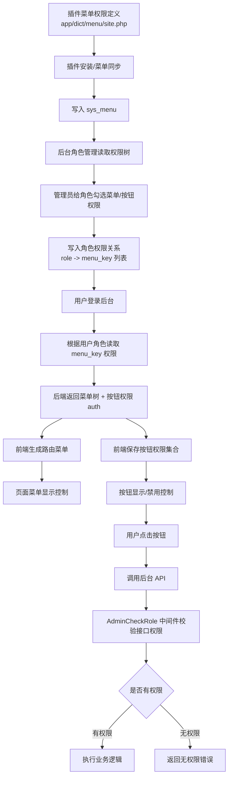

---

## 2. 菜单 / 按钮权限注册流程

插件里的 `app/dict/menu/site.php` 是权限声明源，最终必须同步到 `sys_menu` 后才能在角色管理里授权。

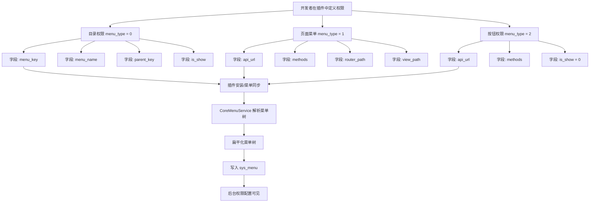

---

## 3. 权限数据结构关系

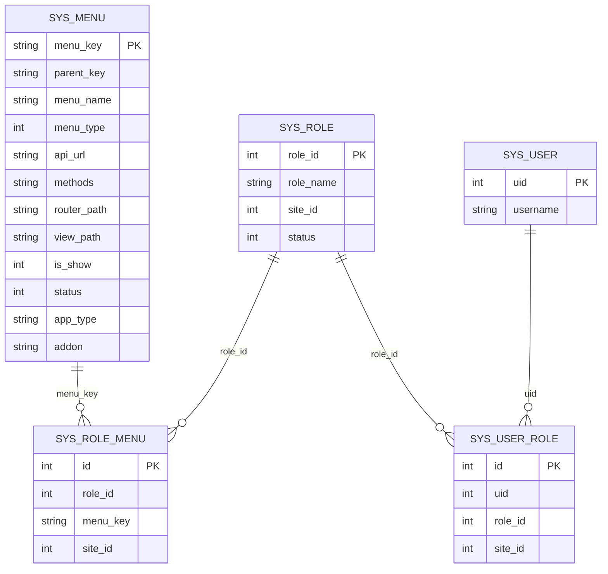

---

## 4. 角色授权流程

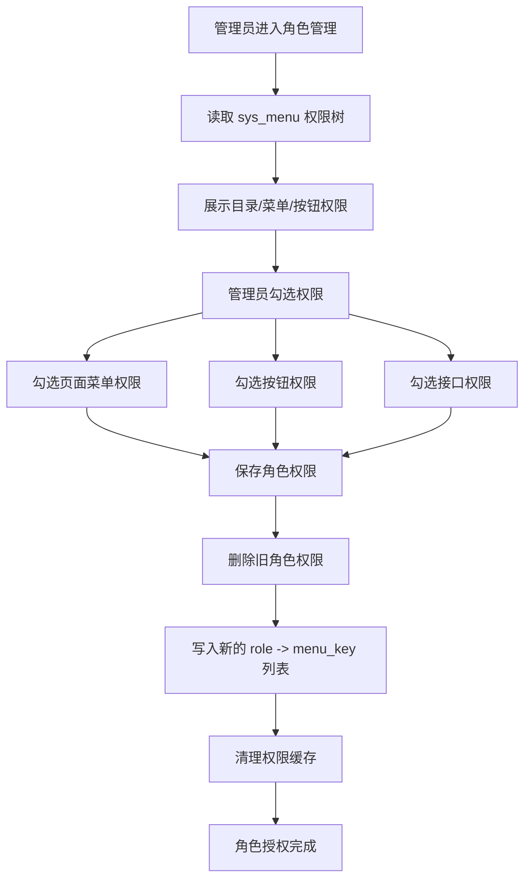

---

## 5. 登录后获取菜单和按钮权限流程

这里是当前系统需要重点补齐的位置。权限已经能配置和保存，但前端页面必须能拿到按钮权限集合，否则按钮级权限无法统一实现。

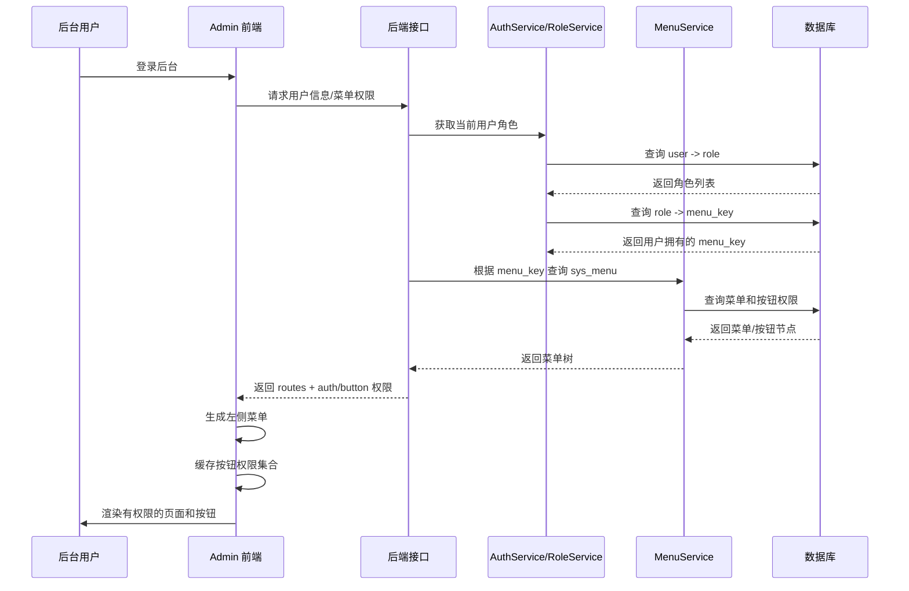

---

## 6. 前端按钮权限控制流程

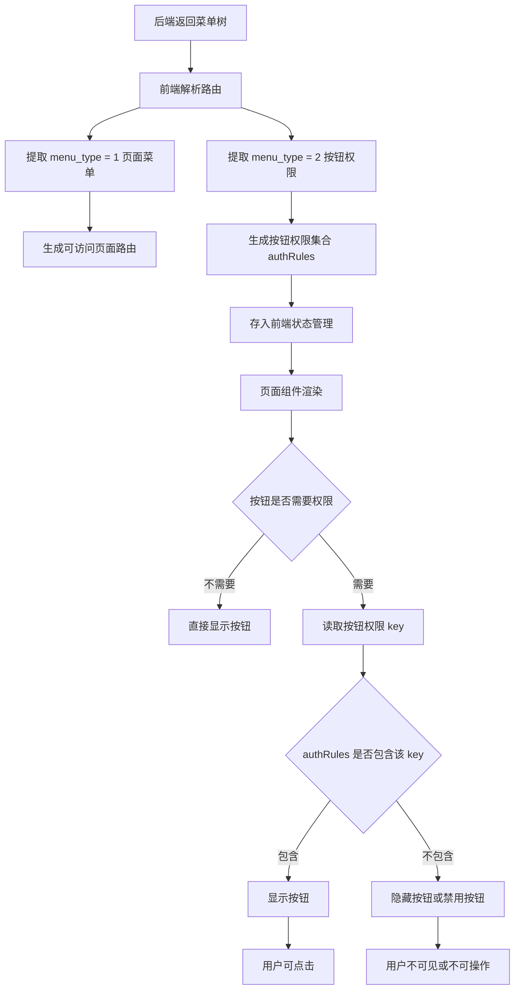

---

## 7. 按钮点击后的后端接口权限校验流程

前端隐藏按钮只解决用户体验，不能作为安全边界。后端 `AdminCheckRole` 必须再次校验当前请求对应的 `api_url + methods`。

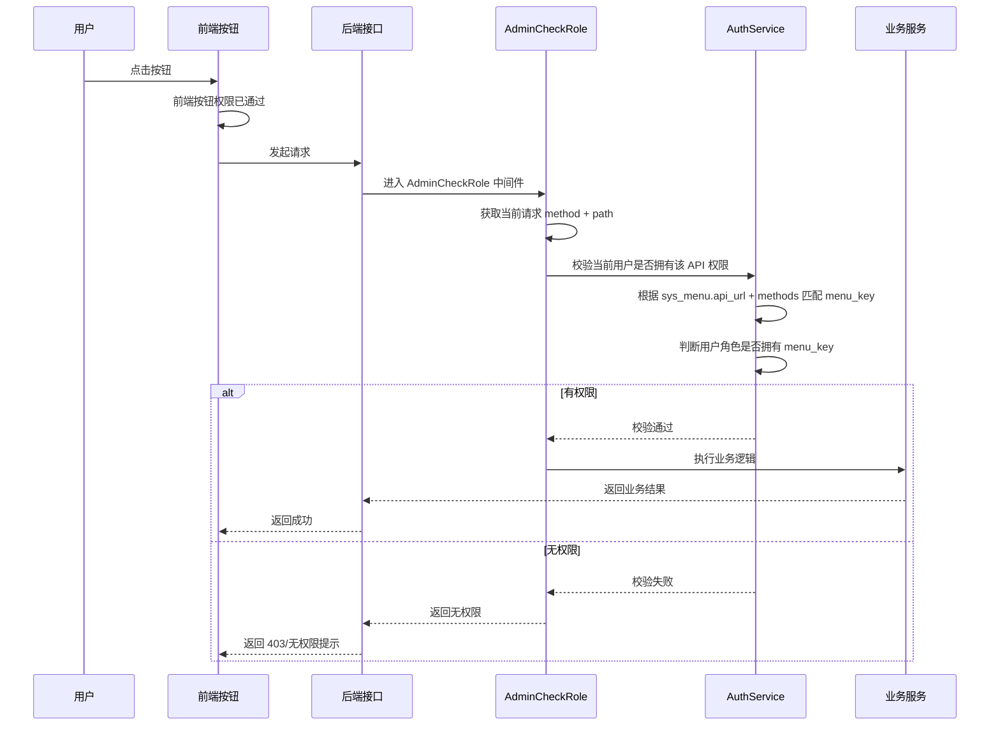

---

## 8. 当前问题：set 有了，但 get 没闭环

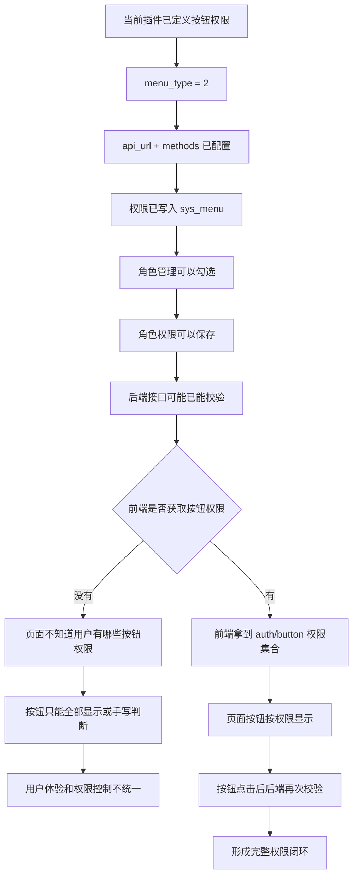

---

## 9. 补齐后的完整权限闭环

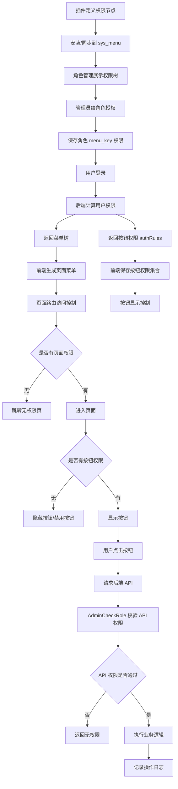

---

## 10. 回收插件按钮权限设计流程

```mermaid
flowchart TD
    A[回收插件业务模块] --> B[订单管理]
    A --> C[质检管理]
    A --> D[报价中心]
    A --> E[物流管理]
    A --> F[财务管理]
    A --> G[服务能力中心]
    A --> H[打印管理]

    B --> B1[订单查看]
    B --> B2[订单创建]
    B --> B3[订单编辑]
    B --> B4[订单取消]
    B --> B5[订单删除]
    B --> B6[订单导出]
    B --> B7[订单备注]
    B --> B8[代用户确认价格]

    C --> C1[开始质检]
    C --> C2[提交质检]
    C --> C3[修改质检]
    C --> C4[复核质检]
    C --> C5[上传质检图片]

    D --> D1[查看报价]
    D --> D2[生成最终报价]
    D --> D3[调整最终报价]
    D --> D4[管理报价规则]
    D --> D5[同步报价源]
    D --> D6[处理规格映射]

    E --> E1[创建平台快递]
    E --> E2[取消快递]
    E --> E3[同步物流]
    E --> E4[创建退回物流]
    E --> E5[修改物流单号]

    F --> F1[查看待打款]
    F --> F2[确认打款]
    F --> F3[上传凭证]
    F --> F4[打款失败处理]
    F --> F5[导出财务记录]

    G --> G1[查看服务能力]
    G --> G2[保存服务配置]
    G --> G3[测试服务连接]
    G --> G4[启用/禁用服务]
    G --> G5[查看调用日志]

    H --> H1[打印设备标签]
    H --> H2[管理打印模板]
    H --> H3[测试打印]
    H --> H4[查看打印记录]
```

---

## 11. 回收系统角色权限矩阵

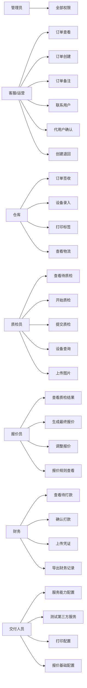

---

## 12. 前端权限组件建议流程

建议前端统一封装 `AuthButton`、`v-auth` 或 `usePermission()`，不要在每个页面里手写判断。

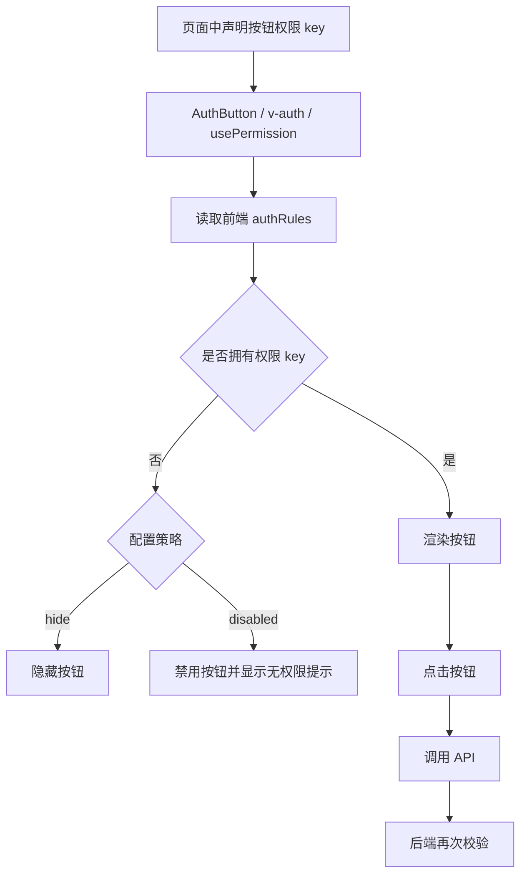

---

## 13. 推荐的按钮权限命名规范

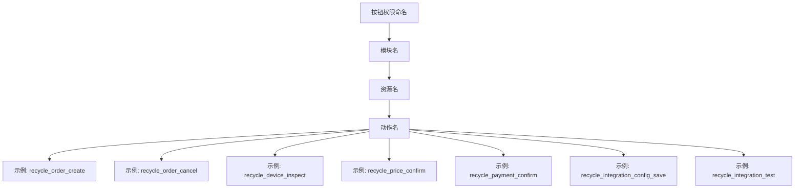

推荐格式：

```text
{addon}_{resource}_{action}
```

示例：

| 权限 key | 说明 |
| --- | --- |
| `recycle_order_list` | 查看订单列表 |
| `recycle_order_create` | 创建订单 |
| `recycle_order_cancel` | 取消订单 |
| `recycle_order_export` | 导出订单 |
| `recycle_device_inspect` | 设备质检 |
| `recycle_device_query` | 设备查询 |
| `recycle_price_confirm` | 确认最终报价 |
| `recycle_payment_confirm` | 确认打款 |
| `recycle_integration_config_save` | 保存服务能力配置 |
| `recycle_integration_test` | 测试服务能力 |
| `recycle_printer_print_label` | 打印设备标签 |

---

## 14. 最终目标流程

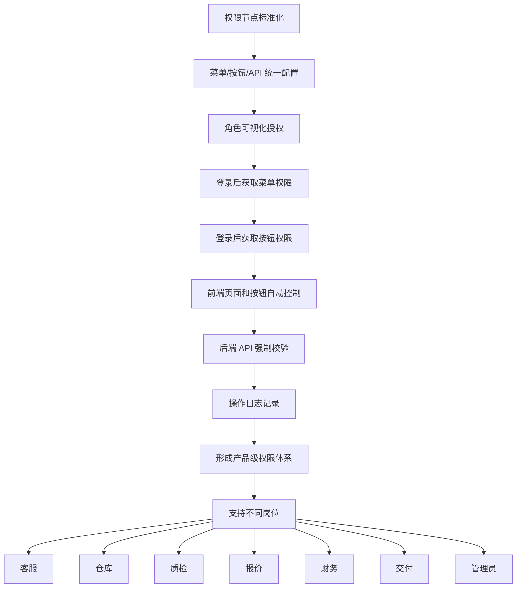

---

## 15. 一句话总结

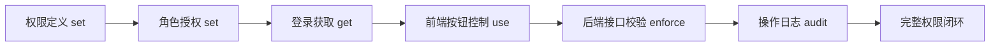

---

## 16. 实现落地清单

| 阶段 | 要做的事 | 说明 |
| --- | --- | --- |
| 1 | 梳理插件所有页面和按钮 | 订单、质检、报价、物流、财务、服务能力、打印 |
| 2 | 标准化 `menu_key` | 避免命名混乱和重复 |
| 3 | 补齐 `menu_type = 2` 按钮权限 | 每个按钮都要对应 `api_url + methods` |
| 4 | 确认插件菜单同步到 `sys_menu` | 安装/升级/同步时写入 |
| 5 | 确认角色管理能勾选按钮权限 | 按钮权限 `is_show = 0`，但授权树可见 |
| 6 | 后端返回按钮权限集合 | 登录或菜单接口返回 `authRules` |
| 7 | 前端统一封装按钮权限组件 | `AuthButton` / `v-auth` / `usePermission` |
| 8 | 页面替换手写按钮判断 | 所有按钮统一走权限组件 |
| 9 | 后端 `AdminCheckRole` 强制校验 | 防止绕过前端直接调接口 |
| 10 | 关键操作写日志 | 订单、质检、报价、打款、配置修改 |

---

## 17. 当前插件要重点检查的位置

| 位置 | 要检查什么 |
| --- | --- |
| `niucloud/addon/recycle/app/dict/menu/site.php` | 是否所有按钮权限都定义了 `menu_type = 2` |
| `niucloud/addon/recycle/app/adminapi/route/route.php` | 路由是否都挂了 `AdminCheckRole` |
| `niucloud/app/service/admin/auth/AuthService.php` | 是否能根据 API 路径和 method 匹配权限 |
| `admin/src/router/routers.ts` | 是否已经提取 `route.auth` |
| `admin/src/addon/recycle/views/**` | 页面按钮是否使用统一权限判断 |
| 角色管理页面 | 是否能勾选插件按钮权限 |

---

## 18. 建议后续文档

后续可以再单独拆两份文档：

| 文档 | 内容 |
| --- | --- |
| `recycle-2.0-permission-keys.md` | 回收插件所有页面和按钮权限 key 清单 |
| `recycle-2.0-role-matrix.md` | 客服、仓库、质检、报价、财务、交付、管理员权限矩阵 |
