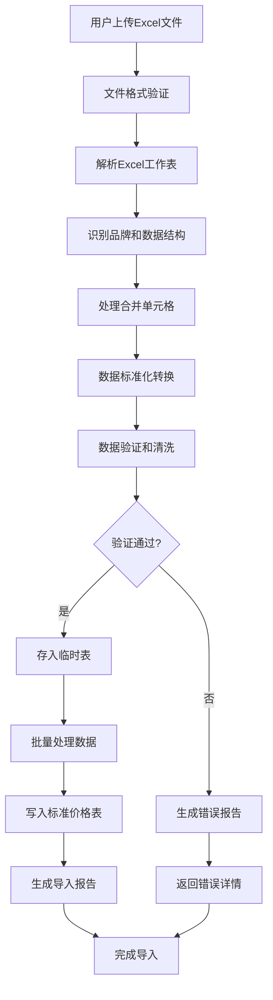

# 牛云SaaS回收系统 - Excel价格数据导入方案

## 📋 项目背景

### 🎯 业务目标
- **批量导入**：将包含约1万条价格数据的Excel文件批量导入到系统
- **标准化处理**：处理多品牌、多规格、多等级的复杂价格体系
- **数据验证**：确保导入数据的准确性和完整性
- **用户友好**：提供直观的导入界面和详细的处理结果反馈

### 📊 数据规模
- **文件格式**：Excel (.xlsx)
- **工作表数量**：13个（苹果、华为、三星、荣耀、OPPO、小米、VIVO、iqoo、苹果平板、华为平板、苹果手表、华为手表、vo手表）
- **数据量**：总计约10,000条价格记录
- **文件大小**：约200KB

## 🔍 Excel文件结构分析

### 📄 标准表格结构
```
第1行: 标题行（如"苹果在保回收单 2025.7.2"）
第2行: 表头（型号|网络型号|容量|高保充新|充新|靓机|小花|大花|外爆|内爆|备注）
第3行+: 数据行（包含合并单元格）
```

### 🏷️ 数据字段定义
| 字段 | 说明 | 示例 | 备注 |
|------|------|------|------|
| 型号 | 设备型号 | `16PROMAX` | 存在合并单元格 |
| 网络型号 | 网络制式型号 | `A3297` | 部分为空或"/" |
| 容量 | 存储容量/内存规格 | `256`, `16+512` | 格式多样化 |
| 高保充新 | 最高品质价格 | `7350` | 部分为"/"表示无此规格 |
| 充新 | 次高品质价格 | `7150` | 主要价格参考 |
| 靓机 | 优良品质价格 | `7000` | 轻微使用痕迹 |
| 小花 | 轻微瑕疵价格 | `6800` | 小瑕疵扣价 |
| 大花 | 明显瑕疵价格 | `6450` | 明显瑕疵扣价 |
| 外爆 | 外观损坏价格 | `6150` | 外屏破损等 |
| 内爆 | 内部损坏价格 | `4850` | 主板损坏等 |
| 备注 | 特殊说明 | `屏大碎400-800...` | 扣价规则说明 |

### 🎨 品牌分类分析
| 品牌类型 | 工作表 | 特点 | 记录数预估 |
|---------|--------|------|-----------|
| 📱 手机 | 苹果、华为、三星、荣耀、OPPO、小米、VIVO、iqoo | 标准7等级价格 | ~8000条 |
| 📟 平板 | 苹果平板、华为平板 | 类似手机结构 | ~1500条 |
| ⌚ 手表 | 苹果手表、华为手表、vo手表 | 简化价格结构 | ~500条 |

### 🔧 技术挑战点
1. **合并单元格处理**：型号字段存在合并单元格，需要智能识别和数据填充
2. **数据格式多样化**：容量字段格式不统一（`256` vs `16+512`）
3. **缺失值处理**：部分价格字段为`/`或空值
4. **内存限制**：大文件读取可能导致PHP内存溢出
5. **数据验证**：价格合理性、格式正确性验证

## 🏗️ 系统架构设计

### 📦 核心模块
```
Excel导入系统
├── 文件上传模块
│   ├── 文件格式验证
│   ├── 文件大小限制
│   └── 安全检查
├── Excel解析模块
│   ├── 工作表识别
│   ├── 合并单元格处理
│   ├── 数据类型转换
│   └── 智能数据填充
├── 数据验证模块
│   ├── 必填字段检查
│   ├── 价格合理性验证
│   ├── 重复数据检测
│   └── 数据格式标准化
├── 批量处理模块
│   ├── 分批导入处理
│   ├── 事务管理
│   ├── 进度跟踪
│   └── 错误回滚
└── 结果反馈模块
    ├── 导入统计报告
    ├── 错误详情列表
    ├── 数据预览
    └── 操作日志
```

## 💾 数据库设计

### 🗄️ 核心数据表

#### 1. 价格导入临时表 (`recycle_price_import`)
```sql
-- 用于存储解析后的原始数据，支持数据验证和预处理
字段设计：
- id: 主键
- site_id: 站点ID（多租户）
- brand: 品牌（从工作表名提取）
- model: 型号
- network_model: 网络型号
- capacity: 容量规格
- price_perfect~price_broken_inner: 7个等级价格
- remark: 备注信息
- import_batch: 导入批次号（便于回滚）
- status: 处理状态
- error_msg: 错误信息
- create_at/update_at: 时间戳
```

#### 2. 标准价格表 (`recycle_price_standard`)
```sql
-- 最终的标准化价格数据存储
字段设计：
- id: 主键
- site_id: 站点ID
- category_id: 设备分类ID（1-手机，2-平板，3-手表）
- brand: 品牌
- model: 型号
- network_model: 网络型号
- capacity: 容量规格（标准化后）
- price_levels: JSON格式存储各等级价格
- remark: 备注信息
- is_active: 是否启用
- sort: 排序权重
- create_at/update_at: 时间戳
```

#### 3. 导入日志表 (`recycle_price_import_log`)
```sql
-- 导入操作的完整记录
字段设计：
- id: 主键
- site_id: 站点ID
- batch_no: 批次号
- file_name: 文件名
- file_path: 文件路径
- total_count: 总记录数
- success_count: 成功记录数
- fail_count: 失败记录数
- status: 整体状态
- error_summary: 错误汇总
- operator_id/operator_name: 操作员信息
- start_time/end_time: 执行时间
- create_at: 创建时间
```

## 🔄 业务流程设计

### 📋 导入流程图


### ⚙️ 核心处理逻辑

#### 1. 合并单元格智能处理
```php
算法逻辑：
1. 扫描型号列，识别合并单元格范围
2. 将合并单元格的值向下填充到相关行
3. 维护型号-容量的层级关系
4. 确保每行数据的完整性

示例：
原始数据：
Row 3: 16PROMAX | A3297 | 256 | 7350 | ...
Row 4:           |       | 512 | 8350 | ...
Row 5:           |       | 1T  | 9600 | ...

处理后：
Row 3: 16PROMAX | A3297 | 256 | 7350 | ...
Row 4: 16PROMAX | A3297 | 512 | 8350 | ...
Row 5: 16PROMAX | A3297 | 1T  | 9600 | ...
```

#### 2. 数据标准化处理
```php
标准化规则：
1. 容量格式统一：
   - "256" → "256GB"
   - "16+512" → "16GB+512GB"
   - "1T" → "1TB"

2. 价格处理：
   - 空值/"/" → 0.00
   - 数字验证和范围检查
   - 货币格式标准化

3. 品牌分类映射：
   - 工作表名 → 标准品牌名
   - 自动识别设备类型（手机/平板/手表）
```

#### 3. 数据验证规则
```php
验证检查点：
1. 必填字段验证：
   - 品牌不能为空
   - 型号不能为空
   - 至少一个价格不为0

2. 数据合理性验证：
   - 价格范围：10-50000元
   - 价格递减规律：高保充新 ≥ 充新 ≥ 靓机 ≥ 小花 ≥ 大花 ≥ 外爆 ≥ 内爆
   - 容量格式正确性

3. 重复数据检测：
   - 同品牌+型号+容量的唯一性检查
   - 提供覆盖/跳过/合并选项
```

## 🎨 用户界面设计

### 📱 前端页面结构
```
Excel导入管理页面
├── 文件上传区域
│   ├── 拖拽上传组件
│   ├── 文件格式说明
│   └── 模板下载链接
├── 导入配置面板
│   ├── 重复数据处理策略
│   ├── 错误数据处理方式
│   └── 导入选项设置
├── 实时进度显示
│   ├── 进度条
│   ├── 当前处理状态
│   └── 已处理/总数统计
├── 结果展示区域
│   ├── 导入统计概览
│   ├── 成功数据预览
│   ├── 错误数据列表
│   └── 操作建议
└── 历史记录面板
    ├── 导入历史列表
    ├── 批次详情查看
    └── 数据回滚功能
```

### 🎯 关键交互设计
1. **上传体验**：支持拖拽上传，实时文件验证，上传进度显示
2. **处理反馈**：实时进度条，分阶段状态提示，预估剩余时间
3. **错误处理**：详细错误定位，修复建议，支持部分重试
4. **数据预览**：导入前数据预览，可编辑确认，批量修正

## ⚡ 性能优化策略

### 🚀 处理效率优化
1. **分批处理**：
   - 每批处理500条记录，避免内存溢出
   - 使用队列异步处理大文件
   - 支持断点续传和暂停/恢复

2. **内存管理**：
   - 流式读取Excel文件
   - 及时释放已处理数据
   - 设置合理的PHP内存限制

3. **数据库优化**：
   - 批量插入减少IO操作
   - 使用事务确保数据一致性
   - 建立合适的索引提升查询速度

### 📈 扩展性考虑
1. **多文件并发**：支持多个文件同时导入，互不干扰
2. **格式扩展**：预留接口支持CSV、JSON等其他格式
3. **自定义映射**：支持用户自定义字段映射规则
4. **API支持**：提供API接口供第三方系统调用

## 🛡️ 安全与容错设计

### 🔒 安全措施
1. **文件安全**：
   - 文件类型白名单验证
   - 文件大小限制（最大100MB）
   - 病毒扫描和恶意代码检测
   - 上传文件隔离存储

2. **权限控制**：
   - 操作权限验证
   - 敏感操作审计日志
   - 数据访问权限控制

3. **数据安全**：
   - 导入前数据备份
   - 敏感信息脱敏处理
   - 操作可追溯性

### 🔄 容错机制
1. **事务回滚**：
   - 导入失败自动回滚
   - 支持手动回滚到指定批次
   - 数据一致性保证

2. **错误恢复**：
   - 详细错误日志记录
   - 支持错误数据修正后重新导入
   - 提供数据修复工具

3. **监控告警**：
   - 导入进度监控
   - 异常情况自动告警
   - 性能指标统计

## 📅 实施计划

### 🎯 开发阶段划分

#### 阶段一：基础架构（3天）
- [ ] 数据库表结构设计和创建
- [ ] 基础服务类和模型创建
- [ ] Excel解析核心类开发
- [ ] 文件上传安全验证

#### 阶段二：核心功能（5天）
- [ ] 合并单元格智能处理算法
- [ ] 数据标准化和验证逻辑
- [ ] 批量导入和事务处理
- [ ] 错误处理和日志记录

#### 阶段三：用户界面（3天）
- [ ] 前端页面开发（Vue3 + Element Plus）
- [ ] 实时进度显示组件
- [ ] 结果展示和错误列表
- [ ] 历史记录和管理功能

#### 阶段四：优化测试（2天）
- [ ] 性能优化和压力测试
- [ ] 边界条件测试
- [ ] 用户体验优化
- [ ] 文档完善

### 📊 里程碑节点
- **Day 3**：完成数据库设计和基础架构
- **Day 8**：完成核心导入功能开发
- **Day 11**：完成前端界面开发
- **Day 13**：完成测试和优化，发布上线

## 🎯 成功指标

### 📈 功能指标
- ✅ **准确率**：数据导入准确率 ≥ 99.5%
- ⚡ **性能**：1万条记录导入时间 ≤ 3分钟
- 🛡️ **稳定性**：导入成功率 ≥ 99%
- 🎨 **易用性**：用户操作步骤 ≤ 3步

### 📊 技术指标
- 💾 **内存使用**：峰值内存使用 ≤ 256MB
- 🔄 **并发支持**：支持5个文件同时导入
- 📱 **兼容性**：支持主流Excel格式（.xlsx, .xls）
- 🔍 **可追溯性**：100%操作日志记录

## 🚨 风险评估与应对

### ⚠️ 主要风险点
1. **数据复杂性**：
   - 风险：合并单元格处理失败
   - 应对：多重验证机制，人工干预接口

2. **性能问题**：
   - 风险：大文件导致内存溢出
   - 应对：流式处理，分批导入，队列异步处理

3. **数据质量**：
   - 风险：源数据格式不规范
   - 应对：强大的数据验证和清洗机制

4. **用户体验**：
   - 风险：导入时间过长，用户体验差
   - 应对：实时进度反馈，后台异步处理

### 🛠️ 应急预案
1. **数据回滚**：提供完整的数据回滚机制
2. **手动修正**：支持单条数据的手动编辑和修正
3. **技术支持**：提供详细的错误诊断和修复建议
4. **监控告警**：实时监控系统状态，及时发现问题

## 📝 总结

这个Excel价格数据导入系统方案充分考虑了：
- 📊 **复杂数据结构**的智能处理
- ⚡ **高性能**的批量导入能力  
- 🛡️ **高可靠性**的错误处理机制
- 🎨 **优秀用户体验**的界面设计
- 🔄 **良好扩展性**的系统架构

通过分阶段实施，可以确保项目按时高质量交付，为回收业务提供强大的价格数据管理能力。 